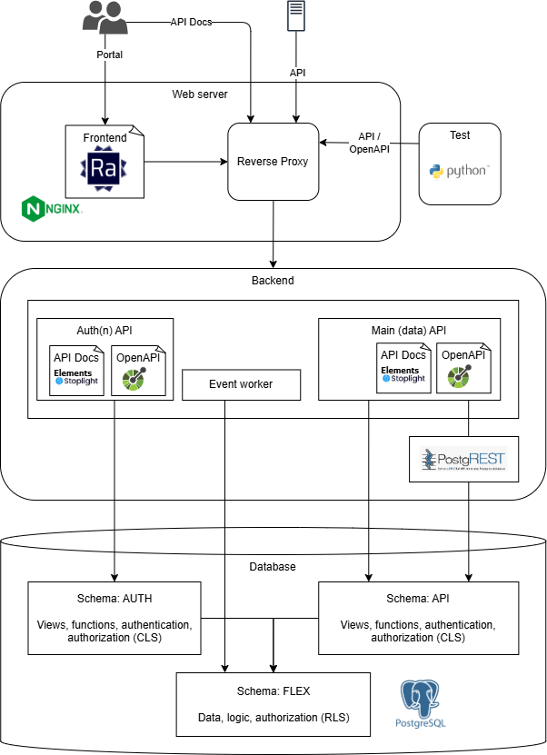

# Architecture

We are defining our software architecture according to
[Martin Fowler](https://youtu.be/DngAZyWMGR0?t=374)

> (shared understanding) [of] the important stuff (that is hard to change)

This document gives an overview of the software architecture of the Flexibility
Information System.

We are _not_ following any real structure in how we document the architecture.
We are aiming for "whiteboard models" or "tourist maps" as coined by
[Dave Farley](https://youtu.be/SYtkbv8LNv0?t=756).

## High level overview

This is how we envision an early platform for learning in our R&D project.

There are a handful of components in the drawing. Details of each are in the following
sections.

### Database - PostgreSQL

We are using PostgreSQL for the database.

In the diagram, the database is very big. This is intentional. We believe in
having a _thick database_. That means putting logic, like authorization and
consistency checking, in the database. This is counter to the thin database
approach, where in its extreme form the database is just a dumb storage of
"objects".

An interesting company in the "PostgreSQL for everything" space is
[Supabase](https://supabase.io/).

> Supabase is an open source Firebase alternative. We're building the features
> of Firebase using enterprise-grade open source tools.

While we are not suggesting going all in on Supabase, we are looking at
the open-source building blocks that Supabase is making use of, e.g. for REST
API, authn/z, etc.

### Backend - PostgREST + Go

The Flexibility Information System will be API first. Regulations from EU
(Network Code Demand Response) and just the general idea of a central system
mandates programmable interfaces.

We currently have two APIs:

* **Auth API** - basically a security token service (STS) that issues and validates
  JWTs. It also provides userinfo.
* **Main API** - our main API that provides access to the data in the database.
  See the [API design documentation](./api-design.md) for more details.

Both of them are served by distinct modules of a backend built with Go.
We use the [**Gin**](https://gin-gonic.com/) web framework for its ease of
development. Other popular options were:

* **Standard library**. This implies using only the `net/http` module, which is
  a bit too low-level. Using a framework removes some of the boilerplate code
  and makes the development faster and more delightful.
* [**chi**](https://go-chi.io/#/).
  Chi is just a router and not a full-fledged framework.
* [**Fiber**](https://gofiber.io/).
  Comparable to gin, but a bit less popular and is based on a non-standard HTTP
  server implementation, making it a slightly riskier choice than Gin.

The Main API relies on a component that generates REST APIs automatically from
the database. [PostgREST](https://postgrest.org/) is the leading open-source
tool for this. It provides us with a RESTish API by plugging into the database.
By default, the backend simply redirects calls on the Main API to PostgREST.
This will allow us to eventually take over PostgREST for better control, by
progressively writing custom implementations for the endpoints.

The Go backend also includes other functionalities implemented as services
running in the background alongside the web server.

* **Notification** - The `event` module is used to start an _event worker_ in
  the background, handling events happening on the system and creating
  notifications to the users.

### Web Server - Static assets and reverse proxy in NGINX

We use NGINX as web server. It is used to:

* serve static assets such as the frontend, API docs and API spec
* reverse proxy to our APIs

NGINX also allows us do a few things that out-of-the-box PostgREST does not do
(like hierarchies). The choice of NGINX (over,
say, httpd or caddy) is because:

* its boring
* its widely used
* whenever the PostgREST docs mentions "reverse proxy" it is always using NGINX
  as an example

### APIs - Application Programming Interfaces

For each of our APIs we ..

* describe them with an OpenAPI document.
* serve generated API documentation from the document.
* provide the functionality from the backend, reverse proxied and slightly
  augmented by NGINX.

For some details about the API design, see the [API design documentation](./api-design.md).

#### OpenAPI 3.1 - API spec

We manually maintain OpenAPI documents that describes the APIs we want to
expose. Some of the toil is removed by generating parts of the documents. We use
the [OpenAPI v3.1.0](https://spec.openapis.org/oas/v3.1.0) dialect.

The API provided by PostgREST is larger and a bit different from what we want to
expose. We "subtract" functionality by not documenting it in the OpenAPI
document and "add/augment" functionality with Nginx. The following venn-like
diagram shows the API surface of the system. Some examples of what is realized
where are also shown.

* auth API is done by the Go backend
* singular resources (`<rsrc>/{id}`) are done by PostgREST with some rewrites
  by Nginx
* plural resources (`<rsrc>`) are done by just PostgREST

To read about the API design, see the [API design documentation](./api-design.md).

!!! info

    Everything is reverse-proxied through Nginx, which provides e.g. TLS
    termination. The diagram above just shows where the _functionality_ is
    implemented.

    The full functionality of PostgREST is available and *not* restricted in the
    reverse proxy. We do this to avoid toil/busywork when changing the API.

    However, the functionality that is not exposed in the API spec might be
    locked down at any point in time. Do _not_ rely on it.

#### (Generated) API Docs - Elements

The OpenAPI spec is used to generate API documentation. We are using
[Elements by Stoplight](https://github.com/stoplightio/elements) for this. It
has a very simple deployment model (html + js via CDN) and provides a
nice-enough UI for the API docs.

Tools that have been evaluated but did not make the cut:

* [Scalar](https://github.com/scalar/scalar). The UI is incorrect and generally
  lacking bad for models that are constructed using
  [composition](https://spec.openapis.org/oas/v3.1.0#composition-and-inheritance-polymorphism)
  (`allOf`).
* [Redoc](https://redoc.ly/) is pretty nice but does not display a combination
  of path, summary and description in a sufficient way.
* [Swagger UI](https://swagger.io/tools/swagger-ui/). The standard for OpenAPI
  documentation. The UI is not very nice and it is not very good at displaying
  the API in a way that is easy to understand.

### Documentation - Material for MkDocs

We are using
[Material for MkDocs](https://squidfunk.github.io/mkdocs-material/) to generate
the documentation that you are reading right now.

### Frontend - React Admin

We use [React Admin](https://marmelab.com/react-admin/) as the frontend
framework. This gives us a lot of functionality/plumbing out of the box and
allows us to spend litte time on the front-end. If there is ever an investment
decision to make an actual information system, we assume that the frontend will
be rewritten to facilitate better UX and design.

An alternative front-end framework for quickly setting up a front-end in front
of such a REST API was [Refine](https://refine.dev/). We explored both options
but decided to use react-admin since it is very opinionated and thus easier to
get started with and understand. We value simplicity for flexibility.

### Test - Focus on the API

We focus our testing on testing the API.
