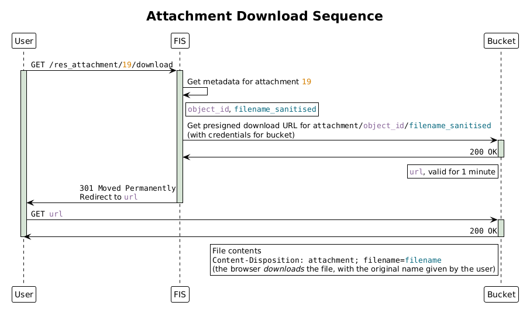
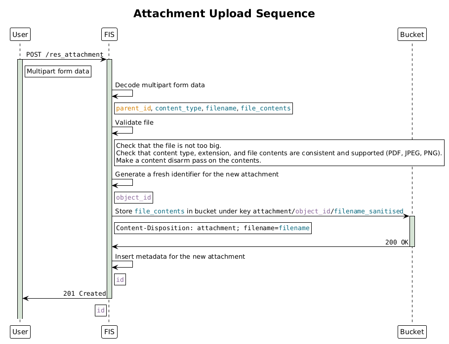

# Attachments

This document gathers design notes on the attachments resources we have in the
system. Attachments are inspired from comments and are designed to behave as a
form of child resource living under another resource in our system. The goal is
to be able to upload files in the context of applications for instance, to give
technical details or contracts.

## Data layout

We need to store in our system both file metadata and the actual file contents.
File metadata for all attachment resources is stored in a general `attachment`
table in our database and the file contents are stored on an external storage
container (S3 bucket). This allows keeping the database as a source of truth
(namely for maintaining consistency) without putting too much pressure on it
when it comes to disk space and I/O.

File metadata includes file name, file type, file size, upload timestamp and
identity of the user uploading, as well as a unique reference to the object in
the bucket containing the file.

The link between metadata and the parent resource is then done with a specific
`<res>_attachment` table (for a given `res` parent resource), containing both
references.

## API design

The attachment tables are then joined and exposed in the API so that users can
read metadata, but we also expose endpoints to upload, download, and delete
files. All attachment endpoints are limited to involved parties on the parent
resource: only a party that has something to do with the resource can read its
attached files.

### Reading attachments

The endpoints to read metadata look like the _list_ and _read_ kind of endpoints
we already have on other resources in the system, except the list endpoint
_requires_ a parent resource ID, because we consider it does not make sense to
query for all attachments regardless of their parent resource.

These endpoints are protected by RLS policies specific to the resource and the
`<res>_id` on each attachment, implemented in the linking table. Any operation
related to an attachment will be linked to an interaction with this linking
table. In other words, we are using the linking table as a way to run RLS even
on the stateful endpoints doing more than only database operations.

Here is an example of list and read call, on a resource having an image and a
PDF attached:

```http
GET /<res>_attachment?res_id=eq.12
```

```json
[
  {
    "id": 15,
    "<res>_id": 12,
    "object_id": "87373baf-d752-41e1-b80a-d91fb9eaf37b",
    "filename": "&a@g.jpg",
    "filename_sanitised": "ag.jpg",
    "content_type": "image/jpeg",
    "size_bytes": 12149102,
    "recorded_at": "2026-07-01T14:05:39+01:00",
    "recorded_by": 17
  },
  {
    "id": 19,
    "<res>_id": 12,
    "object_id": "292e2a5e-11fc-4028-bbf6-7959b1693db3",
    "filename": "b.pdf",
    "filename_sanitised": "b.pdf",
    "content_type": "application/pdf",
    "size_bytes": 58010098,
    "recorded_at": "2026-06-24T09:17:48+01:00",
    "recorded_by": 30
  }
]
```

```http
GET /<res>_attachment/19
```

```json
{
  "id": 19,
  "<res>_id": 12,
  "object_id": "292e2a5e-11fc-4028-bbf6-7959b1693db3",
  "filename": "b.pdf",
  "filename_sanitised": "b.pdf",
  "content_type": "application/pdf",
  "size_bytes": 58010098,
  "recorded_at": "2026-06-24T09:17:48+01:00",
  "recorded_by": 30
}
```

Here, `<res>_id`, `recorded_at`, and `recorded_by` come from the linking table,
whereas the other fields come from the general `attachment` table.

The list call will typically be used in the portal for showing a list of
attachments on the base resource's show page.

To actually read the file contents, we need another endpoint:

```http
GET /<res>_attachment/19/download
```

For performance reasons, this endpoint does not directly return the contents of
the file, but instead uses a [mechanism](https://docs.aws.amazon.com/AmazonS3/latest/userguide/using-presigned-url.html)
similar to PAR requests in authentication protocols, where authentication
towards the bucket happens in the backend and we redirect the user to a
_presigned URL_ on the bucket allowing file download during a given time window.
This is summarised in the following sequence diagram:



Whether the file is opened in the browser or downloaded depends on the
`Content-Disposition` header that we set on redirect. We choose to download by
default.

The PAR request lives for one minute because we estimate this is enough, even
for a slow client, to receive the URL and start downloading the file.

We do not expose the pointer to the bucket object in the API as it is not used
in the endpoint paths and can be considered to be an internal implementation
detail.

### Uploading files

We want to handle file upload in a common way. As a result, the endpoint is a
bit special with respect to the rest of the API. The endpoint needs to receive
the file contents in the body. The user uses a multipart form with a part
containing the reference to the resource the attachment will belong to, and a
part containing the file contents as well as the filename.

Here is an example of call to the upload endpoint:

```http
POST /res_attachment
Content-Type: multipart/form-data; boundary=----ResFormBoundaryABCDEF

----ResFormBoundaryABCDEF
Content-Disposition: form-data; name="res_id"

12
----ResFormBoundaryABCDEF
Content-Disposition: form-data; name="file"; filename="c%%.pdf"
Content-Type: application/pdf

[binary data of the PDF]
----ResFormBoundaryABCDEF
```

```json
{
  "id": 27,
  "res_id": 12,
  "object_id": "6c212ab9-5053-42a8-8c8c-37481bacada1",
  "filename": "c%%.pdf",
  "filename_sanitised": "c.pdf",
  "content_type": "application/pdf",
  "size_bytes": 70440701,
  "recorded_at": "2026-07-03T13:55:08+01:00",
  "recorded_by": 10
}
```

Here are more details about the various steps of the upload sequence:



### Updating files

File versioning is not supported in our system. If a user needs to upload a new
version of a file, they can just delete the existing version and upload a new
one. A dedicated update operation sounds unnecessary in our use case.

### History

We keep history of all attachments. There is a functional reason to this: any
documents that were available to the system operator at the time of the decision
on an application can lead to a better understanding of the decision. Only very
old documents should be deleted at some point, but this may just be carried out
once in a while by administrators if/when the bucket gets too big.

### Deleting files

Deleting a file can be done with the delete endpoint with the attachment row ID:

```text
DELETE /res_attachment/27
```

Internally, it is a shallow delete though, as we keep track of the deleted
metadata in the history. The bucket remains untouched as cleaning it is our
future responsability and less important for the user.

## Storage

In addition to the database and the API endpoints, this section describes what
we store in the bucket, in which format exactly, and how we make the link
between metadata and storage.

### Data quality

When the users upload files, we do not trust the `Content-Type` header and
instead perform an elementary check on the binary data to determine the file
type. Then, according to the file type, we run a dedicated parser on the file
contents to ensure structural validity of the documents. We do not necessarily
have to run some form of antivirus software on the files as we do not use them
in the software but only store them, and the users uploading them can be trusted
to a certain degree, but we can perform a _content disarm_ pass on the file
contents to lower the probability for it to harm other users, as advised by
[OWASP](https://cheatsheetseries.owasp.org/cheatsheets/File_Upload_Cheat_Sheet.html#java-code-snippets).

### Storage container data format

The bucket stores data in a key-value format, but we can choose the format of
each of these two and add some metadata.

The key is stored as `{object_id}/{name}` so that it is unique (thanks to the
`object_id`) but the file name always ends up in the end of the download URL
when we ask the bucket for a presigned URL.

Regarding the file contents, we do not apply any compression pass, as the file
types we decided to support are already optimised formats, so the compression
factor would be close to 1 anyway.

In addition, in the bucket's API, we can provide a `Content-Disposition` header
storing the filename and telling browsers later that we want the file to be
downloaded and not only opened.

### Consistency challenge

As we are storing data in two different places, we need to ensure consistency
between them, not necessarily at all times, but some form of _eventual_
consistency.

We decided that the metadata tables should be the source of truth, so storing an
attachment in the system amounts to creating metadata rows and deleting the
attachment amounts to deleting these rows.

The bucket operations are therefore done in a way that we think of it as a
dependency:

- an object ID represents a reference, so we consider it _necessary_ for the
  object to exist in the bucket before we create the metadata
- deleting the object in the bucket can be considered as an internal operation
  to perform in the background: as long as the metadata is deleted, the object
  is no longer visible/reachable from our API, so it is effectively "deleted".

In theory, this ensures that we never have a metadata row pointing to an object
that does not exist, given that nothing other than our system interacts with the
bucket.

Both points above mean, however, that we accept the possibility of having dead
objects in the bucket. Indeed, a network error after upload before creating the
metadata can cause duplicates, losing the reference to the oldest one, as the
API returns an error and we lose the object ID forever. And a network error
after deleting metadata will be made silent because we do not want to return an
internal server error on a delete operation if not strictly necessary, for user
experience reasons. There we also lose the object ID forever. To solve this
issue, we can have a background worker that sometimes goes through all objects
in the bucket and all attachments in our system, and deletes objects that are no
longer referenced, because the system has no way to use them anyway.

## Factorisation

As this feature looks like the comments feature implemented earlier, we can take
inspiration from it, making sure common classes and components are used, and
harnessing code generation where possible.

### Backend implementation

In the backend, the various attachment resources will have a similar structure,
only varying in the base resource name, so we can define generic classes for the
handlers and routes, and use a common class representing the service contacting
the bucket or validating the uploaded files. This code will be gathered in a
distinct module.

### Code generation

Attachments should be enabled on a resource by setting an `attachments: true`
property in the `resources.yml` file, as we do for comments. We should then use
SQL and YAML templates to define attachment metadata tables, grants, _etc._, and
fill the OpenAPI specification automatically.

### Common UI component

Attachments will look the same on all pages: on a resource having attachments
enabled, we should see a list of attachments where each value is clickable and
leads to downloading the file, a delete button on each attachment with a popup
to confirm and ensure the user really wants to delete the file as this cannot be
undone, as well as buttons to add new attachments. All these should be generic
components parameterised by the base resource name and ID, so they can be used
across all attachment resources.
