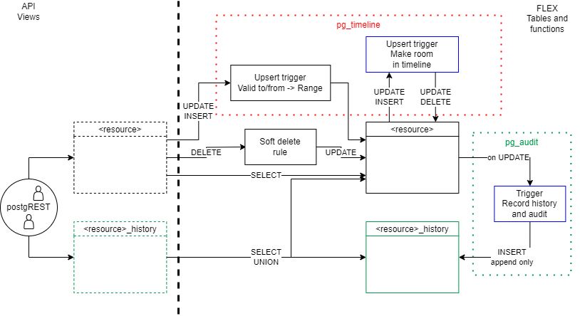

# Database Design

This document contains the database design guidelines for the project.

## Tables and relations

The following diagram is an auto-generated representation of the `flex` schema database.


## Schema maintenance and migrations

The system is still in rapid development and we don't actually want to deal with
migrations just yet. We want to maintain a "declarative" schema without tracking
changes, as long as possible.

Our strategy is therefore to recreate the database when we need to, but usually
rely on just recreating the objects that contain logic, and not the tables
containing data. Retaining the data is benefitial, since we have (external)
testers using the system and we want to deploy frequently. This is somewhat
inspired by the
[approach outlined by one of the PostgREST maintainers](https://github.com/PostgREST/postgrest/discussions/2999#discussioncomment-7592206).

We achieve this by leveraging `IF NOT EXISTS`, `CREATE OR REPLACE` and similar
functionality in PostgreSQL. We also have some schemas that we can drop since
they just hold logic such as views, functions and triggers. If we need to change
an actual data table (alter a column name or table name), then we bite the
bullet, wipe the database and recreate it.

On local, this can be achieved by running the `just reload` command.

Our next step for schema maintenance is to start tracking changes in the data
tables using a schema migration tool. The
[default choice at Elhub is Liquibase](https://elhub.atlassian.net/wiki/spaces/ELHUBDEV/pages/1214163591/AD-50+-+Liquibase).
Once we do that, we must consider refactoring how we set up the database, e.g.
setting up specific schemas for extensions and logic. Maintaining [declarative
versioned migration
authoring](https://atlasgo.io/concepts/declarative-vs-versioned#migration-authoring)
with assisting tools such as migra is the preferred approach.

> [!NOTE]
> If there is some specific reason for why we cannot wipe the database
> within a reasonable timeframe, and it is not feasible to hold the change, then
> we can resort to writing actual migrations. These must be in addition to
> making changes to the declarative object definitions. Migrations can be run
> manually or we can wrap it in a pl/pgsql function that checks if the migration
> was already done, thereby ensuring idempotence. Once done, we should remove
> the migration from version control.

## Foreign keys to tables with multiple types

Some tables, like `party`, have multiple types within the same table. When a
target table has multiple types, and we need to create a foreign key to a
specific type, we use a composite key, with a generated column to ensure that
the data is consistent.

Example:

Table `party` has columns `id` and `type`. The `type` column can be either of
the allowed party types in the system, like `system_operator`.

When we need to reference a system operator, we do the following.

```sql
CREATE TABLE x (
    ...
    system_operator_id bigint,
    system_operator_party_type text GENERATED ALWAYS AS (
        'system_operator'::text
    ) STORED,
    ...
    FOREIGN KEY (system_operator_id, system_operator_party_type)
        REFERENCES party (id, type)
    ...
)
```

The `system_operator_party_type` column is considered internal and should not
_necessarily_ be exposed externally.

## Enumerations

There are
[many ways](https://stackoverflow.com/questions/10923213/postgres-enum-data-type-or-check-constraint)
of declaring enumerations in PostgreSQL.

We prefer using Check constraints via DOMAINs and Lookup tables with natural
keys. ENUM types are considered inflexible and not recommended.

### Check constraint (on DOMAIN)

This method is based on
[check constraints](https://www.postgresql.org/docs/current/ddl-constraints.html#DDL-CONSTRAINTS-CHECK-CONSTRAINTS).
Check constraints can be added directly to the columns or via
[DOMAINs](https://www.postgresql.org/docs/current/sql-createdomain.html) (custom
subtype) if it is likely that it will be reused.

### Lookup table

This method is based on using foreign keys to a lookup table. The lookup table
contains the valid values. If using lookup tables, we use the natural key and
not a surrogate id in the join. This is to make the data more readable and not
require a join to get the value.

### ENUM type

Included for completeness [Enumerated Types](https://www.postgresql.org/docs/current/datatype-enum.html)

## Bi-temporal data

Some of the data we model in the database is
[bi-temporal](../time.md#bi-temporal-data). Most of our resources have record time
history (provided as its own separate resource). Some resources have valid time
timelines in addition.

The
[API docs on bi-temporal modelling](../api-design.md#time-dependent-resources-and-fields)
have some details regarding what we present to the users. This is realized as a
set of:

* views - for the API
* tables - for storing data
* triggers and functions - to handle the bi-temporal aspects

The core of the bi-temporal data model is that we model the record and valid
time as columns on the tables and views in the database. The following table
shows the main columns, their usage and purpose.

| Column name          | Type          | Comment                     | Purpose     | View | History View | Table | History Table |
|----------------------|---------------|-----------------------------|-------------|------|--------------|-------|---------------|
| `recorded_at`        | `timestamptz` | `lower(record_time_range)`  | Record time | Yes  | Yes          | No    | No            |
| `replaced_at`        | `timestamptz` | `upper(record_time_range)`  | Record time | No   | Yes          | No    | No            |
| `record_time_range`  | `tstzrange`   | `[recorded_at,replaced_at)` | Record time | No   | No           | Yes   | Yes           |
| `valid_from`         | `timestamptz` | `lower(valid_time_range)`   | Valid time  | Yes  | Yes          | No    | No            |
| `valid_to`           | `timestamptz` | `upper(valid_time_range)`   | Valid time  | Yes  | Yes          | No    | No            |
| `valid_time_range`   | `tstzrange`   | `[valid_from, valid_to)`    | Valid time  | No   | No           | Yes   | Yes           |
| `recorded_by`        | `bigint`      | FK to `identity.id`         | Audit       | Yes  | Yes          | Yes   | Yes           |
| `replaced_by`        | `bigint`      | FK to `identity.id`         | Audit       | No   | Yes          | No    | Yes           |

!!! example "Example: Record time"

    The table shows that we store record time as `record_time_range`, but in the
    view this is split into `recorded_at` and `replaced_at` using `lower/upper`
    conversion in the database. We do this because we want to be able to use the
    range functionality of postgres in the table, but we want to present the
    data as a simple json object in the API.

    We also see that `replaced_at` is only used in
    the history view, and not in the main view. This is because the main view
    only shows the current, where the record time upper bound will always be
    `null`.

The following diagram shows the structure of how we do it in the database. In
the next sections we will highlight some of the details.



!!! note "Splitting the responsibility for record and valid time"

    We have split the responsibility for record and valid time into two separate
    sets of functions/triggers - `pg_timeline` and `pg_audit` in the
    diagram. These operate independent of each other, allowing us to pick which
    of the temporal axis we need for each resource and it allows us to test it
    independently.

### Record history and audit

The green items in the diagram above highlight the main items that provide
record history. We use a trigger based approach to record history of records in
a separate history table in the database and to track who recorded the changes.
This is done with trigger functions kept in the `pg_audit` "package".

For each update of a record in the source table, a trigger adds a copy of the
now outdated version of the record in the history table, and sets the record
time upper bound to the current time. A separate trigger sets the recorded at
time and recorded by user on the main table.

A union view is made available to the API so that it is possible to get the
whole history of a single record, including the currently active record.

For this to work, the `id` field of the two tables must be unique. This is
ensured by re-using the sequence that generates the primary keys of the resource
on the history table.

### Valid time timelines

We are creating the functionality to handle valid time timelines under the name
"pg_timeline" (highlighted in red).

Inserting and updating views is done with `INSTEAD OF` triggers on the views. We
generally need the instead of triggers since our conversion between `tstzrange`
and `timestamptz` makes our views non-update-able.

For some timelines we also need to ensure that there are no overlaps in the
timeline. This is done by a separate trigger (`make_room`) that runs before
insert and update on the backing table. This trigger runs as `SECURITY INVOKER`
since the calling user does not have direct access to update other rows in the
backing table.

The consistency of the timeline is also ensured with constraints on the main
table. It allows us to ensure that there are no overlaps on the timeline and
that the ranges make sense (e.g. that lower bound is always set).

#### Soft deletes

We use soft deletes on the time dependent resources since we want to be able to
restore a timeline to a previous state. The soft delete is done by setting the
`valid_time_range` to null. We do that by intercepting the actual delete with
rule that turns the `DELETE` into `UPDATE`. A "deleted" record can then be
restored by a simple `PATCH`/`UPDATE` operation with an actual range.
