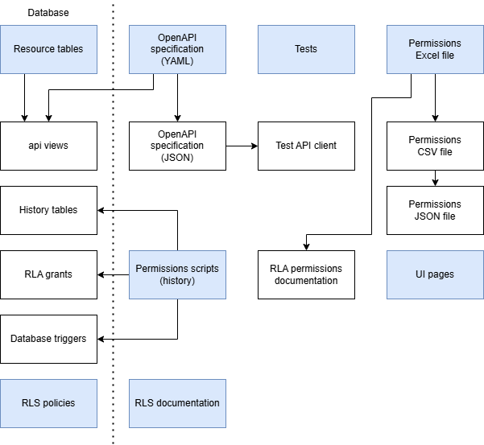

# Editing resources

The project features a lot of automation, so it is not always easy to figure out
what to edit first, and what is to be left for automated generation. The purpose
of this page is to help developers for that.

Here is the general flow of automation:



The blue boxes are the parts that should be edited by hand, and everything white
is handled by the scripts and/or `just` recipes. The rest of this page explains
the different edits to make, preferably in order.

## Editing the resource fields

The first change to make is to actually add or modify the resource. The resource
table in the `flex` SQL schema is the _raw data stored_ in the database, and the
object documented in the OpenAPI specification is the _exposed version_ that can
be seen and handled by users from the outside.

Note that the OpenAPI specification also enjoys automation, and that the manual
edits should be done in the `resources.yml` file. This file contains the exposed
fields but also drives the generation of endpoint documentation.

More detailed documentation about a resource can be added under the `x-details`
attribute. It will be included in the Markdown table of the resource.
Read-only fields and generated fields like surrogate keys should be marked as
such with the `readOnly` attribute, fields referencing other resources should be
marked with `x-foreign-key`, and non-updatable fields (fields that can be given
when creating the resource but read-only after) should be marked with
`x-no-update`. All `x-*` fields are deleted in the final OpenAPI specification
file and only there in the source YAML to inform the schema and documentation
generation procedures.

History and audit are configured by additional properties in the YAML object:

```yaml
history:
  - list
  - read
audit: true
```

The only fields that you need to add by hand are the `record_time_range` and
`recorded_by` fields if you want your resource to have audit enabled.
The other audit fields as well as anything related to history should not be
added anywhere, as all this is automatically generated, as well as the
associated endpoints in the final OpenAPI specification file.

The documentation of endpoints related to CRUD operations on the resource is
generated from the following list in the YAML object of the resource:

```yaml
operations:
  - list
  - read
  - create
  - update
  - delete
```

If an operation should not be allowed, just remove it from this list and the
associated endpoints will not be generated in the OpenAPI documentation.

## Fixing authorisation

[Authorisation](../auth.md) is done in the database, both at the _row_ level
and the _field_ level. Automation is provided after creating manually the
documentation file for the resource (a Markdown file under `docs/resources`).
This file must contain all the sections (you can start by copying another
existing resource file), but they can be empty at the beginning.

### Field-Level Authorisation (FLA)

The actual authorization of FLA is currently realized via Column Level Security
(CLS) aka
[regular GRANTs](https://www.postgresql.org/docs/current/sql-grant.html) in
Postgres. It consists in SQL grants for various roles, that are generated from a
matrix (`field X role`) in the `permissions.csv` file. This allows for easier
modification without having to dive into the code.

!!! warning

    FLA grants do not mention history, because if one can read a resource, we
    consider they should also be able to read the history. However, this means
    that the script must know for which resources to generate history grants,
    and for which resources it is not required (_i.e._, they do not have a
    history table and the grant would not compile). For this reason, history
    grants should be enabled by hand directly in the `permissions_to_*.py`
    scripts, by adding the name of the resource to the `history_enabled` list.

### Row-Level Authorisation (RLA)

RLA is realized via
[Row Level Security (RLS) in Postgres](https://www.postgresql.org/docs/current/ddl-rowsecurity.html).
The policies are hand-written in the `flex` schema. They are
implemented by hand in `_rls.sql` files next to the resource table files. They
should then be added to the imports in `flex_structure.sql` and documented in
the Markdown file associated to the resource. Part of this file is generated,
but the RLA section must be written by hand and the implementation status of
each rule should also be maintained.

!!! warning

    Test coverage of all the RLS policies is checked by looking for specific
    comments at the place of definition of the policies and use in the tests.
    Do not forget to add a comment with the name of the RLS policy on top of its
    definition, as it was done for existing resources in the project.

## Updating the tests

Once the resource and its permissions are edited, one can run the various
generation mechanisms through the associated `just` recipes (see the `justfile`
to find them). Then, in this updated state, the project should be testable.

Resource-related tests are made using the generated API client, by adding a new
file to the `test/api_client_tests` directory. All the endpoints can be called
through the generated API client, and authentication is done automatically with
a security token service object created in the setup function at the top of each
test file.

If you are adding a new resource, do not forget to add data related to this
resource in the test data package (`db/test_data`) and add the endpoint prefix
to the Schemathesis test file (`test/other_tests/test_schemathesis.py`).

## Updating the UI

Independently from the tests, but still after handling authorisation, the UI
pages can be updated.

The UI uses a `permissions.json` file for Field Level Authorization that is also
automatically generated.

> There is no such thing as frontend security. All security checks must be done
> on the backend.

... but the authorization matrix is being used on the UI side to determine what
should be displayed to the user of the flexibility information system. This
allows us to give a smoother user experience by e.g. not showing buttons that
the user does not have access to.
