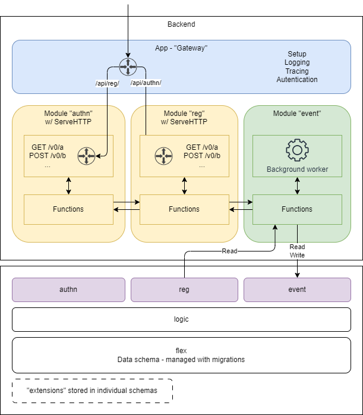

# Modular Monolith

We are building our backend as a modular monolith. If you are new to the concept
of a modular monolith you can watch
[Majestic Modular Monoliths by Axel Fontaine](https://www.youtube.com/watch?v=BOvxJaklcr0)
or read
[When (‌modular) monolith is the better way to build software](https://www.thoughtworks.com/insights/blog/microservices/modular-monolith-better-way-build-software)
or
[Microservices Killer: Modular Monolithic Architecture](https://medium.com/design-microservices-architecture-with-patterns/microservices-killer-modular-monolithic-architecture-ac83814f6862).

We are using this pattern since we are a small team and don't want the overhead
of managing multiple/many deployment units. We are aware of the risk of the
monolith becoming a big ball of mud and modularizing and setting (and enforcing)
a set of rules is a way to mitigate that.

One specific anti-patterns we are concerned about is the joined-at-the-database
monolith - see
[shared database](https://microservices.io/patterns/data/shared-database.html)
vs
[database per service](https://microservices.io/patterns/data/database-per-service.html).

## Our web presence

Lets assume that we will have multiple environments for a while. This is how we
want to structure the domains and paths. In this example, we use the domain
`register.euroflex.no` as the "main domain". For other configurations/environments,
the domain will be different.

* `register.euroflex.no` - a landing page with some information about what is going
  on. The public, default url that anyone will hit. Should provide links to the
  other resources and possibly some news/updates etc?
* `register.euroflex.no/docs/` - user documentation
* `register.euroflex.no/web/` - web interface
* `register.euroflex.no/api/` - api live here interface
* `register.euroflex.no/api/reg/` - the register api
* `register.euroflex.no/api/ts/` - a future de values API (???)
* `register.euroflex.no/api/sync/` - events, notifications, notices and
  reminders (???)
* `register.euroflex.no/api/sts/` - security token service
* `register.euroflex.no/api/authn/` - backend for frontend authentication service

Why not subdomains for the different parts? The main reason is that we want to
serve everything under the same
[authority](https://www.rfc-editor.org/rfc/rfc3986#section-3.2). This simplifies
authentication and follows the URI standard.

### Versioning of APIs

> We do not break our API! But we prepare for a future when we have to 😉

We want to achieve this through
[rolling versions](https://www.getconvoy.io/blog/rolling-versions) as [decribed
by Stripe](https://stripe.com/blog/api-versioning). For some pointers on what is
breaking changes or not, github has a nice list of some
[common breaking and non-breaking changes](https://docs.github.com/en/rest/about-the-rest-api/api-versions).

We are versioning our API with major version in the path. Even Stripe eventually
moved on from `v1` og `v2`, so having the major version in the path provides
some future-proofing and gives us more freedom to change in the future. This
means that we put `/v0/` in the path since the api is currently unstable and
breaking changes will happen frequently. Once we stabilize the functionality we
need to move quickly to `v1` but preserve our ability to change and introduce
unstable parts of the api. We want to use the URL path to indicate major version
since it is very clear an common. Other options like using headers/content
negotiation or query parameters are less clear and makes the API less
approachable.

For new or experimental feature we can make use of the [golang.org package way
of communicating compatibility](https://pkg.go.dev/golang.org/x). In practice,
this mean putting a `/x/` in the path of anything unstable. Once stable, we
remove the `/x/` and users can trust that the API will not change in a breaking
way.

## Our take on a modular monolith

There are many ways to implement a modular monolith. It depends on tech stack
among other things. We are writing our monolith in Go on top of a PostgreSQL
database. We are also exposing our API via PostgREST and plan to transition away
from that (write the API in Go) over time.

This is how we are currently structuring our monolith *with some sample
modules shown*.

These are the general rules we follow:

* Each module "owns" a set of resources.
* HTTP serving modules have a server object with its own router that serves
  those resources.
* Background worker modules have workers that listen replication slots on the
  database.
* Modules interact with each other through functions defined in the other
  modules.
* We have a common database pool for all modules.
* We pass the `tx` and `ctx` around when calling other modules.
* The module is responsible for the tables that backs those resources in a
  common schema in the database. This schema is our "data schema" and managed
  via migrations.
* There is a logic schema that contains data logic for the tables in the data
  schema. This is where we put triggers, functions etc.
* Each module has its own API schema with defined views and functions where the
  module can read and manipulate the resources it controls.
* Both the logic and api schemas are dropped and recreated on each deployment.
* No module should access the common schema directly. All access must be
  through the module's schema to enforce encapsulation and access control.
* No module should mix SQL code and business logic. All interactions with the
  database should be carried out through methods of a `models` package local to
  the module. Some of these local packages are generated with automated tools
  like [sqlc](https://sqlc.dev/).
* Modules can *read* from the schema of another module to faciliate efficient
  data retrieval/joins. We consider the views and functions as part of the
  public API of the module.
* Modules can *write* to the schema of another module only through the public
  API of that module. This is to ensure that the module that owns the resource
  can enforce business rules and invariants.
* Modules must not interact with internal functionality of other modules.
