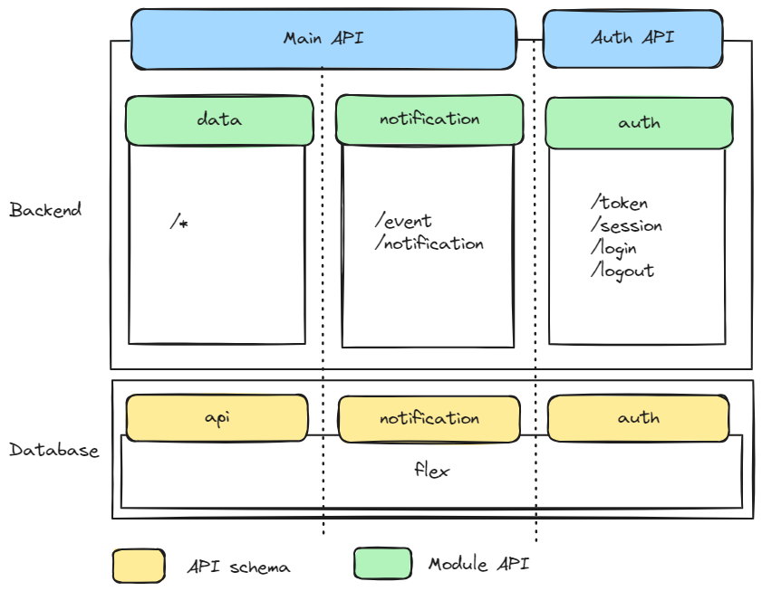

# Modular Monolith

We are building our backend as a modular monolith. If you are new to the concept
of a modular monolith you can watch
[Majestic Modular Monoliths by Axel Fontaine](https://www.youtube.com/watch?v=BOvxJaklcr0)
or read
[When (‌modular) monolith is the better way to build software](https://www.thoughtworks.com/insights/blog/microservices/modular-monolith-better-way-build-software)
or
[Microservices Killer: Modular Monolithic Architecture](https://medium.com/design-microservices-architecture-with-patterns/microservices-killer-modular-monolithic-architecture-ac83814f6862).

We are using this pattern since we are a small team and don't want the overhead
of managing multiple/many deployment units. We are aware of the risk of the
monolith becoming a big ball of mud and modularizing and setting (and enforcing)
a set of rules is a way to mitigate that.

One specific anti-patterns we are concerned about is the joined-at-the-database
monolith - see
[shared database](https://microservices.io/patterns/data/shared-database.html)
vs
[database per service](https://microservices.io/patterns/data/database-per-service.html).

## Our take

There are many ways to implement a modular monolith. It depends on tech stack
among other things. We are writing our monolith in Go on top of a PostgreSQL
database. We are also exposing our API via PostgREST and plan to transition away
from that (write the API in Go) over time.

This is how we are currently structuring our monolith.

These are the general rules we follow:

* Each module "owns" a set of resources.
* The module is responsible for the tables that backs those resources in a
  common schema in the database.
* Each module has its own schema with defined views and functions where the
  module can read and manipulate the resources it controls.
* No module should access the common schema directly. All access should be
  through the module's schema to enforce encapsulation and access control.
* No module should mix SQL code and business logic. All interactions with the
  database should be carried out through methods of a `models` package local to
  the module. Some of these local packages are generated with automated tools
  like [sqlc](https://sqlc.dev/).
* Modules can _read_ from the schema of another module to faciliate efficient
  data retrieval/joins. We consider the views and functions as part of the
  public API of the module.
* Modules can _write_ to the schema of another module only through the public
  API of that module. This is to ensure that the module that owns the resource
  can enforce business rules and invariants.
* Modules should not interact with internal functionality of other modules.
