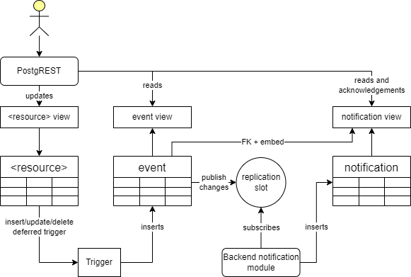

# Notification

The system notifies parties about changes to the data. This page details the
design of the notification functionality.

> [!NOTE] TL;DR;
> We are doing event notification via pull based mechanisms.

## Event notification

The notification functionality is based on the **event notification** pattern.

An **event** is *a thing that happens in the system*. For us, that means a
change in data. An event could be that controllable unit A was updated.

A **notification** is *an alert that informs someone of something*. With event
notification, that something is an event. An email sent to tell party X that
controllable unit A was updated is an event notification.

The event notification does not include any data or the change itself. It just
informs that something happened. The client must call our API to ask for the
updated data. This is in contrast to the **event-carried state transfer**
pattern, where the notification includes the data that changed. For a primer on
these concepts see
[DigDirs Arkitektur for hendelser](https://www.digdir.no/digital-samhandling/arkitektur-hendelser-i-felles-okosystem/4692).

Our reasons for choosing event notification over event-carried state transfer are:

- it is simple to implement both for us and the client
- simplifies data access mechanisms by forcing access to data to go through API calls

The main downside is increased network traffic and latency due to the need for an
additional API call to get the updated data.

## Event resource

The events are presented to the clients as a resource, available on the API.

The event resource is based on the
[CloudEvents spec](https://github.com/cloudevents/spec/blob/main/cloudevents/primer.md).
The fields are from the
[CloudEvents attributes](https://github.com/cloudevents/spec/blob/v1.0.2/cloudevents/spec.md#required-attributes).
We diverge from the spec by having an *integer* `id` field. CloudEvents requires
*string* but we are using integer to be consistent with the rest of the system.
The `data` field is empty/unspecified, but could be used to include additional
information about the event. In the database it's just a JSONB column.

We are not adding any "extension attributes". But will consider adding it in the
future if it makes sense e.g. for filtering.

As an example `GET /event?source=eq.%2Fcontrollable_unit%2F12345`
will get events for a specific controllable unit. `%2F` is URL encoded `/`.

```json
[{
  "specversion": "1.0",
  "source": "/controllable_unit/12345",
  "type": "no.elhub.flex.controllable_unit.update",
  "id": 1234,
  "time": "2023-10-01T12:34:56Z",
  "data": {},
}]
```

## Pull based notifications

We are providing a pull-based notification system. This means that the client
must poll our API to get the notifications. Each market party has its own
"queue". We do not expect a direct response from the recipient of the
notification, apart from an acknowledgement that the notification was received.
The acknowledgement is needed because the FIS must know that it has fulfilled
its obligation to inform the party about the change (and possibly purge old
notifications). We do expect clients to act on the notification according to the
defined business processes.

Clients use `GET /notification?acknowledged=eq.false&limit=1&order=id` to get
notifications. The result is filtered based on resource level authorization, so
a party is only able to query only its own notifications.

```json
[{
  "id": 1,
  "party_id": 123,
  "acknowledged": false,
  "event_id": 1234,
  "recorded_by": 0,
  "recorded_at": "2023-10-01T12:35:56Z"
}]
```

The notification is an "envelope" around an event, that basically tracks who the
recipient is and if they acknowledged it or not. We require the client to look
up the actual event by calling `GET /event?id=eq.1234`. To avoid this extra
chattyness/roundtrip, PostgREST
[resource embedding](https://docs.postgrest.org/en/latest/references/api/resource_embedding.html)
can be used. We will also consider actually embedding the event in the
notification every time.

The client must acknowledge the notification by calling
`PATCH /notification?id=in.(1,2,3)` with `{ "acknowledged" : true }`.

> [!NOTE]
> We might add a push-based system in the future. This could e.g. include email or
> webhooks. Acknowledgement would still be needed.

## Picking recipients

The recipients of the notifications are picked based on the event and the
notification policy for the resource. The notification policy is documented on
the resource. It is important that there is no assumption about who did the
change when defining and implementing the policy. The recipients should be
picked, independent of who did the change. The system will then filter the
recipient list and not send the notification to the one who did the change.
Reasoning:

> ![INFO] Reasoning
> Even though it is common that SP creates a resource that "belongs to" them, it
> might not always be the case. In some cases it might be a system user or FISO,
> or rules might change in the future. If we do not include the SP in the
> recipient list, they will miss any notifications about the newly created
> resource.

To pick the recipients, we must use the `_history` version of the resource and
pick the recipents based on the state of the resource at the time of the event.
There is no garantuee that the resource is still in the same state when the
event is processed and notification is sent, and also deleted resources will not
be present in the regular resource view.

> [!TIP]
> In some cases it might be possible to use the current state of the
> resource, but this can only be done if the field is non-updatable and the
> resource cannot be deleted.

Since we are capturing the event in the same transaction as the change, we can
use the `time` of the event to pick the correct version of the resource, both in
relation to record and valid time (where relevant).

> [!NOTE] Clusivity on record time
> Special care must be taken when the event is a delete event or the change
> could update the recipient of the notification. In those cases, the regular
> `[)` clusivity of the record time might not be suited, and we might want to
> use the `[]` clusivity when matching on event time.

## Delivery, processing and ordering guarantees

The notification system provides an at least once delivery guarantee. This means
that the notifications will be delivered at least once, but might be delivered
multiple times. This can happen if a client asks for notifications before
acknowledgements for previously requested notifications have been received
and committed.

It is recommended that the client runs a single consumer instance to avoid
duplicate deliveries. Duplicate acknowledgements are not accepted so having
several consumers could cause errors and degrade client-side user experience.

Ordering of notifications is guaranteed by having a single process that reads
events to produce notifications. Events can be ordered by the `id` field and it
can be used as a "high water mark" as a light weight way to keep track of what
has been processed or not. The acknowledged field is the actual way to keep
track.

## Retention

The notifications are stored indefinitely in the system, but the storage is
partitioned so that it is possible to easily remove old notifications if that is
required in the future.

## Future improvements

The following are some ideas for future improvements or changes to the
notification system.

1. Use HTTP Headers such as `Etag`, `Last-Modified` or `If-Modified-Since` to
   facilitate polling.
2. Use HTTP Headers such as `Etag` and `If-Match` to facilitate [optimistic
   concurrency control](https://blog.4psa.com/rest-best-practices-managing-concurrent-updates/).

## Implementation



An event in the system is detected and persisted via a trigger based
[transactional outbox pattern](https://microservices.io/patterns/data/transactional-outbox.html).
When a relevant event occurs, a trigger is fired that inserts a row in an event
table. We are using triggers to make the event handling transparent to the
application code changing the data. Also, PostgREST is limited in its ability to
customize transactions.

To read the data from the event table to create notifications, we use a
[logical replication](https://www.postgresql.org/docs/current/logical-replication.html)
and a worker in the custom backend to identify recipients and insert
notifications. The worker is defined in the `worker` package, and connects to
the replication slot by using the `pgrepl` package.

We are doing this in an external worker since to allow for
flexibility to add other notification mechanisms as well as being able to
offload the "identify recipients" read load to a future read replica database.
In the database, we store the notification with a foreign key to the event, but
in the API/view we embed it.
