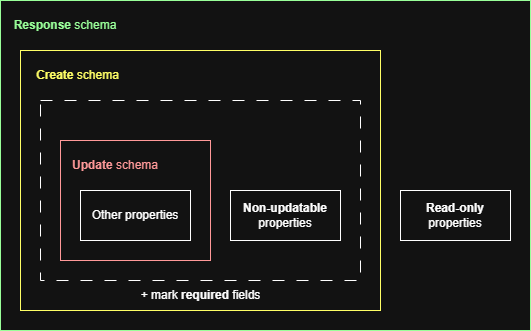
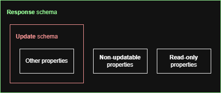
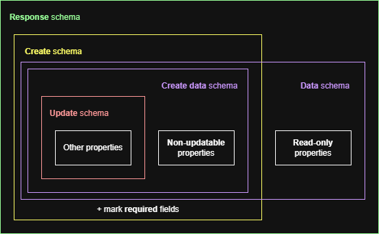

# Structure of JSON schemas in the OpenAPI documentation

The JSON schemas describing the resources in the OpenAPI documentation are
generated mainly from the `resources.yml` file, by running the
`template_to_openapi.py` script.

We try as much as possible not to repeat ourselves in this document.
In particular, fields of a given resource should be defined only once, and if
fields are in common between several API endpoints, this should be reflected in
the use of _inclusion_ between the underlying JSON schemas.
This documentation helps the developer understand how the JSON schemas are
structured, and also allows them to walk through and maintain the script
generating them more easily.

## Primer

In the resource YAML file, fields can be marked namely in the following manners:

| Marker        | Description                                                                                                                                                                                                |
|---------------|------------------------------------------------------------------------------------------------------------------------------------------------------------------------------------------------------------|
| `x-no-update` | _Non-updatable_ field. Used for stuff that can/must be given on create, but that cannot be changed after. `x-` marker because this is non-standard OpenAPI and is just used during the generation process. |
| `readOnly`    | _Read-only_ field. Used for non-updatable fields that cannot be created by the API clients.                                                                                                                |
| `nullable`    | _Nullable_ field.                                                                                                                                                                                          |
| `default`     | Field with a _default value_.                                                                                                                                                                              |

In addition, we define _required_ fields as the following:

> NOT read only
> AND NOT nullable
> AND NO default value
> AND NOT explicitely marked `required: false`

This allows not having to define `required` everywhere and rather infer it from
more meaningful information that we make explicit in the resource YAML file.

## Base JSON schema structure

With the previous information, we can now show the basic structure of JSON
schemas generated by our script:

The smallest schema is the **update** schema, that contains all properties
_except_ the _non-updatable_ and _read-only_ ones (so basically all the
properties that can change over time).

The **create** schema is obtained by adding the _non-updatable_ fields and
marking the _required_ fields based on our definition above.

Finally, the **response** schema is obtained by adding the _read-only_ fields.

Sometimes, there is no create operation for the resource.
In such cases, it makes no sense to create a **create** schema, because it would
just be confusing to read for the user.
Therefore, we adopt the following, simplified generation strategy:

## Data schemas

Some resources have to get their response schema included in other schemas, for
instance in situations where we use _embedding_, like in the data of _notices_.
In such a case, we want to ignore all required annotations, because we may
perform only a partial embedding for instance, returning only part of a
resource's data.

However, OpenAPI does not seem to offer an easy mechanism to override (and thus
erase) `required` field lists.
Therefore, we follow an alternative generation strategy, where we define
**data schemas**, which are basically the **create** and **response** schemas,
but without any annotations for the _required_ fields:

Data schemas are called after the name of the resource, without suffix.
For instance, embedding `party` data in another field should be possible by
referencing the `party` schema.

If the resource does not have a create operation, the **data** schema is
_equivalent_ to the base **response** schema.

## Generation of data schemas

We do not generate all data schemas by default, as non-referenced schemas lead
to linting errors on the final OpenAPI specification.
Instead, we generate them only when the `generate_data_schema` option is
turned on for the resource in the resource YAML file.
