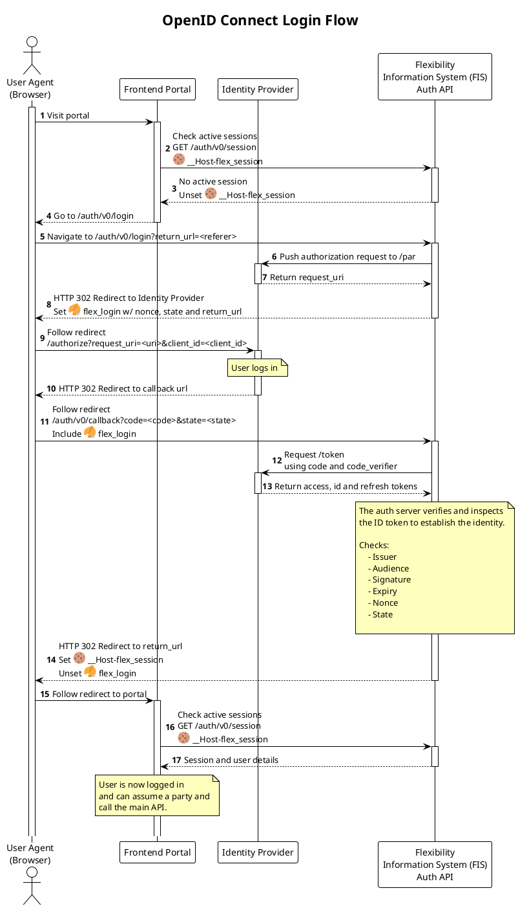
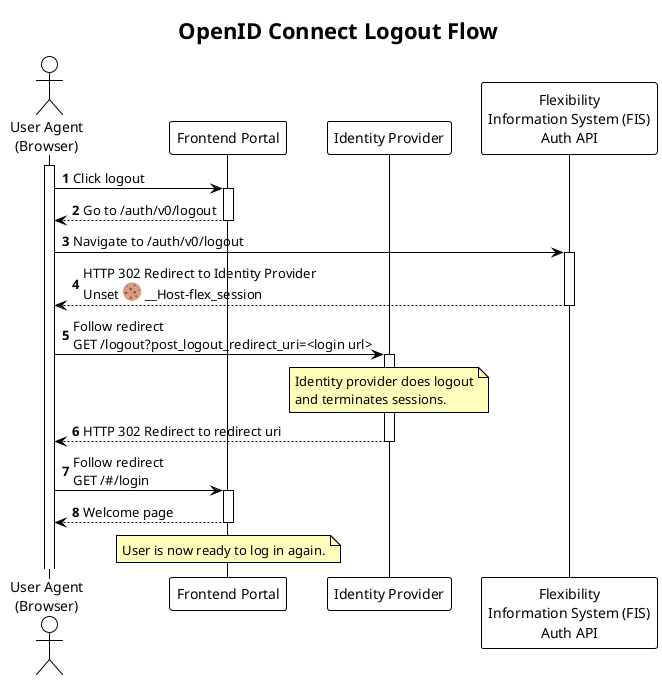

# OpenID Connect

This document contains some information about how we deal with and implement the
OpenID Connect protocol for login in portal.

## Overview

We will probably use
[IDPorten](https://docs.digdir.no/docs/idporten/oidc/oidc_auth_spa) as the
identity provider for persons using the production system via the portal.
IDPorten is based on OpenID Connect (OIDC).

In local dev we are using a OIDC compliant mock solution called
[Authelia](https://www.authelia.com/), while in external test environments, we
are using
[Oracle Cloud Identity and Access Management (IAM)](https://docs.oracle.com/en-us/iaas/Content/Identity/getstarted/identity-domains.htm)
(OCI IAM).

In this diagram with refer to these solutions as the _Identity Provider_ (IDp).

## Token-Mediating Backend pattern

We are following the pattern known as
[Token-Mediating Backend](https://datatracker.ietf.org/doc/html/draft-ietf-oauth-browser-based-apps#name-token-mediating-backend),
where our backend acts as a mediator between the frontend and IDPorten, but
compared to the
[Backend For Frontend](https://datatracker.ietf.org/doc/html/draft-ietf-oauth-browser-based-apps#name-backend-for-frontend-bff)
(BFF) the frontend will exchange the session cookie for an access token and use
that towards the API. We might consider using the BFF pattern in the future, but
since we are using PostgREST to serve our APIs its easier for us to deal with
actual access tokens rather than opaque session cookies as the moment.

We are using the OpenID Connect Authorization Code Flow with Proof Key for Code
Exchange (PKCE) and
[Pushed Authorization Requests](https://datatracker.ietf.org/doc/html/draft-ietf-oauth-par-06)
(PAR).

The folloing diagram shows the sequence of OIDC login and the token mediating backend.

## Logout

Logout is also done via redirects between the Identity provider and the frontend.

The following diagram shows the sequence of OIDC logout.

## Ensuring compatibility between IDPorten and our mock/test IDP

The IDPorten OpenID Connect provider is picky about quite a few things. E.g. it
only supports the `RS256` alg, recommends PAR and stores the personal ID number
in a non-standard claim.

Our mock solution [Authelia](https://www.authelia.com/) and test solution
[OCI IAM](https://docs.oracle.com/en-us/iaas/Content/Identity/getstarted/identity-domains.htm)
are slightly different to IDPorten.

### OpenID configuration

One way to check the support of a given OpenID Connect provider is to check its
`/.well-known/openid-configuration` endpoint. The Authelia (local), OCI IAM and
IDporten endpoints are:

<!-- markdownlint-disable no-bare-urls -->
* http://idp.flex.localhost:9091/.well-known/openid-configuration
* https://idporten.no/.well-known/openid-configuration
* https://auth.bankid.no/auth/realms/prod/.well-known/openid-configuration
* https://idcs-64b43b9cb198438ca17360d2c5bd4b9f.identity.oraclecloud.com/.well-known/openid-configuration

We include BankID in the list just for reference.

### ID token format and claims

The ID token format at IDPorten is
[well documented](https://docs.digdir.no/docs/idporten/oidc/oidc_protocol_id_token).
The most important claim is `pid` - the Norwegian national ID number
(fødselsnummer/d-nummer) of the autenticated end user. This information is
stored in other claims in the other two solutions:

| Solution | Claim                | Description                             |
|----------|----------------------|-----------------------------------------|
| Authelia | `preferred_username` | The username of the authenticated user. |
| OCI IAM  | `sub`                | The subject of the authenticated user.  |
| IDPorten | `pid`                | Custom claim                            |

### Logout endpoints

The logout endpoints are also a bit different. The biggest differece is that
Authelia actually does not fully support the OIDC logout flow yet, but it has
enough functionality to "make it work".

| Solution | Logout endpoint         | OIDC logout support | Redirect uri parameter     |
|----------|-------------------------|---------------------|----------------------------|
| Authelia | `/logout`               | no                  | `rd`                       |
| OCI IAM  | `/oauth2/v1/userlogout` | yes                 | `post_logout_redirect_uri` |
| IDPorten | `/logout`               | yes                 | `post_logout_redirect_uri` |

!!! note "IDPorten logout not fully implemented"

    We have **not** built all the things we need to support
    [logout using IDPorten](https://docs.digdir.no/docs/idporten/oidc/oidc_protocol_logout.html).
    Like `id_token_hint` and front channel logout.

## OpenID Connect Go libraries

We are building the flow in our Go backend. There are a few OIDC libraries
available for Go. The most noticable ones are:

* https://github.com/zitadel/oidc
* https://github.com/coreos/go-oidc

Both of these build on
[golang.org/x/oauth2](https://pkg.go.dev/golang.org/x/oauth2) and provide an
opinionated API on top.

One of the general problems we face is that support for PAR is not there yet ( ref
[x/oauth2](https://github.com/golang/go/issues/65956),
[coreos/oidc](https://github.com/coreos/go-oidc/issues/409)
).

We have decided to roll-our-own OIDC client leaning directly on `x/oauth2` and
leveraging some nice features of the `lestrrat-go/jwx` library for JOSE
handling. The `jwx` library provides handy functions for caching remote JWKs and
signing/validating ID and access tokens.

## Test user creation in Identity Providers

Test user creation in is manual in the authelia `users.yml` file.
