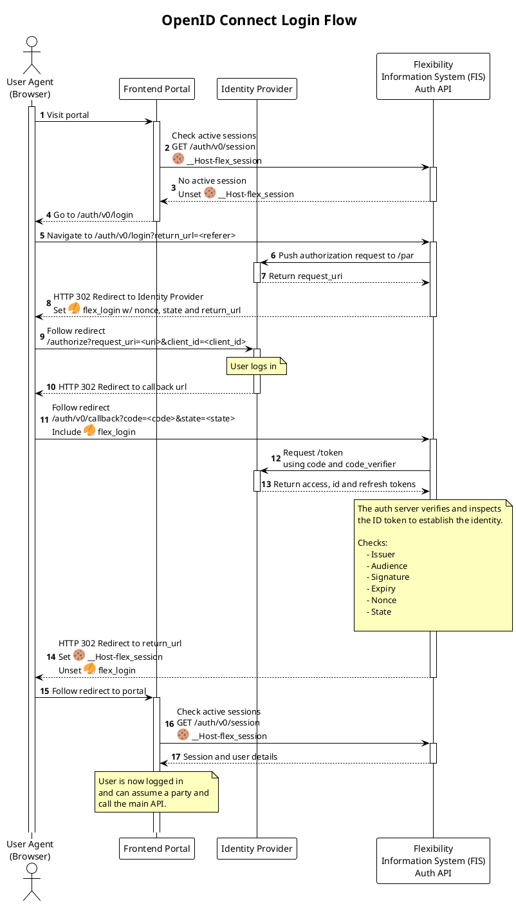
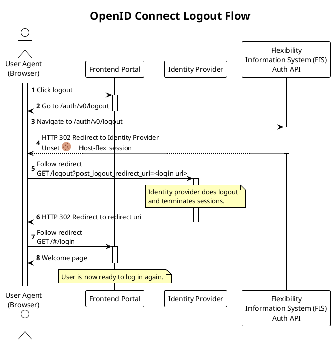

# Sessions

This document contains some information about how we deal with sessions and
implement the OpenID Connect protocol for login in portal.

## Overview

We will probably use
[IDPorten](https://docs.digdir.no/docs/idporten/oidc/oidc_auth_spa) as the
identity provider for persons using the production system via the portal.
IDPorten is based on OpenID Connect (OIDC).

In local dev we are using a OIDC compliant mock solution called
[Authelia](https://www.authelia.com/), while in external test environments, we
are using
[Oracle Cloud Identity and Access Management (IAM)](https://docs.oracle.com/en-us/iaas/Content/Identity/getstarted/identity-domains.htm)
(OCI IAM) and [Microsoft Azure Entra B2C](https://learn.microsoft.com/nb-no/entra/identity-platform/v2-protocols-oidc#fetch-the-openid-configuration-document).

In this diagram with refer to these solutions as the _Identity Provider_ (IDp).

## Backend For Frontend (BFF)

We are following the pattern known as
[Backend For Frontend](https://datatracker.ietf.org/doc/html/draft-ietf-oauth-browser-based-apps#name-backend-for-frontend-bff)
(BFF). To avoid having to deal with "sticky sessions", we are implementing using
"client-side sessions" as described. The cookie setting following the cookie
security recommendations, inlcuding the
[`__Host-` prefix.](https://datatracker.ietf.org/doc/html/draft-ietf-httpbis-rfc6265bis-19#name-the-__host-prefix).

We are using the OpenID Connect Authorization Code Flow with Proof Key for Code
Exchange (PKCE) and
[Pushed Authorization Requests](https://datatracker.ietf.org/doc/html/draft-ietf-oauth-par-06)
(PAR).

The following diagram shows the sequence of OIDC login and the BFF.

## Logout

Logout is also done via redirects between the Identity provider and the frontend.

The following diagram shows the sequence of OIDC logout.

## Assuming party

After the user has logged in, the user must
[assume a party](../docs/technical/auth.md#assuming-party). The `/assume`
endpoint is used by the frontend for this purpose.

## Ensuring compatibility between IDPorten and our mock/test IDP

The IDPorten OpenID Connect provider is picky about quite a few things. E.g. it
only supports the `RS256` alg, recommends PAR and stores the personal ID number
in a non-standard claim.

Our mock solution [Authelia](https://www.authelia.com/) and test solution
[OCI IAM](https://docs.oracle.com/en-us/iaas/Content/Identity/getstarted/identity-domains.htm)
are slightly different to IDPorten.

### OpenID configuration

One way to check the support of a given OpenID Connect provider is to check its
`/.well-known/openid-configuration` endpoint. The Authelia (local), OCI IAM and
IDporten endpoints are:

<!-- markdownlint-disable no-bare-urls -->
* https://idp.flex.internal:9091/.well-known/openid-configuration
* https://idporten.no/.well-known/openid-configuration
* https://idcs-64b43b9cb198438ca17360d2c5bd4b9f.identity.oraclecloud.com/.well-known/openid-configuration
* https://login.microsoftonline.com/common/v2.0/.well-known/openid-configuration

The `common` part in the Entra url will be replaced by the tenant ID in a real
setup.

### ID token format and claims

The ID token format at IDPorten is
[well documented](https://docs.digdir.no/docs/idporten/oidc/oidc_protocol_id_token).
The most important claim is `pid` - the Norwegian national ID number
(fødselsnummer/d-nummer) of the autenticated end user. This information is
stored in other claims in the other two solutions:

| Solution | Claim                | Description                             |
|----------|----------------------|-----------------------------------------|
| Authelia | `preferred_username` | The username of the authenticated user. |
| OCI IAM  | `sub`                | The subject of the authenticated user.  |
| IDPorten | `pid`                | Custom claim                            |
| Entra    | `preferred_username` | The email of the authenticated user.    |

> [!NOTE]
>
> We really
> [shouldn't use the `preferred_username` claim to identify the user](https://learn.microsoft.com/nb-no/entra/identity-platform/id-token-claims-reference#use-claims-to-reliably-identify-a-user).
> We are doing it because it is simple, but we should move to using the
> `sub`/`oid` claim.

### Logout endpoints

The logout endpoints are also a bit different. The biggest differece is that
Authelia actually does not fully support the OIDC logout flow yet, but it has
enough functionality to "make it work".

| Solution | Logout endpoint         | OIDC logout support | Redirect uri parameter     |
|----------|-------------------------|---------------------|----------------------------|
| Authelia | `/logout`               | no                  | `rd`                       |
| OCI IAM  | `/oauth2/v1/userlogout` | yes                 | `post_logout_redirect_uri` |
| IDPorten | `/logout`               | yes                 | `post_logout_redirect_uri` |
| Entra    | `/oauth2/v2.0/logout`   | yes                 | `post_logout_redirect_uri` |

!!! note "IDPorten logout not fully implemented"

    We have **not** built all the things we need to support
    [logout using IDPorten](https://docs.digdir.no/docs/idporten/oidc/oidc_protocol_logout.html).
    Like `id_token_hint` and front channel logout.

## OpenID Connect Go libraries

We are building the flow in our Go backend. There are a few OIDC libraries
available for Go. The most noticable ones are:

* https://github.com/zitadel/oidc
* https://github.com/coreos/go-oidc

Both of these build on
[golang.org/x/oauth2](https://pkg.go.dev/golang.org/x/oauth2) and provide an
opinionated API on top.

One of the general problems we face is that support for PAR is not there yet ( ref
[x/oauth2](https://github.com/golang/go/issues/65956),
[coreos/oidc](https://github.com/coreos/go-oidc/issues/409)
).

We have decided to roll-our-own OIDC client leaning directly on `x/oauth2` and
leveraging some nice features of the `lestrrat-go/jwx` library for JOSE
handling. The `jwx` library provides handy functions for caching remote JWKs and
signing/validating ID and access tokens.

## Test user creation in Identity Providers

Test user creation in is manual in the authelia `users.yml` file.
