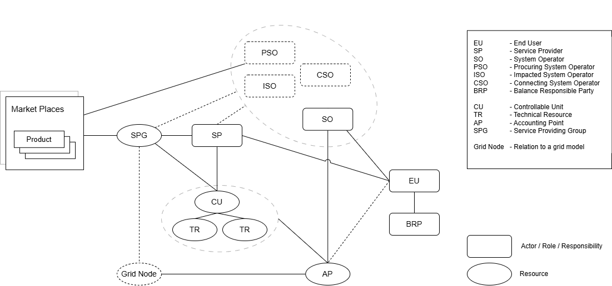

# Conceptual Model and Terminology

This section provides a common understanding of the
key concepts used in the Flexibility Information System (FIS) documentation.

It explains how roles, responsibilities, and resources are represented in the
FIS conceptual model and how they relate to each other.

By understanding the concepts introduced here, users can better interpret the
data model, [API resources](../resources/index.md), and [process descriptions](../processes/index.md)
presented elsewhere in the documentation.

The simplified conceptual model below illustrates some of the most central
concepts in the FIS and the relations between them. The model serves as an
overview when we introduce concepts and abbreviations throughout the documentation.

The conceptual model is based on terminology from the Network Code on Demand
Response (NC DR) and in the concept pages we describe how we have chosen to interpret
these concepts so far.

We start introducing the origin of flexibility in the
controllable resources that represent the flexibility that FIS seeks to unlock and
coordinate across the system.

## What is a controllable unit?

A *controllable unit* (CU) is a unit in the power system that can be
actively controlled to produce, consume, or store electricity.

A CU can be:

* Power-generating module: a unit that *produces* electricity, such as a power
plant or a wind farm.

* Demand unit: an electrical installation that *consumes* electricity,
such as an industrial boiler or an EV charger.

* Energy storage system: a unit that can both *produce and consume* electricity,
  such as a battery that charges and discharges depending on system needs.

### Controllable units and technical resources

Each CU consists of one or more *technical resources* (TRs). A TR is the
physical device that generates, consumes, or stores electricity. The CU
represents the logical control and metering interface for these resources, which
all relate to the same accounting point.

### Connection to an accounting point

In FIS, each controllable unit is connected to a single accounting point (AP).
This ensures an unambiguous link between the CU and the balance responsible
party (BRP) of the associated energy supplier (ES), which enables imbalance
adjustment and settlement.

The AP also provides the locational reference for the CU.
System operators (SOs) use this reference to associate the AP with
the corresponding *grid node*, enabling them to identify where flexibility can be
activated in the grid.

## A service providing group is a collection of controllable units

A *service providing group* (SPG) is a collection of CUs.
The CUs are grouped together within a scheduling area by a service provider (SP)
to deliver certain services (like balancing or congestion management).

## Example with EV smart charges

The diagram below illustrates how CUs and a SPG are related in the context of
EV smart charging.

Each charging site is a CU. All chargers at the same site are connected
behind the same accounting point and are operated under a common control
module. These chargers are the technical resources that make up the CU.

The CUs are then grouped by a service provider, forming a SPG. The SPG acts as the
interface between the SP and the SO, offering services such as balancing or
congestion management.

Each CU (charging site) can respond individually to control signals,
while the SPG coordinates all sites to deliver a joint service to the power system.

!!! info "CU and SPG definitions in the Network Code on Demand Response (NC DR)"

    The definitions below are based on the NC DR, where the following definitions apply:

    Article 2:
    (21) 'controllable unit' or 'CU' means a single power-generating module and/or demand unit pursuant to Article 2(5) of
    [RfG NC 2.0] and Article 2(4) of [DC NC 2.0];

    (26) 'service providing group' or 'SPG' means an aggregation of controllable units or service providing units connected
    to more than one connection agreement point within the same scheduling area. SPG is defined by the service provider
    to provide balancing or local services;
  
    The NC DR also includes a definition of a 'service providing unit' (SPU) as a single unit connected to one connection
    agreement point. In FIS, a SPU is treated as an SPG where all CUs are connected to the same connection point.

    Find the current version of the network code here: [Network Code on Demand Response](../index.md#network-code-on-demand-response-nc-dr).

## Relevant resources in the API

The terms controllable unit, service providing group, and technical resource
correspond to specific resource types in FIS.

See the individual resource descriptions for detailed data structure and field definitions:

* [Controllable Unit](../resources/controllable_unit.md)
* [Service Providing Group](../resources/service_providing_group.md)
* [Technical Resource](../resources/technical_resource.md)
* [Accounting Point](../resources/accounting_point.md)
