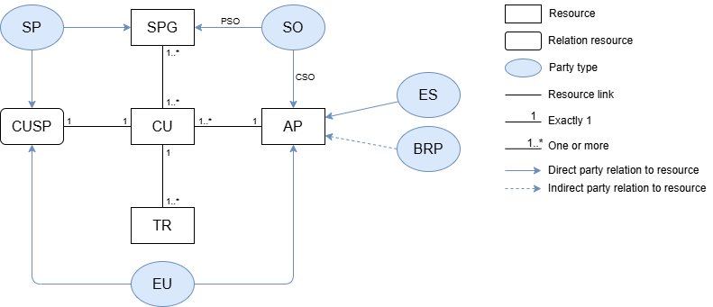
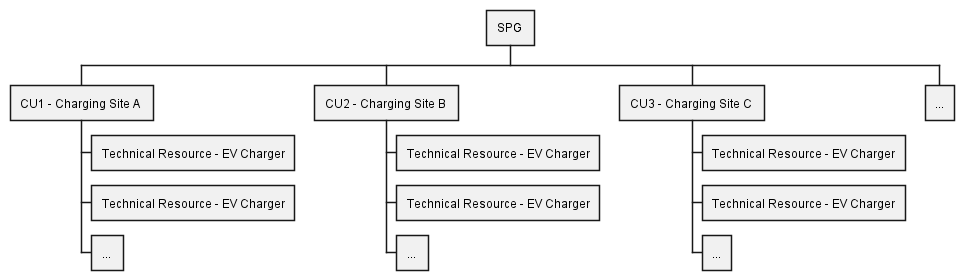

# Conceptual Model and Terminology

This section provides a common understanding of the
key concepts used in the Flexibility Information System (FIS) documentation.

It explains how party types and resources are represented in the
FIS conceptual model and how they relate to each other.

By understanding the concepts introduced here, users can better interpret the
data model, [API resources](../resources/index.md), and [process descriptions](../processes/index.md)
presented elsewhere in the documentation.

## The conceptual model

The simplified conceptual model below illustrates some of the most central
concepts in the FIS and the relations between them. The model serves as an
overview when we introduce concepts and abbreviations throughout the documentation.

The conceptual model is based on terminology from the [Network Code on Demand
Response](../index.md#network-code-on-demand-response-nc-dr) (NC DR) and in the concept
pages we describe how we have chosen to interpret these concepts so far.

### Abbriviations

| Abbriviation | Concept                                                                                             |
|--------------|-----------------------------------------------------------------------------------------------------|
| SPG          | [Service Providing Group](../resources/service_providing_group.md)                                  |
| CU           | [Controllable Unit](../resources/controllable_unit.md)                                              |
| TR           | [Technical Resource](../resources/technical_resource.md)                                            |
| AP           | [Accounting Point](../resources/accounting_point.md)                                                |
| EU           | [End User](end-user.md)                                                                             |
| ES           | [Energy Supplier](../technical/auth.md#energy-supplier)                                             |
| SP           | [Service Provider](../technical/auth.md#service-provider)                                           |
| BRP          | [Balance Responsible Party](../technical/auth.md#balance-responsible-party)                         |
| SO           | [System Operator](../technical/auth.md#system-operator)                                             |
| PSO          | [Procuring System Operator](../technical/auth.md#system-operator)                                   |
| CSO          | [Connecting System Operator](../technical/auth.md#system-operator)                                  |
| CUSP         | [Controllable Unit Service Provider](../resources/controllable_unit_service_provider.md) (contract) |

### Notation

We are using the following notation:

* `rectangles` - resource
    * `rounded` - membership resource
* `line` - resource link
* `numbers near line ends` – cardinality, indicating how many instances can
be related
    * `1` – exactly one
    * `1..*` – one or more
* `blue ellipses` - party type
* `blue arrows` - dependencies between processes
    * `solid` - direct party relation to resource
    * `dotted` - indirect party relation to resource

## What is a controllable unit?

We start introducing the origin of flexibility in the
controllable units that FIS seeks to coordinate across the system.

NC DR defines a controllable unit like this:

> Article 2:
>
> (21) 'controllable unit' or 'CU' means a single power-generating module and/or
> demand unit pursuant to Article 2(5) of [RfG NC 2.0] and Article 2(4) of
> [DC NC 2.0];

A [*controllable unit*](../resources/controllable_unit.md) (CU) is a unit in the
power system that can be actively controlled to produce, consume, or store
electricity, and is therefore a source of flexibility in the system.

A CU can be:

* Power-generating module: a unit that *produces* electricity, such as a power
plant or a wind farm.

* Demand unit: an electrical installation that *consumes* electricity,
such as an industrial boiler or an EV charger.

* Energy storage system: a unit that can both *produce and consume* electricity,
  such as a battery that charges and discharges depending on system needs.

### Controllable units and technical resources

Each CU consists of one or more
[*technical resources*](../resources/technical_resource.md) (TRs). A TR is a
physical device that generates, consumes, or stores electricity. The CU
represents the logical control and metering interface for these resources, which
all relate to the same accounting point.

### Connection to an accounting point

In FIS, each controllable unit is connected to a single
[accounting point](../resources/accounting_point.md) (AP).
This ensures an unambiguous link between the CU and the [balance responsible
party](../technical/auth.md#balance-responsible-party) (BRP) of the associated
[energy supplier](../technical/auth.md#energy-supplier) (ES), which enables
imbalance adjustment and settlement.

The AP also provides the locational reference for the CU.
[System operators](../technical/auth.md#system-operator) (SOs) use this
reference to identify where flexibility can be activated in the grid.

## A service providing group is a collection of controllable units

NC DR defines a service providing group like this:

> Article 2:
>
> (26) 'service providing group' or 'SPG' means an aggregation of controllable
> units or service providing units connected to more than one connection
> agreement point within the same scheduling area. SPG is defined by the service
> provider to provide balancing or local services;

A [*service providing group*](../resources/service_providing_group.md) (SPG) is
a collection of CUs. The CUs are grouped together within a scheduling area by a
[service provider](../technical/auth.md#service-provider) (SP) to deliver
certain services (like balancing or congestion management).

> [!NOTE]
>
> The NC DR also includes a definition of a 'service providing unit' (SPU) as a
> single unit connected to one connection agreement point. We do not include SPU
> in the FIS. We do not see a reason for this distinction and have thus not
> modelled it in.

## Example with EV smart charges

The diagram below illustrates how CUs and a SPG are related in the context of
EV smart charging.

Each charging site is a CU. All chargers at the same site are connected
behind the same AP and are operated under a common control
module. These chargers are the TRs that make up the CU.

The CUs are then grouped by a SP, forming a SPG. The SPG acts as the
interface between the SP and the SO, offering services such as balancing or
congestion management.

Each CU (charging site) can respond individually to control signals,
while the SPG coordinates all sites to deliver a joint service to the power system.

