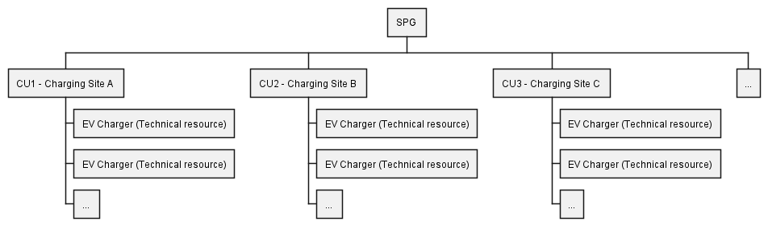

# Conceptual Model and Terminology

This section provides a common understanding of the
key concepts used in the Flexibility Information System (FIS) documentation.

It explains how party types and resources are represented in the
FIS conceptual model and how they relate to each other.

By understanding the concepts introduced here, users can better interpret the
data model, [API resources](../resources/index.md), and [process descriptions](../processes/index.md)
presented elsewhere in the documentation.

## The conceptual model

The simplified conceptual model below illustrates some of the most central
concepts in the FIS and the relations between them. The model serves as an
overview when we introduce concepts and abbreviations throughout the documentation.

The conceptual model is based on terminology from the [Network Code on Demand
Response](../index.md#network-code-on-demand-response-nc-dr) (NC DR) and in this
section we describe how we have chosen to interpret these concepts so far.

> [!NOTE]
>
> Throughout this section, the names of resources (such as CU, TR, AP or SPG)
> are linked to their corresponding [API resources](../resources/index.md) descriptions.
> These links provide the fields, validation rules, and other technical details
> for each resource.
>
> Likewise, the names of parties (such as SP, SO, ES, BRP and EU) are linked to the
> party type definitions in the [Auth section](../technical/auth.md), which describe
> their authentication model and authorization rules.

## What is a controllable unit?

NC DR defines a controllable unit like this:

> Article 2:
>
> (21) 'controllable unit' or 'CU' means a single power-generating module and/or
> demand unit pursuant to Article 2(5) of [RfG NC 2.0] and Article 2(4) of
> [DC NC 2.0];

A [controllable unit](../resources/controllable_unit.md) (CU) is a unit in the
power system that can be actively controlled to produce, consume, or store
electricity, and is therefore a source of flexibility in the system.

A CU can be:

* Power-generating module: a unit that *produces* electricity, such as a power
plant or a wind farm.

* Demand unit: an electrical installation that *consumes* electricity,
such as an industrial boiler or an EV charger.

* Energy storage system: a unit that can both *produce and consume* electricity,
  such as a battery that charges and discharges depending on system needs.

A [service provider](../technical/auth.md#service-provider) (SP) offers flexibility
from the controllable unit on behalf of the [end user](end-user.md) (EU) based on
their [controllable unit service provider](../resources/controllable_unit_service_provider.md)
(CUSP) agreement, which authorises the SP to manage the CU for flexibility services.

### Technical resources

Each CU consists of one or more
[technical resources](../resources/technical_resource.md) (TRs). A TR is a
physical device that generates, consumes, or stores electricity. The CU
represents the logical control for these resources, which
all relate to the same accounting point.

> [!NOTE]
>
> The NC DR does not define a concept equivalent to a 'technical resource'
> (TR), but several requirements motivate including TRs in FIS:
>
> * SPs must describe the type of technical assets used to deliver
> services (Art. 17(1)(d)), and system operators (SOs) must receive structural and
> technical data about CUs and service providing groups (Art. 52-54).
>
> * Prequalification should be simplified when CUs are technically identical
> (Art. 20(3), 21).
>
> * When doing [CU lookup](../processes/controllable-unit-lookup.md), the SP can
> use the TR information to identify the CU more easily.

### Connection to an accounting point

In FIS, each controllable unit is connected to a single
[accounting point](../resources/accounting_point.md) (AP).
This ensures an unambiguous link between the CU and the [balance responsible
party](../technical/auth.md#balance-responsible-party) (BRP) of the associated
[energy supplier](../technical/auth.md#energy-supplier) (ES), which enables
imbalance adjustment and settlement.

Knowing the AP where a CU is located also allows
[system operators](../technical/auth.md#system-operator) (SOs) to know where in
the grid it is. As a result they know where flexibility can be activated in the grid.

## A service providing group is a collection of controllable units

NC DR defines a service providing group like this:

> Article 2:
>
> (26) 'service providing group' or 'SPG' means an aggregation of controllable
> units or service providing units connected to more than one connection
> agreement point within the same scheduling area. SPG is defined by the service
> provider to provide balancing or local services;

A [service providing group](../resources/service_providing_group.md) (SPG) is
a collection of CUs. We call the CUs *members* of the SPG.

The topological location of the members limits the use of the SPG. If SPG members
are close together and all connected to the same part of the grid, the SPG can
offer local services such as congestion management. If the members are spread
out over a larger area, the SPG can maybe only offer balancing services.

Each SPG is resticted to a specific area by the service provider. The provider
specifies this when creating the SPG. We use the term `bidding zone`, rather
than `scheduling area` used in NC DR, for this area.
[SOGL](https://eur-lex.europa.eu/eli/reg/2017/1485/oj/eng) tells us that the
geographical scope of the scheduling area is equal to the bidding zone. The term
`bidding zone` is widely used and easy to understand for market participants.
The norwegian word for bidding zone is `budområde`, and in common language also
referred to as `prisområde`.

As of now, the bidding zones are the scheduling areas in Norway (NO1-NO5), used
for balancing. But this concept and restriction of SPG can also be extended to
include local services. We foresee use of local bidding zones on SPGs used for
congestion management. The term `bidding zone` is thus more flexible and
future-proof than `scheduling area`.

> [!NOTE]
>
> The NC DR also includes a definition of a 'service providing unit' (SPU) as a
> single unit connected to one connection agreement point. We do not include SPU
> in the FIS. We do not see a reason for this distinction and have thus not
> modelled it in.

## Example with EV smart charges

The diagram below illustrates how CUs and a SPG are related in the context of
EV smart charging.

Each charging site is a CU. All chargers at the same site are connected
behind the same AP and are operated under a common control
module. These chargers are the TRs that make up the CU.

The CUs are then grouped by a SP, forming a SPG. The SPG acts as the
interface between the SP and the SO, offering services such as balancing or
congestion management.

Each CU (charging site) can respond individually to control signals,
while the SPG coordinates all sites to deliver a joint service to the power system.

