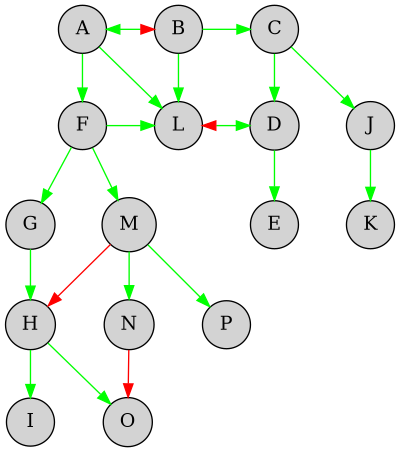
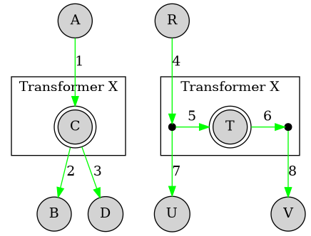
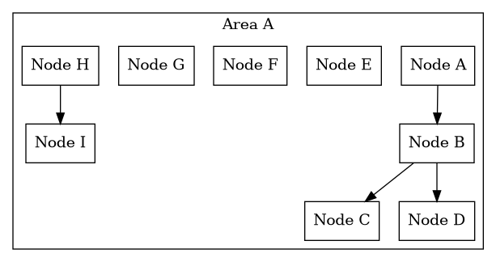
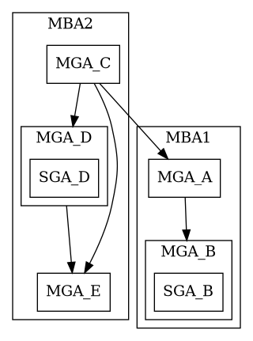
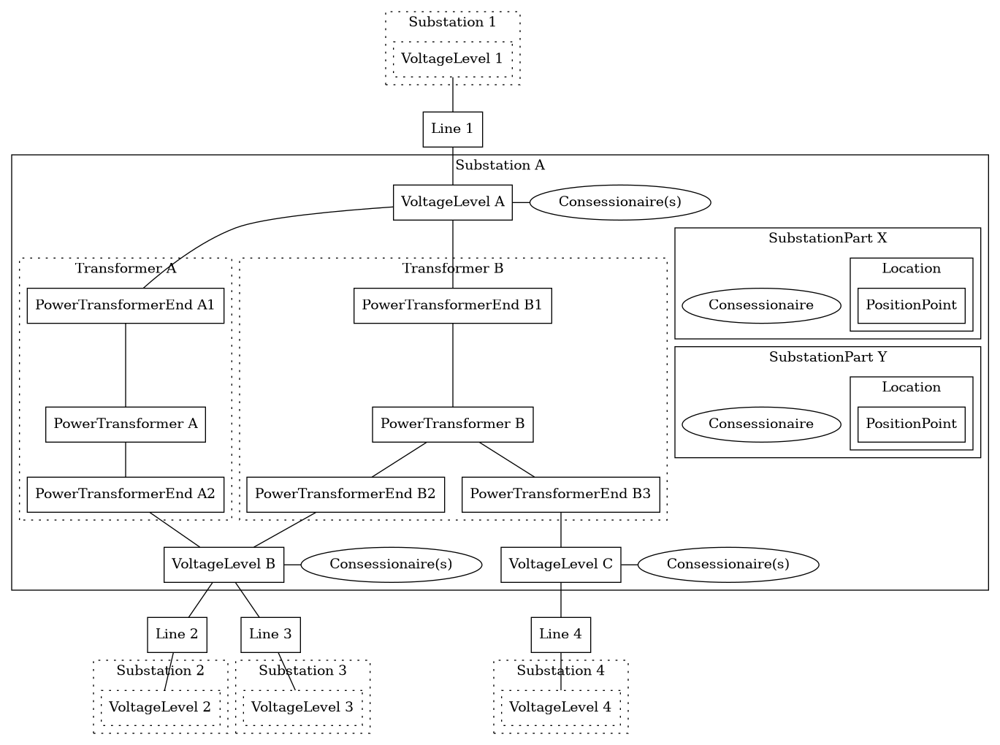
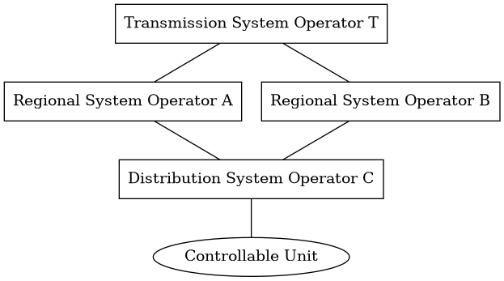
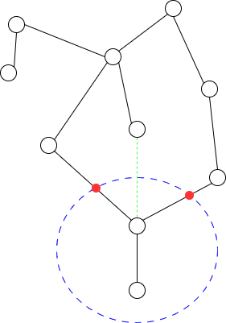

# Grid Model

!!! note "Work in progress"

    This document is very much work in progress. It highlights some existing
    models and ideas connected to a possible grid model used in a flexibility
    information system. In its current state, the document is intended as input
    for discussion.

A grid model is a simplified representation of the physical grid. It should
contain geographical or topological information about the grid. Its use would be
to support data exchange and aggregation in the value chain of flexibility.

## Introduction

Flexibility is intended to deliver services in the physical grid: balancing,
congestion and voltage. As such, a grid model must be a physical representation
of the grid. However, a model can and should be used to *simplify the complexity
of the real world*.

The physical grid is split in different levels depending on the voltage level
and ownership.

* **Transmission grid** - masked transmission grid operated by TSO
* **Regional grid** - generally, regional grids can be operated radially from a
  transmission grid point, meshed from a transmission network point, or meshed
  between two transmission network points. Operated by DSO, but currently TSO is
  [responsible for handling bottlenecks](https://www.statnett.no/globalassets/for-aktorer-i-kraftsystemet/utvikling-av-kraftsystemet/samarbeidsforum-dsotso/rapport-om-flaskehalser-i-regionalnett.pdf).
* **Distribution grid** - radial, but with some reduntant connections that
  allows the SO to switch/route power in different directions

### Difficulties in making a simple model

As stated above, the grid can be thought of as a complex mesh of nodes and
edges. It is not a simple tree structure where aggregation of resources can be
done by simply moving up the tree. The grid is also not static, but dynamic, and
flows/directions are changing all the time. This might require us to have a more
complex model than what we would like to have.

In the diagrams we are trying to show some example challenges related to the
grid model. Nodes in the grid are either drawn as circles or points. Nodes can
be grid stations, junction points or similar. Edges are connections like power
lines or cables, and are drawn as lines with arrows. The arrows on the edge
indicate the direction of flow. The color of the edge indicate if the edge
and/direction direction is active (green) or not (red)

.

If a node represents a transformer (station), then it might be important to know
on which side of the transformer the edges are connected. In the following
example diagram, `C` and `T` represents the same transformer, but the two graphs
are modelling it in different ways.

In the first graph edges 1, 2 and 3 are simply connected to the node, but does
not indicate on which side of the transformer they are connected. In the second
graph, the edges are connected junctions and the junctions are connected to the
transformer.

If the transformer had a capacity problem (think over-heating), then knowing on
which side the edges are connected is important since we see in the second graph
that disconnecting/lowering consumption in `U` does not actually help the
transformer.

.

## Existing models

There are a few existing models that are relevant for the discussion.

### NODES

In the NODES platform, the local market platform in EuroFlex, system operators
define one or more grid *areas*. An area is then divided into grid *nodes*.
Nodes can exist in a hierarchy, where a node *can be* a parent to other nodes.
The following diagram shows this.

Assets (controllable units) are connected to the "lowest level" node, and the
node hierarchy is used when aggregating assets into portfolios. If assets in a
portfolio are connected to node `B`, `C` and `D` in the diagram, then the
portfolio is connected to node `B` and can also be used for bids in node `A`.

Nodes in NODES can also be linked between system operators, in a hierarchy.
Meaning that a node in a "sub" system owners area can be linked to a node in a
"parent" system owners area.

### Balancing markets - station groups

In Statnett's balancing markets, there is no actual grid model *being
communicated*. When a (B)SP wants to deliver balacing services, part of the
[process](https://www.statnett.no/for-aktorer-i-kraftbransjen/systemansvaret/kraftmarkedet/reservemarkeder/delta-i-reservemarkedene/)
includes requesting station groups (stasjonsgrupper) for the resource(s).
Statnett creates station groups based on its own knowledge of the grid and the
information about the resource(s) provided by the (B)SP.

A station group is defined not only based on the physical reference in the grid,
but also:

* same balance responsible party (BRP)
* no bottlenecks
* same (production) technology

As part of the qualification process done by Statnett, impacted DSOs are given
an opportunity to comment on the application.

A
[2018 report from Statnett](https://www.statnett.no/contentassets/d27d9d5efd7a4371abe2b17c97ef4a64/27-august-2018-roller-i-balansemarkedene-og-aggregering.pdf)
highlights the importance of getting more geographical information as part of
the bids suggests three high-level solutions:

1. splitting station groups or defining new geographical levels
2. more detailed geographical information in bids
3. including geography in prequalification and approval from grid owners. This
   could include defining "problem areas" in the grid that cannot be part of the
   balancing markets.

### Balance Settlement Grid Model

The grid model used in balance settlement is described here.

The model consists of three types of areas:

* Marked Balance Areas (MBA) aka price area
* Metering Grid Area (MGA) aka settlement areas
* [Sub-Grid Areas](https://elhub.no/aktorer-og-markedsstruktur/markedsstruktur/subnett/)
  (SGA) e.g. malls and industrial areas/parks

MBAs contains MGAs, and MGAs contains SGAs. Both MGAs and SGAs contain
accounting points (AP), where energy is either consumed or produced (or both).
MGAs are defined by Statnett as settlement responsible together with the system
operators. The
[division of MGAs](https://elhub.no/aktorer-og-markedsstruktur/markedsstruktur/endring-av-nettavregningsomrader/)
is based on the grid topology (e.g. bottlenecks) and the ownership of the
metering points within the area.

The sub-grid area is connected to MGA via an accounting point in the parent MGA.
In addition to this, there are individual accounting points inside the SGA -
e.g. stores in a shopping center. There can be different energy suppliers in the
accounting points and the SGA is settled by the sub-grid operator. It is assumed
that *controllable units in the flexibility register will always be referred to
the accounting point in the MGA*.

There are 123 grid owners and 354 MGAs and SGAs. The MGAs are divided into the following
types:

* 17 Transmission
* 52 Regional
* 37 Industrial
* 117 Production
* 92 Distribution

In addition there are 37 sub-grids.

### Simplified National Grid Model (Elbits)

"Forenklet Nasjonal Nettmodell" (FNN) is a model developed by
[Elbits](https://nemo.elbits.no/) to facilitate easier exchange of basic
information about the power grid in Norway. It is a simplification of the CIM100
standard and currently has a data foundation from FOS at Statnett.

The model aims to be a reference for central elements in the grid and covers the
transmission and regional grids across the entire country. Work is underway
to include distribution. It will have common names and IDs for each component,
making the grid understandable for both humans and machines.

The model includes grid elements and their connections, but e.g. not include
switches, breakers etc. It is distributed in a JSON-LD format and looks like a
directed graph, but the line direction is random and does *not* indicate flow.

The following is an example derived from the FNN model definition (and not from
model data itself). It just provides another view on how the model i structured
and how different types are connected.

## System operators and ownership

The balance settlement grid model allows us to understand how the operation of
the grid is split between different system operators. This can be interesting to
look at since controllable units connected to a distribution grid can be/are used
to deliver services in regional or central grids. In NCDR-speak, we can use it
to consider who will be *connecting*, *procuring* and *impacted* system
operators of a given asset.

What we see is that some controllable units, depending on the flow of energy,
can have multiple procuring system operators and multiple impacted system
operators, even if we are only considering the hierarchy of the grid model (and
not defining adjacent system operators as "impacted"). The following is an
example drawn from the analysis.

In the diagram, the controllable unit can be used to deliver services for all
the system operators. Activation can also impact all the system operators.

There are also other "edge" cases where we see chains of system operators. Some
cases shows a chain of four or more different system operators. Examples are:

* Transmission -> Regional -> Distribution -> Distribution
* Transmission -> Regional -> Production -> Industrial -> Distribution

Further analysis must be done to understand the details in the grid. We are just
looking at a very simplified model that e.g. does not account for how the grid
is switched. The key takeaway, however, is that we must support having multiple
system operators related to the controllable units. It is not the case of "just"
one local and one central system operator/market for one controllable unit.

## (Possible) Use Cases

This section outlines some possible needs for a grid model in the flexibility
value chain. Some of these requirements are based on
[draft network code on demand response](https://www.acer.europa.eu/documents/public-consultations/pc2024e07-public-consultation-draft-network-code-demand-response).

### Knowing the location of a controllable unit

The grid model will be used to place the controllable units in the grid - to map
accounting point ids to physical assets in the grid and to responsible system
operators. This requires unique identification of all nodes and edges. The
purpose of this placement is to facilitate aggregation and data exchange (see
further requirements).

For service providers, knowing the location of the controllable unit can allow
them to prioritize which units to get ready for market. This can be based on the
current tenders in the market(s).

If the flexibliity information system knows the grid location of all accounting
points in advance (and not requiring grid owners to add that information), we
can also provide "synchronous" registration processes that includes assignment to
grids.

Some accounting points are located in sub-grid areas. The value chain must be
able to identify the relation between the accounting points in an SGA with the
accounting point for the connection point in the surrounding MGA. FIS can get
this information from Elhub.

### Defining topological trade areas

Each system operator will procure flexibility within certain trade areas.
Communicating what these areas are is important for the value chain.

The most precise definition of such a area would be a description referencing a
common, national grid model.

The most reliable way to define such areas would be to express them as a list of
cuts in the grid model. A grid model is basically a graph of nodes and edges. By
defining a set of edges that "cut" the graph, we can define an area in the grid.
This would allow for unambiguous definitions of trade areas. It also allows for
detecting when the grid changes in a way that impacts the area definition.

The following example shows such a definition. The black nodes and lines are
the graph representing the grid. An accounting point (and thus CU) would
typically be connected to the black and white dots.

An area (blue) is defined by the red cuts. Any accounting point connected to the
nodes inside the blue area belongs to the area.

The green dotted line is a non-existing but planned connection. Since the area
is defined by the cuts, it is possible to detect that the planned connection
would impact the area.

### Aggregation to service providing groups using areas

Flexibility resources are distributed across many different locations in the
grid, many of which are connected in the lowest level: in the distribution grid.

The service provider is responsible for grouping controllable units (CUs) into
service providing groups (SPGs). Using grid-defined areas like above can help
guide the service provider when forming these groups.

### Identifying Impacted System Operators for SPG Grid Prequalification

Impacted System Operators (ISO) should do grid prequalification of service
providing groups. A grid model can be used to identify which system operators
are impacted by activation of services from a certain SPG. Network Code Demand
Response (NCDR) definitions:

> `impacted system operator` means any DSO or TSO significantly impacted by
> congestion or voltage issues on the grid of another system operator, or
> significantly impacted by balancing and local services bids from SPU or SPG
> connected to another system, or whose system or system users may provide
> solutions to these issues, or whose data on the system or the system users are
> necessary to forecast, detect or solve such issues;
>
> `grid prequalification` means the process by the connecting system operators
> and the *impacted system operators* to ensure that the delivery of balancing or
> local service(s) by a SPU, a SPG or parts of a SPG does not compromise the
> safety and operational conditions of connecting and impacted grids;

### Temporary limits

NCDR defines a flexibility information system as:

> `flexibility information system` means a system to record at least the
> qualification of service providers, the product prequalification, product
> verification and grid prequalification of SPUs and SPGs, **the temporary limits
> set by system operators** and the switch of controllable units for the provision
> of balancing and local services and to exchange of data for such processes;

... and article 58 states:

> The connecting system operators and impacted system operators shall have the
> right to set or update **temporary limits on grid elements**, bids, SPUs, SPGs
> or parts of SPGs in the operational planning to ensure that the delivery of
> the balancing or local services does not compromise the safe operation of the
> transmission and distribution systems.

To be able to set and communicate limits on grid elements, those grid elements
must be modelled in the system.

### Data exchange in observability areas

Network Code Demand Response (NCDR) define "observability areas" for
distribution system operators. Other regulation has this concept for TSO
already. They are defined for the purpose of clarifying data exchange scope and
scope of coordination.

> `DSO observability area` means a DSO’s own distribution system and parts of
> other system operators’ distribution and transmission systems that are
> relevant for the operation of the DSO distribution system;

"Operation" could also mean DF (driftsmessig forsvarlig) or FOL (Forskrift om
leveringssikkerhet) analysis.

Similar to trade areas, a grid model can be used to define these areas and will
allow a flexibility information system to give the correct data access and
notifications to the eligible system operators.

Data exchange between SOs and from FIS to SO include:

* `structure data` such as substations, lines, transformers, SGUs, reactors/capacitors
* `schedule and forecast data` such as planned outages, schedules, production
  plans, baselines, forecasts, temporary limits
* `real-time data` such as actual topology, busbar voltages, active and reactive
  power flows and real time measurements
* `activations` such as activation of balancing services with a controllable unit
  in a distribution grid

## Challenges

The following is a list of issues that we must tackle.

1. The grid is not a tree, but a mesh. How do we model the grid in a way that
   allows for aggregation of resources?
2. The grid is not static, but dynamic. That is problematic for aggregation and
   buying from groups. How do we model the grid in a way that allows for changes
   in the grid? We believe that system operators will do more topological
   maneuvers in the future as the load on the grid increases.
      * One strategy used in NODES is to define nodes on a low level/below
        possible switches.
      * This can also be challenging for long term contracts. What if the grid
        has been changed from bid to activation?
3. Is the current state of the grid sensitive? Can it be shared with all parties
   in the value chain?
4. How can we build a grid model incrementally so that we can get value early on
   and not wait for the "full" model? Making a complete, "perfect" national
   grid model for flexibility will take time.
