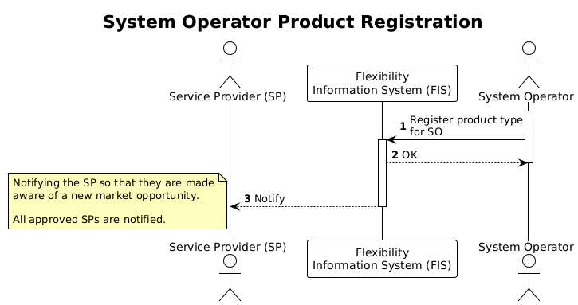

# Notification and notice

Many of the processes in the Flexibility Information System (FIS) trigger
notifications and notices. This section explains what they are and how
they differ.

While notifications are a required function in FIS and automatically inform
parties when events occur in the system, notices are a supporting feature that
helps users identify and complete the actions needed for those processes to
continue. In short, notifications keep parties informed and notices help them act.

The following sections describe each of them in more detail and explain how
they are used in FIS.

## Notification

A notification is a resource that contains information about the event that has
occured in FIS. Notifications are created when something is created, updated or
deleted in the system and can be retrieved by parties in FIS. The purpose
of notifications is to convey information to enable parties to act according
to the business processes.

Each notification includes the event type, event source and the time of occurance.
Notifications also include a direct link to the update that caused the notification.

The notification is cleared when the notification is aknowledged. Aknowledgement
lets FIS know that it has fulfilled its obligation to inform the party about the
change.

### Example of notification

When a procuring system operator [registers a new product type](../processes/system-operator-product-registration.md)
they intend to procure, a notification is made available for all approved service
providers through the API. Service providers retrieve this notification to receive
information about a new market opportunity. The notification enables them to
act according to the the business processes by registering a product application.
Without the notification, service providers would not have received information
about the new product type in FIS.

In this case, a notification is created, but no notice is needed since the
information does not require action from the service provider as acting on it is
optional.

## Notice

A notice is a resource that informs a party that action is required in order for
a business process to continue. Notices complement notifications by highlighting
situations where user input is needed. In this way, notices function as a task list
that helps parties complete steps required by the processes in FIS.

Notices can be retrieved by parties in FIS. Each notice includes information
about which party it concerns, the type of notice, and the status that triggered
it. Notices also include a direct link to the resource that led to the notice.

The notice is cleared when the required task is completed.

### Example of notice

When a [controllable unit (CU) is registered in FIS](../processes/controllable-unit-registration.md)
by a service provider, the connecting system operator needs to add the grid node
to the CU and grid validate the CU. During the registration, the connecting system
operator reads two notices. One notice for the missing grid node and one ntoice for
the missing grid validation status. By completing these tasks,the registration process
can be finalized, and the service provider will have a controllable unit that is
validated.

In this case, notices are created in addition to the notification about the CU
registration because the CU status requires action from the system operator.
Acting on the information is therefore mandatory for the process to move forward.

Diagram with notification and notice at the same time to illustrate the
difference? [notification/notice](..diagrams/notification_notice.drawio.png)
