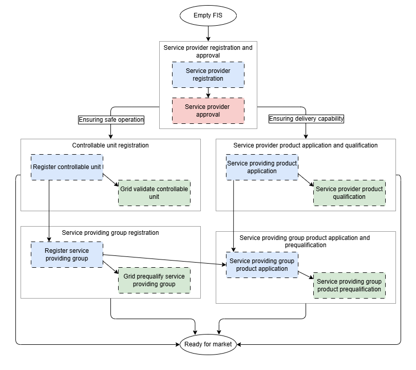

# Get ready for market

Before a service provider can participate in the market, several registration and qualification steps must be completed. The process starts with an empty FIS (Flexibility Information System) and ends with service providing groups that are fully validated, (pre)qualified, and ready for market participation. 

The diagram below highlights the key steps and their dependencies. It is not a full process map, but shows the most important activities for service providers and system operators preparing for market participation.

## Prerequisites
* Service provider registration
* System operator registration
* Service provider approval
* System operator product registration

## Process Groups

The registration and qualification steps can be grouped into two main categories:

- **(Left) Ensuring safe operation**  
  Covers the technical registration of controllable units and the formation of service providing groups. This ensures that units do not compromise system security when participating in the market.
  Approved by connecting/impacted system operators.  

- **(Right) Ensuring delivery capability**  
  Covers product applications and (pre)qualification steps for both service providers and service providing groups. This ensures that the provider can actually deliver the requested product type according to the requirements.
  Approved by procuring system operators.  

## Registration and Qualification Overview

The following diagram shows how service providers move from an empty FIS to being ready for market:

<!--[Process priority - the happy path](../diagrams/registration_happy_path.png)-->

The diagram shows us that a service provider can register all their data at
once, and that the (pre)qualification processes can run in parallel.

### Notation
We are using the following notation:

* `ellipses` - start and end states
* `rectangles` - processes
    * `solid border` - main process listed below
    * `dotted border` - sub-process
  driving/responsible market party (see above)
* colors indicating the driving/responsible market party for a (sub-)process
    * `green` - system operator
    * `blue` - service provider
    * `white` - unspecified
* `arrows` - dependencies between processes

!!! note "For a detailed definition of when a Service Providing Group (SPG) is considered *ready for market*"

    See the [Ready for market](../concepts/ready_for_market.md) concept page.
