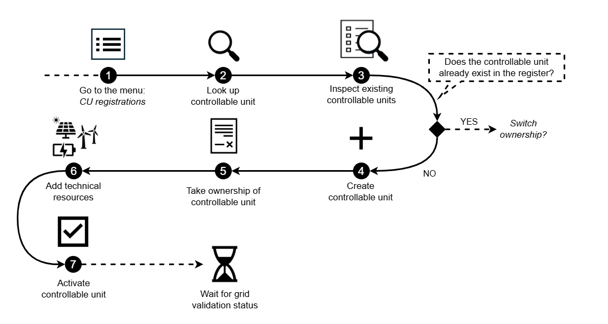

# Registering a Controllable Unit

This guide explains how a Service Provider (SP) can register a new Controllable
Unit (CU) in the Flexibility Information System (FIS).  

Learn more about the controllable unit and related concepts here:
[Conceptual model](../../concepts/conceptual-model.md)

The illustration below gives an overview of the necessary steps the service
provider myst go through to register a controllable unit in the FIS portal.

The sections that follow describe each step in detail, including both the actions
to take in the portal and the reasons these steps are required.

> [!NOTE]
>
>Relevant links to related processes and resources are provided under each
>step:
>
>* Process pages describe the end-to-end process and show how each step relates
>to other parties.
>
>* Resource pages provide explanations of the resource fields, validation rules,
>notifications and authorization policies.

## 1. Start at CU registrations

Begin by navigating to `CU registrations` in the menu.  
This is where the [CU registration](../../processes/controllable-unit-registration.md)
and [maintenance](../../processes/controllable-unit-update.md) are performed.

## 2. Look up the controllable unit

Before creating a new [controllable unit](../../resources/controllable_unit.md),
ensure it does **not** already exist in the register
by performing the [CU lookup process](../../processes/controllable-unit-lookup.md).

> [!NOTE]
> The lookup process does more than prevent duplicate CUs:
>
> * It confirms that the accounting point actually belongs to the specified end
> user.
> * It requires an end‑user ID (the business ID), which prevents unauthorized
> use of the lookup function.

## 3. Check if the controllable unit already exists

Inspect the list of CUs associated with the accounting point:

* If the CU does **not** appear → proceed to `Create a new controllable unit`.
* If the CU **does** appear → the CU is already registered.  
  *If the CU is receiving a new contract to switch service provider, follow the
  [SP Switching Initiated by New SP](../../processes/service-provider-switching.md)
  process.*

> [!NOTE]
>
> Because the CU ID is created only after a CU is registered in FIS, it cannot be
> used to prevent duplicates.
> Service providers must therefore manually check the list of existing CUs on
> the accounting point to ensure the CU is not already registered.

## 4. Create a new controllable unit

Provide the required information about the [controllable unit](../../resources/controllable_unit.md)
as described in the portal.

>[!NOTE]
>
>The information supports several processes: *linke til prosesser*
>
>* It enables the system operator to assess whether the CU can operate safely
>within the grid.
>* It ensures that the CU can be correctly linked to a service providing group (SPG),
>which determines how the CU will participate in flexibility markets.
>* It influences how the prequalification application for the >SPG is structured,
>since the technical characteristics of the CU affect the overall
>delivery potential of the group.

## 5. Add a reference to the end‑user contract

After saving the information in step 4, the [contract reference](../../resources/controllable_unit_service_provider.md)
between the service provider and the end user has to be registered.

The contract establishes the service provider’s right to control the CU and
functions as the authorization mechanism within the register, enabling the
service provider to manage the CU in the system.

> [!NOTE]  
> When creating a new CU, set the contract start time **as of now or in the
>past**.  
> If it is set in the future, you will not have access to manage the CU until
> that date.

## 6. Add technical resources

The next step is to add [Technical resources](../../resources/technical_resource.md),
which represent the actual
assets that the CU consists of.

A controllable unit may contain several technical resources, and each must be
added individually in the portal.

>[!NOTE]
>Registering these resources is important because:
>
>* It provides the technical details needed by procuring system operators when
>performing product pre‑qualification.
>* It enables more efficient evaluation when different CUs contain identical or
>similar technical resources.

## 7. Activate the controllable unit

Review all information to ensure everything is correct before activating the CU.

Set the [CU](../../resources/controllable_unit.md) status from **new → active**.

Activation automatically notifies the system operator, who will grid validate
the CU.
Based on the system operator's analysis, the CU receives a grid validation status
and the service provider will be notified.

Information about the status is found under the menu item CU registration.
