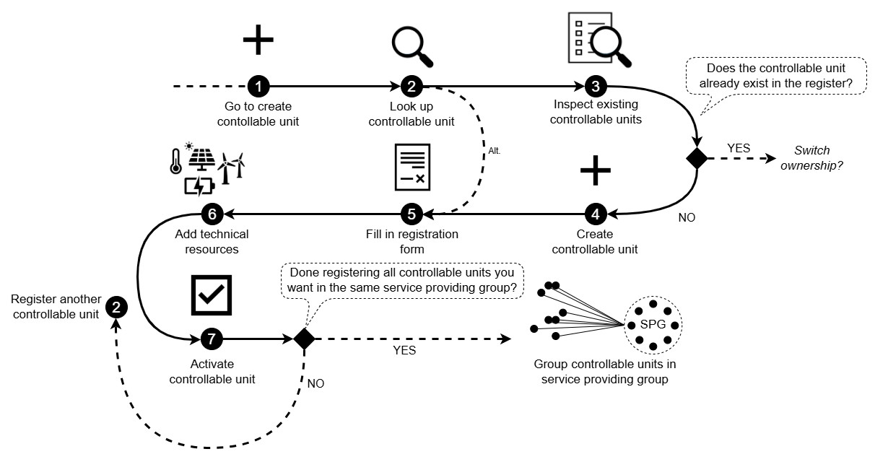

# Controllable unit registration - portal

This guide explains how a Service Provider (SP) can register a new
[Controllable Unit (CU)](../../resources/controllable_unit.md) in the Flexibility
Information System (FIS). It explains each step that is needed as well as the
reason why these steps are required.

> [!NOTE]
>
> The guide is geared towards users of the portal. If you are looking for an API
> guide, check the [companion guide](../../api/guides/sp-cu-registration.md).

Learn more about the CU and related concepts here:
[Conceptual model](../../concepts/conceptual-model.md)

The illustration below shows the steps needed to
[register a controllable unit](../../processes/controllable-unit-registration.md)
in the FIS.

## 1. Create a new CU

To create a new CU, click **create new** from the dashboard or navigate to
**Controllable units** on the menu and select **create**

This is where the [CU registration](../../processes/controllable-unit-registration.md) process begins.

## 2. Look up the CU

The first step in the registration flow is the [CU lookup](../../processes/controllable-unit-lookup.md)
process. This process is done to ensure that the CU does **not** already exist
in the register.

The lookup process also verifies that the accounting point belongs to the end user.
An end user ID is required to prevent unauthorized use of the lookup function.

If no CUs are registered on the accounting point, you will automatically continue
to the CU creation step.

If one or more CUs are already registered on the accounting point, the lookup process
will return a list of the existing CUs. Review the list to determine whether
the CU has already been registered. If it has not, you can continue creating a new
CU.

If the CU is registered by a different service provider and the end user has changed
service provider, follow the [service provider switching process](../../processes/service-provider-switching.md).

## 3. Fill in CU form

Provide the required information about the CU as described in the portal.

> [!NOTE]
>
> The information required supports several processes:
>
> * [SPG registration](../../processes/service-providing-group-registration.md):
> It ensures that the CU can be correctly linked to a service providing group (SPG),
> which determines how the CU will participate in flexibility markets.
> * [SPG product application](../../processes/service-providing-group-product-application.md):
> It influences the prequalification application for the SPG,
> since the technical characteristics of the CU affect the overall
> delivery potential of the group.

## 4. Add technical resources

The next step is to add [technical resources](../../resources/technical_resource.md),
which represent the assets that the controllable unit consists of.

A controllable unit may contain several technical resources, and each must be
added individually in the portal.

>[!NOTE]
>Registering these resources is important because:
>
>* It provides the technical details needed by procuring system operators when
> performing product prequalification.
>* It enables more efficient evaluation when different CUs contain identical or
> similar technical resources.

## 5. Activate the controllable unit

The controllable unit is now registered in the FIS, but it is only visible for the
SP that has registered it because it has not been activated.

Activating the controllable unit will allow you to add it to service providing groups.

Ensure the following before activating:

* all technical resources have been added
* data is correct

## Next step: Grouping controllable units in a service providing group

Once the CU is registered, it can be added to a service providing group (SPG).

You may choose between two valid workflows:

1. Add each CU to an SPG immediately after registration

2. Register all CUs first, then group them

    If you plan to include several CUs in the same SPG, you can complete the
    registration of all those CUs first. When you are done registering the relevant
    units, you can create or update an SPG and add the CUs together.

→ Continue with [the guide on grouping CUs](sp-spg-registration.md).
