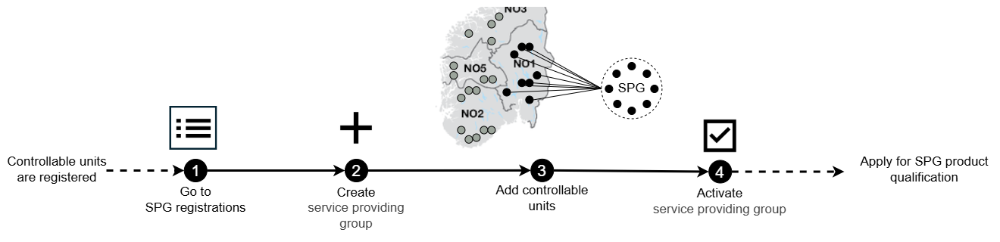

# Grouping Controllable Units in a Service Providing Group

This guide explains how a Service Provider (SP) can group Controllable
Units (CU) in a [Service Providing Group (SPG)](../../resources/service_providing_group.md)
in the Flexibility Information System (FIS). It explains each step that is needed
as well as the reason why these steps are required.

Learn more about the controllable unit, service providing group,
and related concepts here: [Conceptual model](../../concepts/conceptual-model.md)

The illustration below gives an overview of the necessary steps the service
provider must go through to
[group controllable units in a service providing group](../../processes/service-providing-group-registration.md)
in the FIS portal.

## 1. Start at SPG registrations

Begin by navigating to SPG registrations.  
This is the entry point for [grouping of controllable units](../../processes/service-providing-group-registration.md).

## 2. Create a new service providing group

Before creating an SPG, it is important to consider what the SPG will be used for.
An SPG is the operational unit the service provider uses in the market. This means
the SPG should be structured in a way that reflects:

* Which product types the group is intended to deliver
* [Which bidding zone the units belong to](../../concepts/conceptual-model.md#types-of-bidding-zones)

Thinking about the SPG’s purpose early helps ensure that the group is created
correctly and avoids the need for restructuring later.

Create a new [service providing group](../../resources/service_providing_group.md)
and fill in the required information as described in the portal.

## 3. Add controllable units to the service providing group

Add the CUs you want included in the SPG. The grouping must follow the product
requirements which depend on the [product type(s)](../../resources/product_type.md).

>[!NOTE]
>
> Adding CUs to an SPG influences multiple processes:
>
>* [Grid prequalification](../../processes/controllable-unit-registration.md):
> It enables the system operator(s) to assess whether the SPG can operate safely
> within the grid.
>* [SPG product application](../../processes/service-providing-group-product-application.md):
> It enables the procuring system operatos to assess whether the SPG can deliver
>a certain product.

## 4. Activate the service providing group

The service providing group is now registered in the FIS and the controllable units
have been added, but the service providing group is only visible for the SP because
it has not been activated.

Review all information to ensure everything is correct before activating the SPG.

When a service providing group is activated, the impacted system operator(s) is
notified. The impacted system operatorwill grid prequalify the SPG.

The system operator sets a grid prequalification status and the SP is notified of
the status. The status is registered on the SPG.

## Next step: Apply for service providing group product prequalification

Once the SPG is registered with CUs, the service provider can apply for
[SPG product prequalification](../../processes/service-providing-group-product-application.md).
