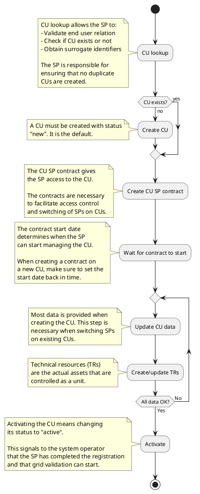

# Registering a Controllable Unit (CU) as a Service Provider (SP)

This guide explains how a Service Provider (SP) can register a Controllable Unit
(CU) in the Flexibility Information System. It covers the necessary steps and is
geared towards SPs that wish to integrate with the API. The same steps apply
when using the portal, but the user will be guided through forms instead of API
calls.

## Refereces

TODO resource and process links

## Steps to register a CU

