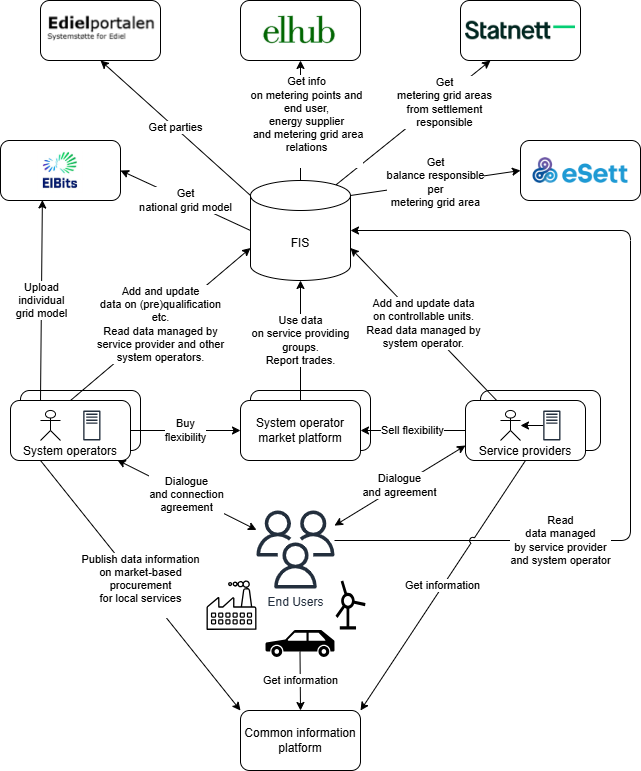

# Flexibility Information System

This is the documentation for the Flexibility Information System (FIS) concept
that is being developed in the context of the [EuroFlex
project](https://www.euroflex.no/) in Norway. [Elhub](https://elhub.no/) is
leading the work as part of work package 4. This work is [funded by Enova
SF](https://www.euroflex.no/aktuelt/enova-gir-100-millioner-til-a-etablere-fremtidens-stromnett).

## License

This documentation is licensed under the [CC-BY-4.0
License](https://github.com/elhub/flex-information-system/blob/main/LICENSE-CC-BY-4.0).
Attribution should be made to Statnett SF and Elhub AS.

## How to use the documentation

!!! note "Work in progress"

    This documentation is a work in progress. Do not consider any of the details
    here as final or complete.

Learn more about how FIS works and how to use it:

* [Concepts](concepts/index.md) – understand the main ideas and terms used
in FIS.
* [Processes](processes/index.md) – the business processes in the flexibility
value chain.
* [Resources](resources/index.md) – explore API endpoints and data structures.
* [Guides](guides/index.md) – how to use and test FIS.
* Technical – read about system architecture and integrations.

## About the Flexibility Information System

A flexibility information system, or flexibility register, is an IT system used
to keep track of (register) data about flexible assets such as demand
response resources, energy storage systems, and other controllable loads. The
system will be a central part of a future flexibility value chain. We can think
of it as an integration- and datahub in the value chain. The value proposal includes

* lowering barriers for service providers
* simplifying the use of flexible resources in multiple markets
* increasing transparency and trust
* cost effectiveness through centralising common tasks

The following diagram illustrates the concept of a flexibility information
system in the Norwegian context. There are many details in the diagram, but
there are also still many unanswered questions. Consider it a starting point for
discussion and one way to visualise the concept we are developing.

## What does a Flexibility Information System do?

The heart of a flexibility information system is to facilitate communication and
data exchange between parties and systems in the value chain for flexibility
services. The main parties are

* `system operators` - that operates the electricity grid and procure flexibility
  services
* `service providers` - that aggregate and offer flexibility services to system
  operators
* `end users` - the owners of the flexible assets that provide flexibility services

A flexibility information system can also take on additional tasks due to being
shared infrastructure in the value chain. An example could be tasks related
to imbalance settlement/adjustment and financial transfer.

## Network Code on Demand Response (NC DR)

A network code on demand response is currently under development in the EU. We
are basing our work on the proposed Flexibility information system as
suggested in this regulation.

> "flexibility information system" means a system to record at least the
> qualification of service providers, the product prequalification, product
> verification and grid prequalification of SPUs and SPGs and the switch of
> controllable units for the provision of balancing and local services and to
> exchange data for such processes;

* [European Commision - Targeted Consultation - July 2025](https://energy.ec.europa.eu/consultations/targeted-consultation-support-establishment-new-network-code-demand-response_en)
* [ACER Recommendation 01-2025 - March 2025](https://www.acer.europa.eu/documents/search?search_api_fulltext=ACER+Recommendation+01-2025+)
* [ACER public consultation - September 2024](https://www.acer.europa.eu/public-consultation/pc2024e07-public-consultation-draft-network-code-demand-response)

### Centralised system or common access point?

The NC DR specifies that a flexibility information system should be operated and
maintained in one of two ways. The first is a system operated and maintained by
each procuring system operator with a _common access point_ for service providers
and system operators. The second is a _centralised flexibility information system_
operated and maintained by an entity specified in national terms and conditions.

We are piloting a centralised FIS. We believe that such a setup has many
benefits, e.g. reduced technical complexity by avoiding having many systems
appear as one. The decentralised option also fails to address the challenge of
registering CUs _only once_. To achieve that every _connecting_ (not the
_procuring_) system operator must operate a FIS. Because of this the common
access point approach also requires system operators - regardless of size and
maturity - to operate a FIS. This is not a good fit for Norway where we have a
wide variety of system operators.

### Integrated CU and SP modules

Another aspect that is part of the NC DR is that they distinguish between
Controllable Unit (CU) and Service Provider (SP) modules. We have decided to
integrate these into a single system in our Flexibility Information
System.

We believe that this is a good choice for a common flexibility information
system in Norway as it is a small country with a small number of actors. It is
also technically easier to have a single system.

## Pilot Flexibility Register

We are piloting the Flexibility Information System as part of the EuroFlex
project at [flex-test.elhub.no](https://flex-test.elhub.no). Participants in the
EuroFlex project have access to the pilot system.

!!! warning

    The Flexibility Information System is a prototype. As such, even though it
    offers authentication and authorisation features, it should _not_ be
    considered as a production-level system. Please make sure the data used
    while testing is _fictitious_ and does not contain _any_ sensitive
    information (_e.g._, health data, sexual orientation, _etc_).

    Our system stores read-only
    [historical data](./technical/time.md#record-time) for some of its
    resources. This means that wrong data will remain in the system
    even though the last version of the resource is corrected.
    Should you inadvertently add sensitive data to a resource, please
    [contact us](mailto:post@elhub.no) so that we can manually clean the
    problematic records.
