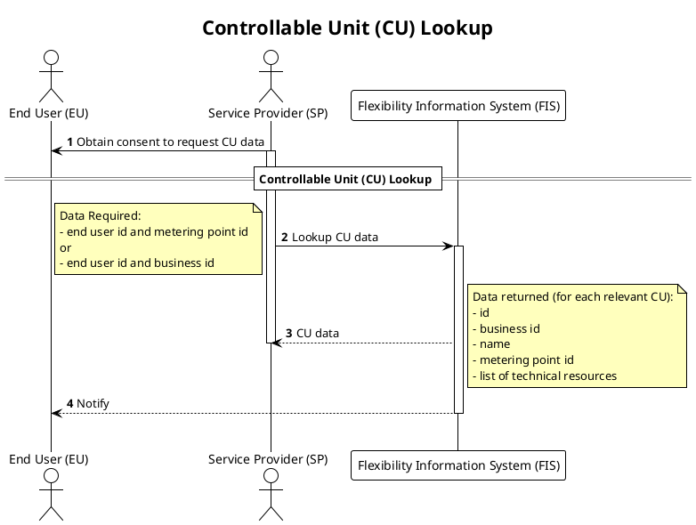

# CU Lookup

This process is used to look up information about controllable units before
initiating controllable unit registration or service provider switching, in
order to verify whether the unit is already registered in the system.

Before starting the CU registration or switching process, the service provider
needs to verify the linkage between the end user and the accounting point / CU, as
well as validate CU data. This process retrieves the necessary information from
FIS, to ensure that the service provider has sufficient data to determine the
appropriate process to execute.

To prevent unauthorized use, FIS requires the end user id for the service
provider to access CU data.

## Prerequisites

- Service provider has a consent from the end user to request data on the
  accounting point / CU.
- Service provider knows the end user id and other key information about
  accounting point / CU.
- CU ID provided from FIS must be used in service provider switching.

## Request and response

The input to the controllable unit lookup contains three fields:

- end user (EU) business identifier
- accounting point (AP) business identifier
- controllable unit (CU) business identifier

The request must contain EU and one of AP or CU. If that requirement is not met,
or the format of the input is malformed, the request will be rejected with a
`400 - Bad Request` response.

If the request is valid, but the requested resource (CU or AP) does not exist,
the response will be `404 - Not Found`. If the requested resource exist, but the
end user does not match the end user associated with the CU or AP, the response
will be `403 - Forbidden`.

Upon a successful request, the response will be `200 - Ok` and contain the
following fields.

| Field              | Abbr | Description                                                                            |
|--------------------|------|----------------------------------------------------------------------------------------|
| end_user           | EU   | Technical identifier for the end user.                                                 |
| accounting_point   | AP   | Information about the accounting point, including its identifier.                      |
| controllable_units | CU   | A list of controllable units, if found. Each containing a list of technical resources. |

The following table describes the possible combinations of input parameters and
the expected response. The column `Next action` is just ment as a guide.

| CU  | AP  | AP exists | CU(s) exists | EU matches | HTTP response   | Response      | Next action           |
|-----|-----|-----------|--------------|------------|-----------------|---------------|-----------------------|
| Yes | No  | ❔         | ❌            | ❔          | 404 - Not found | ErrorMessage  | Check request data    |
| Yes | No  | ❔         | ✅            | ❌          | 403 - Forbidden | ErrorMessage  | Check request data    |
| Yes | No  | ❔         | ✅            | ✅          | 200 - Ok        | EU, AP, CU(1) | Create contract       |
| No  | Yes | ❌         | ❔            | ❔          | 404 - Not found | ErrorMessage  | Check request data    |
| No  | Yes | ✅         | ❔            | ❌          | 403 - Forbidden | ErrorMessage  | Check request data    |
| No  | Yes | ✅         | ❌            | ✅          | 200 - Ok        | EU, AP, CU(0) | Create CU             |
| No  | Yes | ✅         | ✅            | ✅          | 200 - Ok        | EU, AP, CU(n) | Evaluate returned CUs |

## Sequence

[Full Size](../diagrams/controllable_unit_lookup.png) | [PlantUML description](../diagrams/controllable_unit_lookup.plantuml)

