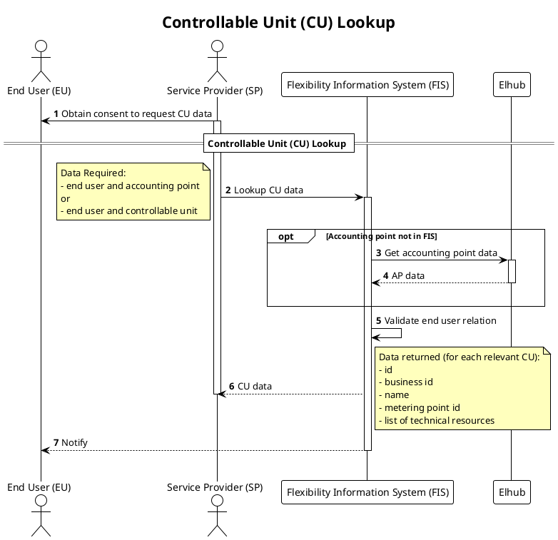

# Controllable Unit Lookup

This process is used to lookup information on controllable units before initiating controllable unit registration or service provider switching.  

## Prerequisites

- Service provider has a consent from the end user to request data on the metering point / CU.
- CU ID provided from FIS must be used in service provider switching.

## Sequence

[Full Size](../diagrams/controllable_unit_lookup.png) | [PlantUML description](../diagrams/controllable_unit_lookup.plantuml)

