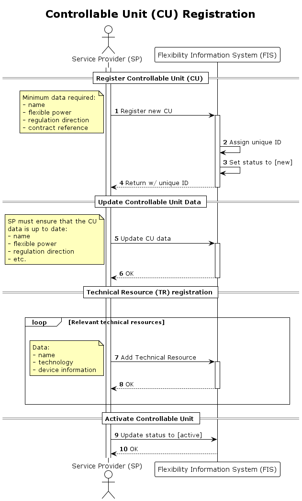

# CU Registration

This process describes the registration of a controllable unit (CU) in the
flexibility register as a Service Provider.

A CU is considered new until the status is changed to active.
Once a CU is activated, any changes to the CU is considered an
update, and handled by the update process.

## Prerequisites

* The service provider runs controllable unit lookup to check if CU exists in
  the flexibility information system
* Controllable Unit does not exist in the flexibility information system
* Service Provider knows the metering point id of the accounting point for the
  controllable unit
* Flexibility Information System knows
    * the system operator and end user of all metering points (from Elhub)

## Sequence

[Full Size](../diagrams/controllable_unit_registration.png) | [PlantUML description](../diagrams/controllable_unit_registration.plantuml)

