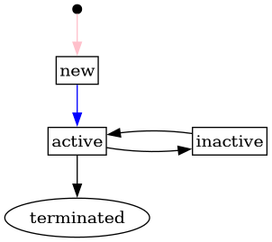
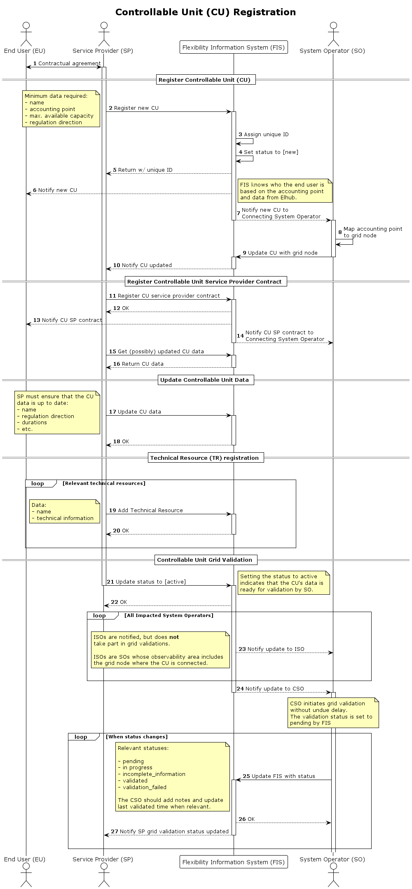

# Controllable Unit Registration

This process describes the registration of a controllable unit (CU) in the
flexibility register as a Service Provider. It also includes grid validation for
the system operator to validate the information provided.

A CU is considered new until the status is changed to active.
Once grid validation is requested, any changes to the CU is considered an
update, and handled by the update process. Grid validation on the CU level
is done by the connecting system operator.

The connecting system operator will during the validation process be able to
inform SP about missing details.

## Status transitions for grid validation

[Full Size](../diagrams/controllable_unit_grid_validation_status.png)
|
[Plantuml description](../diagrams/controllable_unit_grid_validation_status.plantuml)
|
[How to read the diagram](./index.md#status-and-transitions)

## Status transitions for controllable unit

The following diagram shows the status and its transition for controllable unit.
The Service Provider is responsible for creating a new controllable unit.
Initially, the status is set to "new." Once the CU registration is complete, the
Service Provider updates the status to "active." After termination, the status
can only be edited by a FIS operator

[Full Size](../diagrams/controllable_unit_status.png)
|
[Plantuml description](../diagrams/controllable_unit_status.plantuml)
|
[How to read the diagram](./index.md#status-and-transitions)

## Prerequisites

* Controllable Unit does not exist in the flexibility information system
* Service Provider knows the metering point id of the accounting point for the
  controllable unit
* Flexibility Information System knows
    * the system operator and end user of all metering points (from Elhub)
    * mapping of grid nodes in local markets to grid nodes in transmission
      system operator markets
* There is no national grid model that includes all metering point ids. Requires
  system operator to map metering points to grid nodes.

## Sequence

[Full Size](../diagrams/controllable_unit_registration.png) | [PlantUML description](../diagrams/controllable_unit_registration.plantuml)

