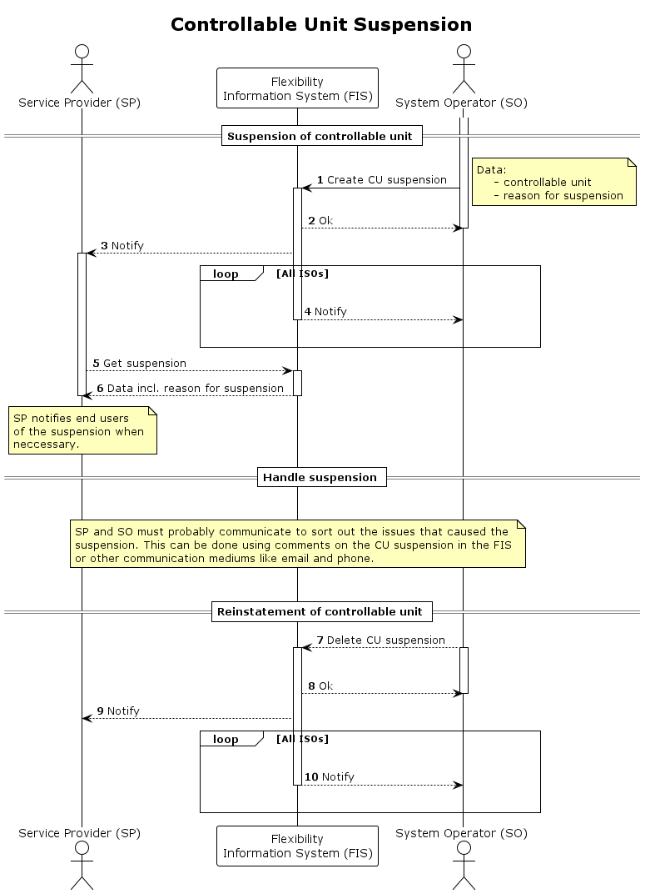

# CU Suspension

This process is used to [suspend](../concepts/suspension.md) the controllable
unit (CU) temporarily.

The suspension is valid for the following combination:

* `controllable unit` - the CU that is suspended.
* `service provider`- the supplier of the CU.
* `impacted system operator`- the one that suspends.

All procuring system operators will be affected by the suspension as the CU
will no longer be approved to deliver services. Procuring system operators and
impacted system operators will receive notification of the suspension.

Changes in CU data is handled by the [CU Update](../processes/controllable-unit-update.md) process.
If there are significant changes in CU data or the data is incorrect, the CSO
can perform a new grid validation instead of relying on CU suspension.

If there are issues in the grid where the CU will temporarily be a threat to safe
operation, then temporary limits should be used.

Suspension is a powerful tool, and it should not be the primary way to limit the
use of a CU. A CU suspension will effectively prevent the CU from delivering _any_
services to _any_ procuring system operator. The combination of temporary limits
and new grid validation status should be sufficient to ensure safe operation.
Consequently, CU suspension should not be neccessary unless there is an extraordinary
case. Rather than serving as a primary solution, CU suspension functions as a
safety valve for extraordinary cases.

Reasons for suspension:

| Reason                       | Description                                                                                   |
|------------------------------|-----------------------------------------------------------------------------------------------|
| `compromises_safe_operation` | Delivery of services from the CU might compromise the safe operation of the ISOs grid.        |
| `other`                      | Should generally _not_ be used, but can in cases where ISO has a valid reason for suspension. |

The process also includes reinstatement of the controllable unit,
i.e. removing the suspension.

## Prerequisites

* The issue that triggers the suspension is temporary.

## Sequence

[Full Size](../diagrams/controllable_unit_suspension.png)
| [PlantUML description](../diagrams/controllable_unit_suspension.plantuml)

