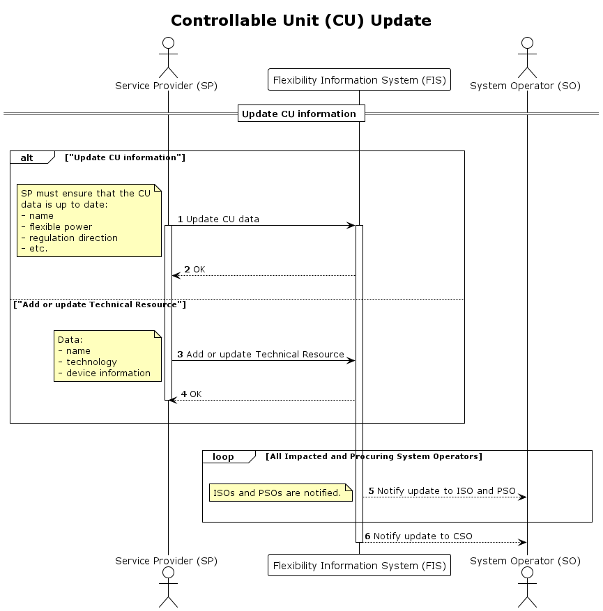

# CU Update

Update of controllable unit information from service provider.

## Prerequisites

* Controllable Unit exist in the flexibility information system.
* Service provider has access to the controllable unit.
* If the Controllable Unit is part of a Service Providing Group (SPG) product
application or a prequalified Service providing group, the system operator
evaluates if the update triggers the need for a new SPG product application
or grid prequlaification.

## Sequence

[Full Size](../diagrams/controllable_unit_update.png) | [PlantUML description](../diagrams/controllable_unit_update.plantuml)

