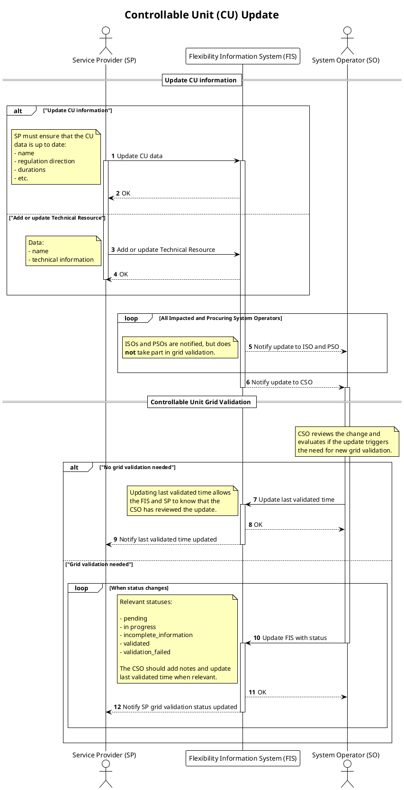

# CU Update

Update of controllable unit information from service provider. Includes steps
for connecting system operators to validate the information provided (CU grid
validation) if needed.

## Prerequisites

* Controllable Unit exist in the flexibility information system.
* Service provider has access to the controllable unit.
* The system operator evaluates if the update triggers the need for new grid validation.
    * If the change does not trigger new grid validation, system operator should
      update last validated time.
    * If the change triggers new grid validation, system operator should update
      to relevant status and initiate grid validation without undue delay.

## Sequence

[Full Size](../diagrams/controllable_unit_update.png) | [PlantUML description](../diagrams/controllable_unit_update.plantuml)

