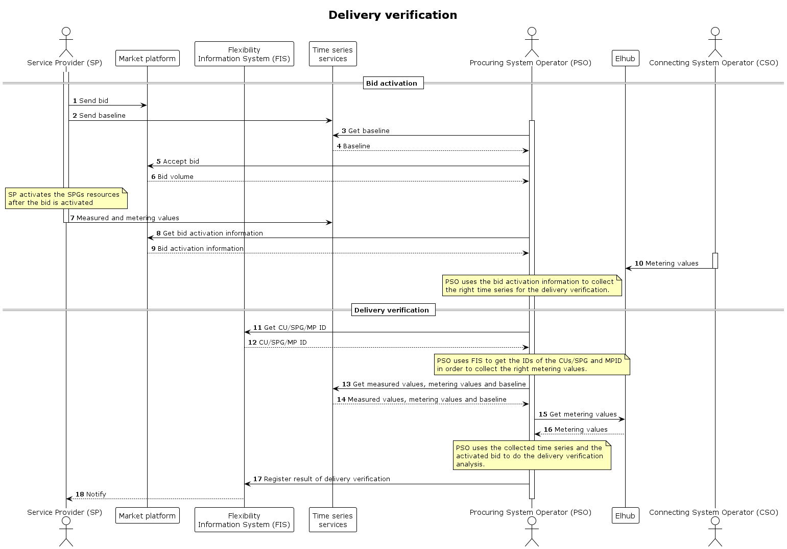

# Delivery verification

This process describes the [verification](../concepts/time-series.md#verification) of a delivered flexibility service and 
how it relates to the FFlexibility Information System (FIS).

[!NOTE]

>This is a general description of how a delivered service can be verified. The detailed
>requirements for the time series required for the analysis (e.g. the requirements
>for time resolution) should be defined in the product-specific requirements.

The delivery verification is done by the procuring system operator (PSO) that has
activated a bid from the service provider (SP). The verification is done at the 
SPG level, as the service is delivered at the SPG level.
Time series for the verification are available through the time series services and FIS.

There is an [integration](../technical/time-series-design.md#integration) between the time series services
and FIS, where FIS references the time series by ID,
holds authorization information and relationships. ([concept model](../concepts/conceptual-model.md))

## Required time series

The time series needed for the verification are:

* Metering values
* Baseline
* Activated bid volume

#### Metering Values
SP continuously sends _metering values_ from its CUs to the time series services.
It's possible to send metering values with different granularity, e.g. minute and 15 minutes values
The times eries on CU level can be aggregated to the SPG level.

The metering values from the smart meter connected to the accounting point are sent
continuously to Elhub by the SO. Values are available at 07:00 for the previous day and 
are available through the time series service.

#### Baseline

Where the SP produces the _baseline_, the baseline is sent by SP after a bid is offered to the PSO, before
the bid is accepted. The baseline is accessible through the time series service 
after the bid has been activated.

Where the baseline is automatically driven by rules, like hour before activation, after or null,
the values are produced by the time series services

#### Activated Bid Volume
The _bid volume_ is collected by PSO when they accept the bid. Normally this information is managed by the marketplace. 
The volume and period will be available when performing verification - via time series services.
The bid volume is given at an SPG level.

## Time resolution

In most cases, a 15-minute time resolution will be sufficient to verify that the
delivered volume was equal to the bid volume. However, if the analysis also
contains a verification of the quality of the delivery, more granular data
will usually be required.

## Prerequisites

* PSO has the activated volmes for the bid and are available via time series service

## Sequence

[Full Size](../diagrams/delivery-verification.png) | [PlantUML description](../diagrams/delivery-verification.plantuml)

