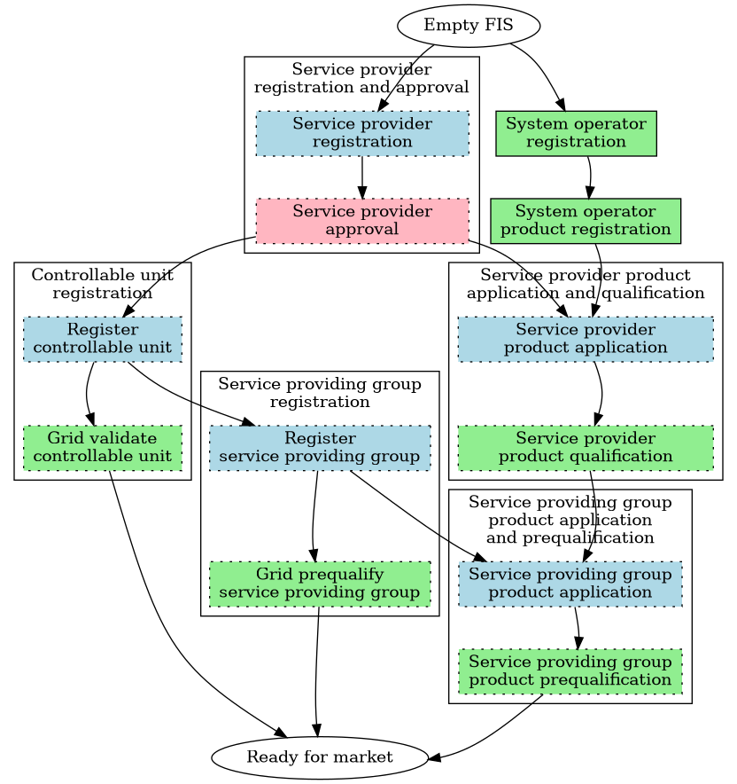

# Processes

This section of the documentation describes the business processes in the
flexibility value chain. The processes assumes that there is one common Norwegian
flexibility information system (FIS).

The processes describe the sequence of activities that are done to achieve a
goal. They are *business processes* and not technical processes *in* the FIS,
but does provide quite a lot of details about how interaction will be done with
the FIS API. All interactions with the FIS is done via syncronous calls to the
[Resource-oriented JSON-over-HTTP(s) Data API](../technical/api-design.md).
The FIS API will be implemented to *support* the processes and enforce certain
rules/policies such as data validation, state transitions and notifications.

!!! note "User experience will differ from the process descriptions"

    The process descriptions are a *generalized* view of how interactions are
    done between parties and systems in the value chain. It does **not** show
    the actual user experience, but rather logical steps that must be performed,
    e.g. towards the FIS API.

    It is up to the FIS UI and market party backend system to provide a good
    user experience on top. Some interactions might be fully automated between
    systems, some might be chained together from a single user interface and
    some cases might require the user to follow the process steps quite
    literally.

## Process documentation

Each process is documented in its own sub-page. The detail level varies between
them. The intent is to provide just as much detail as needed to understand the
process, but not more to avoid unnecessary rework when we change the processes.

Some parts of the process might look more like a detailed procedure than a
process while other parts are high-level and fairly unspecific. The lack of
details can be either because we are missing information at present or because
there is no need to specify in great detail. Over time, the processes will become
more detailed.

The following sub-sections describe some of the *common* elements of the process
documentation. Other sections and elements will be added to the individual
process pages as needed.

### High level description

Each process has a high level description that describes the process.

### Prerequisites

We are using prerequisites as a wide term to include all assumption,
preconditions, dependencies, constraints and other conditions that must be met
before a process can be done as documented.

### Sequence

We are using
[PlantUML sequence diagrams](https://plantuml.com/sequence-diagram) to document
the flow of the processes. The diagrams are simplified, business oriented
descriptions of how the process should flow. Most of the time, we are not caring
about error conditions or other exceptional cases. The process details the
so-called "happy path".

The diagram definition is a simple text format that is easy to read and write
and is included for download.

## Registration process overview

The following diagram shows dependencies between the registration processes that
takes a service provider from an empty FIS to a place where the service
providing groups are ready for use in the market(s).

Related processes are not included in the diagram on purpose. The diagram is
ment to highlight the main processes to inform us about what processes we should
prioritize discussing in the project as well as show a overview to the
registration.

We are using the following notation:

* `ellipses` - start and end states
* `rectangles` - processes
    * `solid border` - main process listed below
    * `dotted border` - sub-process
  driving/responsible market party (see above)
* colors indicating the driving/responsible market party for a (sub-)process
    * `green` - system operator
    * `blue` - service provider
    * `pink` - flexibility information system operator
    * `white` - unspecified
* `arrows` - dependencies between processes

The diagram shows us that a service provider can register all their data at
once, and that the (pre)qualification processes can run in parallel.

## Process list

The following is a list of processes where the Flexibility Information System
might take part in. This is an evolving list. If we have started detailing the
process, you will find that the process heading is a link to a sub-page. You can
also use the menu to find process details.

### Controllable unit

#### [Controllable Unit Lookup](controllable-unit-lookup.md)

Before a service provider registers or switch a controllable unit, they must
look up the controllable unit to see if it is already registered in the system.

#### [Controllable unit registration](controllable-unit-registration.md)

Register of a CU and data from a service provider and/or system user. Includes
steps for connecting system operators to validate the information provided -
Controllable Unit Grid Validation.

#### [Controllable unit update](controllable-unit-update.md)

Update of controllable unit information from service provider and/or system
user. Includes steps for connecting system operators to validate the information
provided (CU grid validation).

#### [Service provider switching initiated by the new service provider](service-provider-switching.md)

Switching of a controllable unit between service providers. Initiated by new
service provider.

#### [Service provider contract revocation and termination](revocation.md)

Ending the service provider contract on a controllable unit. Initiated by end
user, implicit contract termination or service provider.

#### Suspension of controllable unit

Entitled parties can suspend a controllable unit.

#### Controllable unit de-registration

Removing a controllable unit from the system. Must not be part of any SPG.

### Service provider

#### [Service provider registration and approval](service-provider-registration-and-approval.md)

Registering a new service provider and approval by the flexibility information
system operator.

#### Service provider update

Update of service provider information from service provider.

#### [Service provider product application and qualification](service-provider-product-application.md)

A service provider applies for products with a specific procuring system
operator. The application includes all the product types the service provider
wants to offer to that specific system operator. The procuring system operator
will qualify the service provider for the product(s). Includes communication
test.

#### Service provider suspension

Suspension of a service provider initiated by system operator.

#### Service provider de-registration

De-registration of a service provider.

### Service providing groups

The following lists the processes related to service providing groups. We are
not modelling service proving units but rather treat them as a special case of
service providing groups.

#### [Service providing group registration](service-providing-group-registration.md)

Registering a new service providing group. Includes grid prequalification.

#### Update service providing group

Update of service providing group information from service provider.

#### Assigning controllable units to group(s)

Assigning controllable units to a group from service provider.

#### Removing controllable units from group(s)

Removing controllable units from a group from service provider.

#### Suspension of service providing groups

This process is used to suspend the prequalification of a SPG.
Initiated by system operator.

#### De-register service providing group

Removing a service providing group from the system.

#### [Service providing group product application and prequalification](service-providing-group-product-application.md)

Service providers apply for product types with their SPGs. This includes product
pre-qualification that might end in temporary qualification until the product
verification is concluded. Includes procuring system operators to confirm the
SPG characteristics registered by the service provider.

### Product

Product management by system operators.

#### [System operator product registration](system-operator-product-registration.md)

The procuring system operator register what product types (according to national
table of equivalences) they will procure.

#### Product update

Update of product information from procuring system operators.

#### Product de-registration

Removing a product from the system.

### Temporary limits

#### Set, update or remove temporary limits on grid elements

Temporary limits on grid elements. Initiated by system operator.

#### Set, update or remove temporary limits on service providing groups

Temporary limits on service providing groups. Initiated by system operator.

### Grid topology

TODO - processes related to maintaining the grid topology.

### Metering values

TODO - processes related to collecting, validating, storing and distributing
metering values and other time-series like baselines.

### Imbalance adjustment

TODO - processes related to imbalance adjustment.

### Not in scope

This section includes processes and procedures outlined in NCDR and/or other
documents that are deemed out-of-scope for a Norwegian Flexibility Information
System

#### Export of data from the Norwegian Flexibility Information System

NCDR states that:

> To avoid vendor and operator lock-ins, all data stored in the SP modules and
> CU modules shall be portable.

This is not relevant since we are assuming the national terms in norway will
dictate a single, integrated system operated by the system responsible.

#### Set, update or remove temporary limits on bids

This must be handled in the market place.
