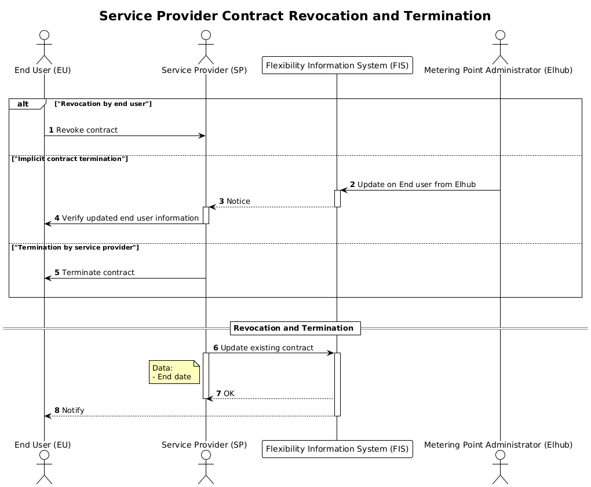

# SP Contract Revocation and Termination

This process is used to terminate the service provider contract for the
controllable unit. The process can be triggered by one of the following:

- Service contract revocation by end user.
- Implicit contract termination triggered by updated end user information in
  Elhub (Metering Point Administrator).
- Service contract termination by service provider.

Updated end user information from Elhub can occur for several reasons, such as:

- Move in of a new end user, which automatically terminates the current end user.
- Move out of the current end user.
- Deactivation of an accounting point, which results in the termination of the
  current end user.
- Corrections to move ins and move outs, which trigger updates on end users.

In all these cases, FIS does not have insight into the reasons behind the
updates from Elhub. Therefore, it is important for the service provider to
actively monitor these updates and verify them against their end users, to
assess whether the update trigger an implicit contract termination. Note that
updates on end user information from Elhub can be both in the future and back in
time.

## Prerequisites

- The service provider acts on behalf of the end user in all scenarios.
- End users access to the controllable unit is given based
  on continuously updated end user information from Elhub.
- A controllable unit service provider contract is decoupled from the end user
  and can span multiple end users from Elhub.
- The service provider must verify the information given by FIS when informed
  of an implicit contract termination.
- The service provider must update affected service providing groups if the CU
  contract is revoked or terminated.

## Sequence

[Full Size](../diagrams/revocation.png) |
[PlantUML description](../diagrams/revocation.plantuml)

