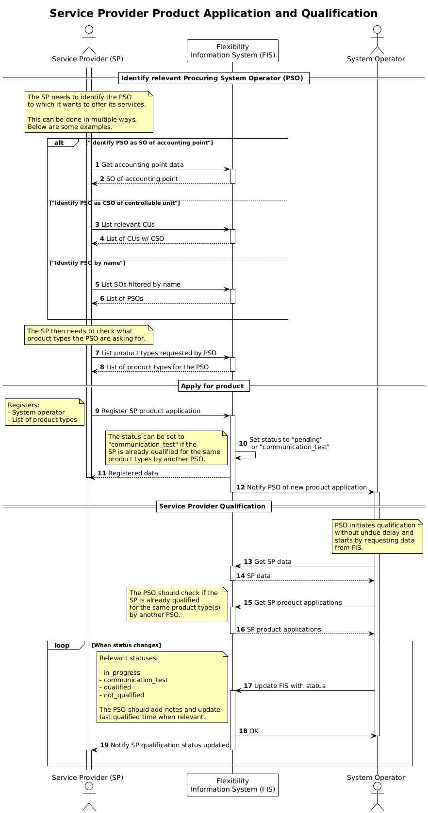

# Service provider product application and qualification

A service provider applies for products with a specific procuring system
operator. The application includes all the product types the service provider
wants to offer to that specific system operator.

!!! note "One at the time"

    The service provider should only initiate one application per product type,
    then wait for that application to be processed before initiating another
    application for the same product type towards another system operator. This
    prevents double/duplicate work for the system operators. The qualification
    process done by the system operator will be much lighter when the service
    provider is already qualified for the product type by another system operator.

The service provider will have to apply for the product type(s) they want to deliver
for every _procuring system operator_ they want to deliver to, but if the
service provider is already qualified for the product type by another procuring
system operation, the qualification process can be simplified by letting the
flexibility information system automatically move the application ahead to
communication test.

## Prerequisites

- The service provider is registered and approved by the flexibility information
  system operator.
- Service provider data is updated. The data used in qualifying is registered on
  the service provider, not the application itself.
- The service provider will identify and nominate a system operator to do the
  qualification. This is done as part of the application.

## Qualification checks

The procedure for qualifying a SP will differ based on what product types the
SP is applying for. The qualification is about ensuring that the _service provider_
is capable of delivering the specific type of product. The qualification is done
by a _procuring system operator_.

Also note that the service provider has been vetted as part of the
[registration](service-provider-registration-and-approval.md) process and that
[SPG product application](./service-providing-group-product-application.md) will
happen later.

The following is a list of types-of-checks that _might_ be relevant for the
qualification, _depending on the product type_.

- Banking information.
- Financial security.
- Trading license from the Norwegian Energy
  Regulatory Authority (RME).
- Settlement agreement with settlement responsible for imbalance settlement.
- User agreement with the procuring system operator/market operator.
- Qualifying the service providers technical solutions for activation, including
  full chain of systems involved.
- Communication test.
- Operational capabilities e.g. operations center and on-call procedures.

## Sequence

[Full Size](../diagrams/service_provider_product_application.png) |
[PlantUML description](../diagrams/service_provider_product_application.plantuml)

