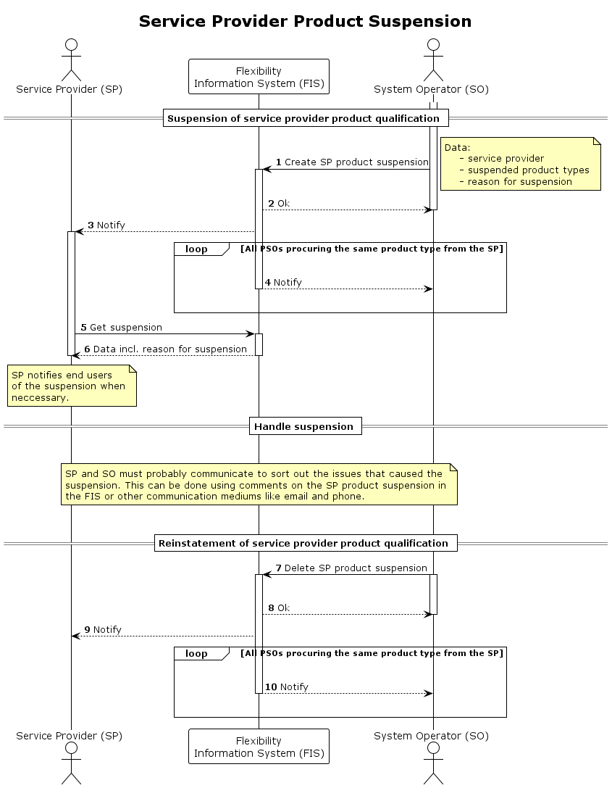

# SP Product Suspension

This process is used to [suspend](../concepts/suspension.md) the service
provider product qualification temporarily. The suspension is done by a
procuring system operator and is registered in the flexibility information
system (FIS) by updating the relevant SP product application. By registering it
in the FIS, both the service provider and other relevant procuring system
operators will be made aware of the suspension.

The suspension is valid for the following combination.

* `service provider` - the one that is suspended
* `procuring system operator` - the one that suspends
* `product types` - a list of product types that the SP is qualified for

This means that the suspension does _not_ impact other procuring system operators.
Procuring system operators that have qualified the service provider for the same
product type will however be notified of the suspension.

The system operator must include the reason for suspension when suspending. The
reason for suspension is a predefined list. There are two reasons for that. The
first is that the PSO is only allowed to suspend for valid reasons. The other is
that it allows for a greater degree of automation in the process.

| Reason                 | Description                                                                                                                              |
|------------------------|------------------------------------------------------------------------------------------------------------------------------------------|
| `communication_issues` | There are communication issues between the service provider and the procuring system operator.                                           |
| `failing_heartbeat`    | If SP does not respond to heartbeat, SO may consider the SP to be unavailable for activation.                                            |
| `system_issues`        | There are issues with the service providers systems. Their back office systems used in delivering flexibility.                           |
| `clearing_issues`      | Delayed or lack of payment.                                                                                                              |
| `other`                | Should generally _not_ be used, but can in cases where PSO have a valid reason for suspension that is outside the other defined reasons. |

Depending on the reason for suspension, the system operator should warn the
service provider in advance of the suspension. The reasons for suspension that
require a warning in advance of the suspension - and how that warning is
conveyed - must be specified in the terms and conditions of the product type or
service.

The process also includes reinstatement of the service provider qualification,
i.e. removing the suspension.

## Prerequisites

* The issue that triggers the suspension is temporary.
* Adding and lifting a suspension is instantaneus. There is no need to
  communicate suspension or reinstatement ahead in time.
* End users should not be notified about or view the suspension in FIS. Service
  providers will notify end users when necessary and dependent on the agreement
  between them and the end user.
* The suspension of the SP qualification will impact the
  [ready for market](https://elhub.github.io/flex-information-system/concepts/ready-for-market/)
  status for a SPG.

## Sequence

[Full Size](../diagrams/service_provider_product_suspension.png) |
[PlantUML description](../diagrams/service_provider_product_suspension.plantuml)

