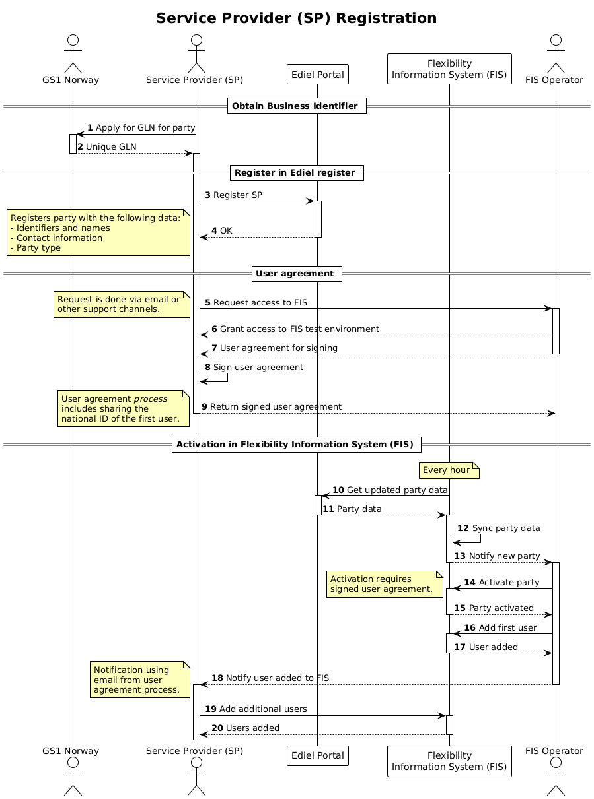

# Service provider registration and approval

Service provider registration is the process of registering the service provider
with the Flexibility Information System. It starts with a new service provider
that wants to take part in the market(s) and end once the service provider is
successfully registered in the Flexibility Information System and can apply for
products and start adding/modifying controllable units and service providing
groups.

## Existing Processes

This section lists some existing processes that has been used as inspiration or
input to the design of the process.

* [Balancing markets - Statnett](https://www.statnett.no/for-aktorer-i-kraftbransjen/systemansvaret/kraftmarkedet/reservemarkeder/delta-i-reservemarkedene/)
* [EuroFlex R&D](https://www.euroflex.no/slik-deltar-du/stromselskap-tjenestetilbyder)
* [Ny aktør - Elhub](https://elhub.no/aktorer-og-markedsstruktur/opprette-endre-og-avslutte-aktorer/sjekkliste-for-nye-aktorer/)

## Prerequisites

The following is a list of conditions that must be met before the process can
successfully be executed.

* It is assumed that the service provider does not have a party identifier,
  either GLN or EIC-X, and as such the process includes a step to request one.
* The Ediel register is a national register of market participants in the
  power sector. It is natural that the service provider is registered there first.

## Approval checks

The approval of a service provider by FIS is based on the following
types-of-checks.

* The legal entity (organization) is registered in Brønnøysundsregisteret. The
  main organization number is used in the registration process.
* The service provider has a valid party identifier (GLN or EIC-X).
* Contact information is provided (in Ediel).
* The service provider has signed a user agreement with FIS.

The approval process does **not** include any steps to verify that the service
provider is *capable* of delivering services/products. Such qualification will
be handled in the product application and qualification process.

## Sequence

[Full Size](../diagrams/service_provider_registration.png) | [PlantUML description](../diagrams/service_provider_registration.plantuml)

