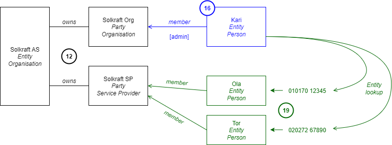

# SP Registration and Approval

Service provider registration is the process of registering the service provider
with the Flexibility Information System. It starts with a new service provider
that wants to take part in the market(s) and end once the service provider is
successfully registered in the Flexibility Information System and can apply for
products and start adding/modifying controllable units and service providing
groups.

## Existing Processes

This section lists some existing processes that has been used as inspiration or
input to the design of the process.

* [Balancing markets - Statnett](https://www.statnett.no/for-aktorer-i-kraftbransjen/systemansvaret/kraftmarkedet/reservemarkeder/delta-i-reservemarkedene/)
* [EuroFlex R&D](https://www.euroflex.no/slik-deltar-du/stromselskap-tjenestetilbyder)
* [Ny aktør - Elhub](https://elhub.no/aktorer-og-markedsstruktur/opprette-endre-og-avslutte-aktorer/sjekkliste-for-nye-aktorer/)

## Prerequisites

The following is a list of conditions that must be met before the process can
successfully be executed.

* It is assumed that the service provider does not have a party identifier,
  either GLN or EIC-X, and as such the process includes a step to request one.
* The Ediel register is a national register of market participants in the
  power sector. It is natural that the service provider is registered there first.

## Approval checks

The approval of a service provider by FIS is based on the following
types-of-checks.

* The legal entity (organization) is registered in Brønnøysundsregisteret. The
  main organization number is used in the registration process.
* The service provider has a valid party identifier (GLN or EIC-X).
* Contact information is provided (in Ediel).
* The service provider has signed a user agreement with FIS.

The approval process does **not** include any steps to verify that the service
provider is *capable* of delivering services/products. Such qualification will
be handled in the product application and qualification process.

## Sequence

[Full Size](../diagrams/service_provider_registration.png) | [PlantUML description](../diagrams/service_provider_registration.plantuml)

## Details on user creation

Here is a diagram showing more precisely which resources are created in the FIS
in the last steps of the registration process, for a new Service Provider called
*Solkraft AS*:

Step 12 in the sequence diagram above creates everything that represents the
organisation that must exist in our system:

* the Service Provider party that the employees of Solkraft will assume to
  perform operations on the FIS on behalf of the company;
* the entity representing the organisation, that will own the previous party;
* the organisation party for Solkraft, that will be used to give administrator
  privileges to the user the FIS operator is in contact with in the context of
  the current process (let us call her Kari Nordmann).

In Step 16, the FISO creates a new person entity for Kari and makes it a member
of the organisation party with administrator scopes, *i.e.*, a set of scopes
that allows at least to perform entity lookups and edit party memberships.

In Step 19, Kari logs in as her own entity, then assumes the organisation party.
She can then make the person numbers of her colleagues Ola and Tor members of
the Service Provider party, so that they can also act on behalf of the company
later on.
Kari sets the privileges of her colleagues by adjusting which scopes they get on
their party memberships.
The operations include entity lookups to get technical entity IDs in the FIS
from the person numbers, ensuring there is no double entity creation going on.
