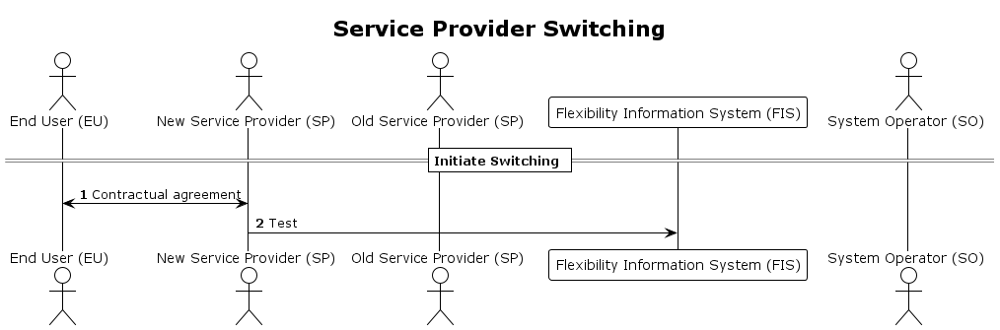

# Service provider switching initiated by the new service provider

The end user contacts a new service provider in order to obtain a new contract
for controllable unit services and ending of the contract with the present
service provider

## Prerequisites

- There exists a valid contract between the new service provider and the end
  user, and all contract requirements from the old contract have been met.
- The service provider acts on behalf of the end user.
- The service provider gets necessary information to perform the switch by doing
  controllable unit lookup.
- The controllable unit will remain with the old service provider’s control and
  useable for operations until the contract start date for new service provider.
- The old service provider must update affected service providing groups.

## Sequence

[Full Size](../diagrams/service_provider_switching.png) |
[PlantUML description](../diagrams/service_provider_switching.plantuml)

