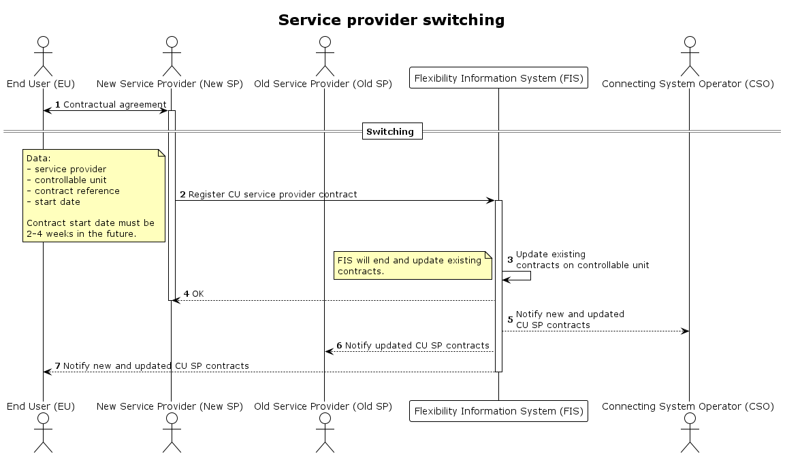

# Service provider switching initiated by the new service provider

The final customer contacts a potential new service provider in order to obtain an offer which may lead to a new contract for CU services and the possible ending of the contract with the present service provider

## Prerequisites

- There exists a valid contract between the new service provider and the final customer, and all switching deadlines from the old contract have been met. 

- The Service Provider acts on behalf of, and has consent from the Final Customer. 

- The resource will remain with the old Service Provider’s control and useable for operations until the intended switching date.  

- The Flexible Information System will arrange for the swiching of Service Provder on the CU and perform the switcing at switcing date (midning allinged) and remove CU from old Sercice Providers SPG(s).

- Further update of CU characteristics and assignment of CU to SPG(s) will be done using dedicated processes

## Application status transitions
Decitions to be made:
- Do we set statuses on CU validation, grid prequalification or SPG Product prequalification depending of Articles, e.g. 22.2?

## Sequence

[Full Size](../diagrams/service_provider_switching.png) |
[PlantUML description](../diagrams/service_provider_switching.plantuml)

