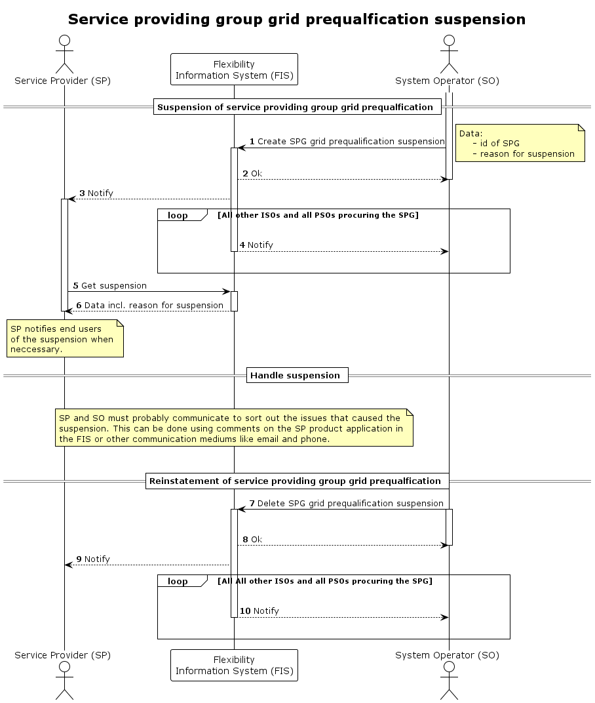

# SPG grid prequalification suspension

This process is used to [suspend](../concepts/suspension.md) the service providing
 groups grid prequalification temporarily.
The suspension is done by an impacted system operator and is registered in the
flexibility information system (FIS) by updating the relevant SPG grid prequalfication.
By registering it in the FIS, both the service provider and other relevant
procuring and impacted system operators will be made aware of the suspension.

The suspension is valid for the following combination.

* `service provider` - the one that is suspended
* `impacted system operator`- the one that suspends
* `grid prequalification`- the grid prequalification of the SPG

Other impacted system operators and all procuring system operators will be affected
 by the syspension as the SPG will no longer be approved. They will receive
notification of the suspension.

The system operator must include the reason for suspension when suspending. The
reason for suspension is a predefined list. There are two reasons for that. The
first is that the PSO is only allowed to suspend for valid reasons. The other is
that it allows for a greater degree of automation in the process.

| Reason                   | Description                                                                                                                             |
|--------------------------|-----------------------------------------------------------------------------------------------------------------------------------------|
| `breach_of_conditions`    | The status is _conditionally_approved_ and SPG repeatedly breaches the conditions.                                                       |
| `significant_alteration` | In cases where the SPG is altered significantly and ISO needs time to consider if they need to do a new grid prequalification or use other tools.             |
| `other`                  | Should generally _not_ be used, but can in cases where ISO has a valid reason for suspension that is outside the other defined reasons. |

Depending on the reason for suspension, the system operator should warn the
service provider in advance of the suspension. The reasons for suspension that
require a warning in advance of the suspension - and how that warning is
conveyed - must be specified in the terms and conditions of the product type or
service.

The process also includes reinstatement of the service provider qualification,
i.e. removing the suspension.

## Prerequisites

* The issue that triggers the suspension is temporary.
* Adding and lifting a suspension is instantaneus. There is no need to
  communicate suspension or reinstatement ahead in time.
* End users should not be notified about or view the suspension in FIS. Service
  providers will notify end users when necessary and dependent on the agreement
  between them and the end user.
* The suspension of the SPG grid prequalification will impact the [ready for market](https://elhub.github.io/flex-information-system/concepts/ready-for-market/)
  status for an SPG.

## Sequence

[Full Size](../diagrams/service_providing_group_grid_prequalification_suspension.png)
| [PlantUML description](../diagrams/service_providing_group_grid_prequalification_suspension.plantuml)

