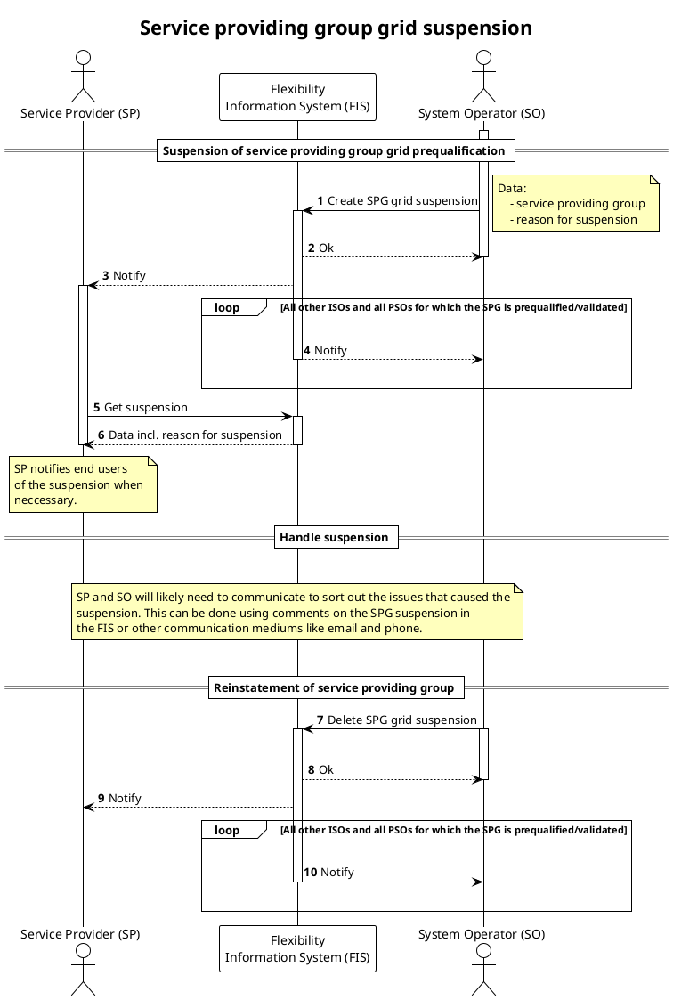

# SPG grid suspension

This process is used to [suspend](../concepts/suspension.md) the service
providing group (SPG) temporarily.
The suspension is done by an impacted system operator and is registered in the
flexibility information system (FIS) by creating a SPG suspension.
By registering it in the FIS, both the service provider, relevant
procuring and impacted system operators will be made aware of the suspension.

The suspension is valid for the following combination:

* `service providing group`- the SPG that is suspended.
* `service provider` - the supplier of the SPG.
* `impacted system operator`- the one that suspends.

All procuring system operators will be affected by the suspension as the SPG
will no longer be approved to deliver services. Procuring system operators and
impacted system operators will receive notification of the suspension.

The impacted system operator must include the reason for suspension when
suspending. The reason for suspension is a predefined list. There are two
reasons for that. The first is that the ISO is only allowed to suspend for
valid reasons. The other is that it allows for a greater degree of automation
in the process.

| Reason                   | Description                                                                                                                                                                                                                                                           |
|--------------------------|-----------------------------------------------------------------------------------------------------------------------------------------------------------------------------------------------------------------------------------------------------------------------|
| `breach_of_conditions`   | The SPG grid prequalification status is _conditionally_approved_ and SPG repeatedly breaches the conditions.                                                                                                                                                                                    |
| `significant_alteration` | In cases where the SPG is altered significantly and ISO needs time to consider if they need to do a new grid prequalification or use other tools. Suspension is _not the primary tool_ that should be used in this case. Temporary limits should be used when possible. |
| `other`                  | Should generally _not_ be used, but can in cases where ISO has a valid reason for suspension that is outside the other defined reasons.                                                                                                                               |

Depending on the reason for suspension, the system operator should warn the
service provider in advance of the suspension. The reasons for suspension that
require a warning in advance of the suspension - and how that warning is
conveyed - must be specified in the terms and conditions of the product type or
service.

The process also includes reinstatement of the service providing group grid prequalification,
i.e. removing the suspension.

## Prerequisites

* The issue that triggers the suspension is temporary.
* Adding and lifting a suspension is instantaneous. There is no need to
  communicate suspension or reinstatement ahead in time.
* End users should not be notified about or view the suspension in FIS. Service
  providers will notify end users when necessary and dependent on the agreement
  between them and the end user.
* The suspension of the SPG will impact the [ready for market](https://elhub.github.io/flex-information-system/concepts/ready-for-market/)
  status for a SPG.

## Sequence

[Full Size](../diagrams/service_providing_group_grid_suspension.png)
| [PlantUML description](../diagrams/service_providing_group_grid_suspension.plantuml)

