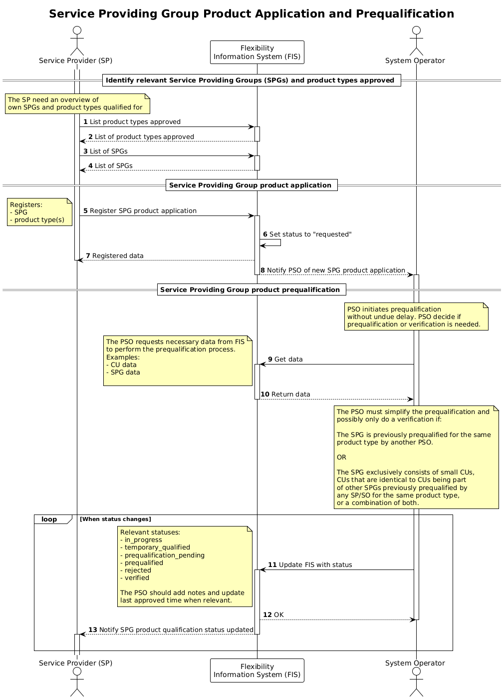

# SPG Product Application and Prequalification

A service provider applies for a combination of a SPG and a product type with a
specific procuring system operator.

The service provider will have to apply for the combination of a SPG and a
product type for every _procuring system operator_ they want to deliver to. The
system operator will assess if a prequalification or a verification is needed, and
simplify if certain conditions are met.

## Prerequisites

- The
  [service provider is registered](./service-provider-registration-and-approval.md)
  and approved by the flexibility information system operator.
- The service provider has
  [registered the Service Providing Group](./service-providing-group-registration.md).

## Prequalification checks

The procedure for prequalifying a SPG will differ based on what product types
the SP is applying for. The checks also might differ based on the composition of
the SPG.

Also note that the service provider has been vetted as part of the
[registration](service-provider-registration-and-approval.md) and
[product application](service-provider-product-application.md) processes.

The following is a list of types-of-checks that might be relevant for the prequalification.

- The SPG has the necessary technical capabilities to deliver the product type.
- The Service provider has been qualified for offering services to the SO for
  the specific product type as part of the
  [service provider product application process](./service-provider-product-application.md).
- Activation test

## Sequence

[Full Size](../diagrams/service_providing_group_product_application.png) |
[PlantUML description](../diagrams/service_providing_group_product_application.plantuml)

