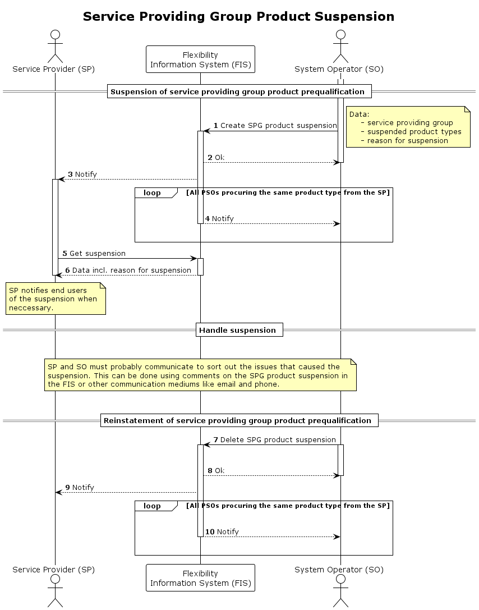

# SPG Product Suspension

This process is used to [suspend](../concepts/suspension.md) the service
providing group (SPG) product prequalification temporarily.

The suspension is valid for the following combination:

* `service providing group`- the group that is suspended.
* `product types` - a list of product types that the SPG is qualified for.
* `procuring system operator`- the one that suspends.

This means that the suspension does _not_ impact other procuring system operators.

Reasons for suspension:

| Reason                | Description                                                                                                                              |
|-----------------------|------------------------------------------------------------------------------------------------------------------------------------------|
| `failed_verification` | The agreed upon service has not been delividered - in multiple consecutive trades.                                                       |
| `other`               | Should generally _not_ be used, but can in cases where PSO have a valid reason for suspension that is outside the other defined reasons. |

The process also includes reinstatement of the SPG product prequalification,
i.e. removing the suspension.

## Prerequisites

* The issue that triggers the suspension is temporary.
* End users should not be notified about or view the suspension in FIS. Service
  providers will notify end users when necessary and dependent on the agreement
  between them and the end user.
* The suspension of the SPG product prequalification will impact the
  [ready for market](https://elhub.github.io/flex-information-system/concepts/ready-for-market/)
  status for a SPG.

## Sequence

[Full Size](../diagrams/service_providing_group_product_suspension.png) |
[PlantUML description](../diagrams/service_providing_group_product_suspension.plantuml)

