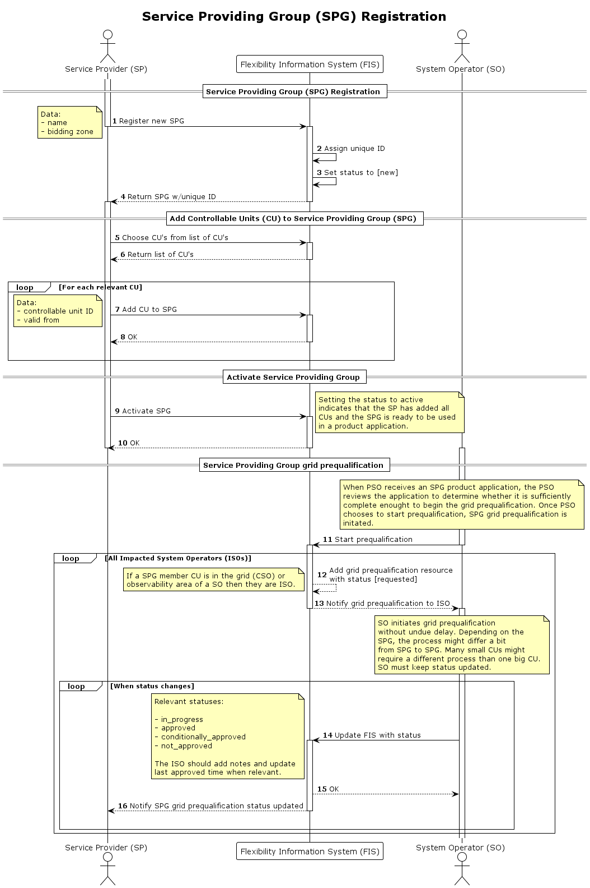

# SPG Registration

Service Providing Group registration is the process of registering a new SPG and
adding CUs.

A Service Providing Group (SPG) is considered as new until the status is changed
to active. When this happens, the SPG can be used in a product application. Once
a product application is considered complete enough for prequalification, grid
prequalification is initiated.

## Prerequisites

* Controllable units are registered and assigned to the Service Provider.
* Service Providing Unit is **not** modelled in the process. We do not have a clear
  understanding of the reasoning behind distinguishing between the two.
* Creating a SPG will commonly be done from another system, e.g. SP backoffice
  systems or the market systems. The actor that does changes towards the FIS
  will still be the service provider, so the process does not model those
  systems specifically. The FIS is considered the system of record for the SPG information.

## Sequence

[Full Size](../diagrams/service_providing_group_registration.png) |
[PlantUML description](../diagrams/service_providing_group_registration.plantuml)

