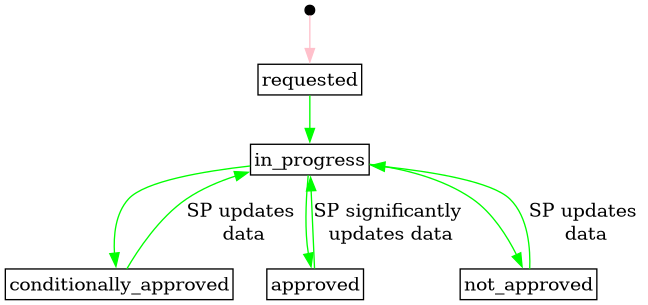

# Service Providing Group Registration

Service Providing Group registration is the process of registering a new SPG,
adding CUs and ends once grid prequalification is completed. The process is
initiated by the Service Provider.

A Service Providing Group (SPG) is considered as new until the status is changed
to active. When this happens, grid prequalification notifications are sent to
all ISOs. Once grid prequalification has been requested, any changes to the SPG
is considered an update, and handled by the update process.

## Prerequisites

* Controllable units are registered and assigned to the Service Provider.
* Service Providing Unit is **not** modelled in the process. We do not have a clear
  understanding of the reasoning behind distinguishing between the two.
* Creating a SPG will commonly be done from another system, e.g. SP backoffice
  systems or the market systems. The actor that does changes towards the FIS
  will still be the service provider, so the process does not model those
  systems specifically. The FIS is considered the system of record for the SPG information.

## Status transitions for grid prequalification

[Full Size](../diagrams/service_providing_group_prequalification_status.png)
|
[Plantuml description](../diagrams/service_providing_group_prequalification_status.plantuml)
|
[How to read the diagram](./index.md#status-and-transitions)

## Sequence

[Full Size](../diagrams/service_providing_group_registration.png) |
[PlantUML description](../diagrams/service_providing_group_registration.plantuml)

