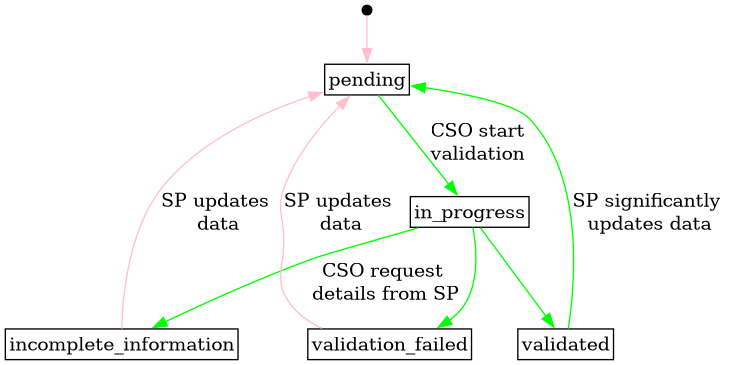

# Controllable Unit

A controllable unit (CU) is a unit in the power system that can be
actively controlled.

In FIS, each CU is linked to exactly one accounting point, ensuring a unique
connection to the balance responsible party (BRP) and determining its location
in the grid.

For more information about the CU concept and its role in the flexibility structure,
see [Conceptual Model and Terminology](../concepts/conceptual-model.md).

## Business Identifiers

Controllable units are identified by a UUID. UUID are simple and easy to
generate and requires no coordination with external bodies (like GS1 or
ENTSO-E). It is a un-complicated way to ensure uniqueness.

The UUIDs are generated by the system when a CU is created.

## Status transitions for grid validation

The following diagram shows the transitions for the grid validation status of
controllable units.
It normally starts as `pending`, then the system operator takes over to conclude
on their validation or signal that information is missing.
On any change to a technical information on a controllable unit or one of its
technical resources, the grid validation status is reset to `pending` if not already
`pending` or in statuses `in_progress` or `validated`.

If the service provider significantly updates data on a controllable unit that
has already been `validated` by CSO, then the CSO has the option to re-validate.
The `validated_at` field can be used in combination with history on the
controllable unit to determine if a significant change has occurred. The CSO can
then either reset the status before doing the validation or directly do the
validation and just update the `validated_at` timestamp.

[Full Size](../diagrams/controllable_unit_grid_validation_status.png)
|
[Plantuml description](../diagrams/controllable_unit_grid_validation_status.plantuml)
|
[How to read the diagram](./index.md#status)

## Status transitions for controllable unit

The following diagram shows the status and its transitions for controllable
unit.
The Service Provider is responsible for creating a new controllable unit.
Initially, the status is set to "new." Once the CU registration is complete, the
Service Provider updates the status to "active." After termination, the status
can only be edited by a FIS operator.

[Full Size](../diagrams/controllable_unit_status.png)
|
[Plantuml description](../diagrams/controllable_unit_status.plantuml)
|
[How to read the diagram](./index.md#status)

## Relevant links

* [API Documentation](../api/v0/index.html#/operations/list_controllable_unit)
* [Download docx](../download/controllable_unit.docx)

## Fields

| Name                                                                                                               | Description                                                                                                                                                                                     | Format                                                                                                                                                                                                                                                       | Reference                                           |
|--------------------------------------------------------------------------------------------------------------------|-------------------------------------------------------------------------------------------------------------------------------------------------------------------------------------------------|--------------------------------------------------------------------------------------------------------------------------------------------------------------------------------------------------------------------------------------------------------------|-----------------------------------------------------|
| <a name="field-id" href="#field-id">id</a>                                                                         | Unique surrogate key.                                                                                                                                                                           | bigint Read only                                                                                                                                                                                                                                         |                                                     |
| <a name="field-business_id" href="#field-business_id">business_id</a>                                              | Unique business identifier for the controllable unit.                                                                                                                                           | text Pattern: `^[0-9a-f]{8}-[0-9a-f]{4}-4[0-9a-f]{3}-[89ab][0-9a-f]{3}-[0-9a-f]{12}$` Read only                                                                                                                                                      |                                                     |
| <a name="field-name" href="#field-name">name</a>                                                                   | Free text name of the controllable unit.                                                                                                                                                        | text Required Max length: `512`                                                                                                                                                                                                                      |                                                     |
| <a name="field-start_date" href="#field-start_date">start_date</a>                                                 | The usage date when the controllable unit is first active.                                                                                                                                      | date                                                                                                                                                                                                                                                         |                                                     |
| <a name="field-status" href="#field-status">status</a>                                                             | The status of the controllable unit.                                                                                                                                                            | text One of: `new`, `active`, `inactive`, `terminated` Default: `new`  Always `new` when created. Can then be updated to the other values. Once `terminated`, only editable by a FIS operator.                                               |                                                     |
| <a name="field-regulation_direction" href="#field-regulation_direction">regulation_direction</a>                   | The regulation direction of the controllable unit. `up` means it can be used to increase production or decrease consumption, while `down` means to decrease production or increase consumption. | text One of: `up`, `down`, `both` Required  `up`                                                                                                                                                                                             |                                                     |
| <a name="field-maximum_available_capacity" href="#field-maximum_available_capacity">maximum_available_capacity</a> | Maximum continuous active power that the controllable unit can produce or consume, i.e. deliver for balancing and congestion services, in kilowatts.                                            | decimal Required Min: `0` Max: `999999.999` Multiple of: `0.001`                                                                                                                                                                             |                                                     |
| <a name="field-is_small" href="#field-is_small">is_small</a>                                                       | Whether the controllable unit is small or not, following NCDR.                                                                                                                                  | boolean Read only                                                                                                                                                                                                                                        |                                                     |
| <a name="field-minimum_duration" href="#field-minimum_duration">minimum_duration</a>                               | The minimum activation duration in seconds.                                                                                                                                                     | bigint Min: `0`                                                                                                                                                                                                                                          |                                                     |
| <a name="field-maximum_duration" href="#field-maximum_duration">maximum_duration</a>                               | The maximum activation duration in seconds.                                                                                                                                                     | bigint Min: `0`                                                                                                                                                                                                                                          |                                                     |
| <a name="field-recovery_duration" href="#field-recovery_duration">recovery_duration</a>                            | The minimum recovery duration between activations in seconds.                                                                                                                                   | bigint Min: `0`                                                                                                                                                                                                                                          |                                                     |
| <a name="field-ramp_rate" href="#field-ramp_rate">ramp_rate</a>                                                    | The rate of power per unit of time to reach empty or full power for the controllable unit, in kilowatts per minute.                                                                             | decimal Min: `0.001` Multiple of: `0.001`                                                                                                                                                                                                            |                                                     |
| <a name="field-accounting_point_id" href="#field-accounting_point_id">accounting_point_id</a>                      | Reference to the accounting point that the controllable unit is connected to.                                                                                                                   | bigint Required Non-updatable                                                                                                                                                                                                                        | [accounting_point.id](accounting_point.md#field-id) |
| <a name="field-grid_node_id" href="#field-grid_node_id">grid_node_id</a>                                           | Reference to the node that the controllable unit is connected to.                                                                                                                               | text Pattern: `^[0-9a-f]{8}-[0-9a-f]{4}-4[0-9a-f]{3}-[89ab][0-9a-f]{3}-[0-9a-f]{12}$`  This field is controlled by the system operator, but can be set by the service provider when creating the controllable unit if they have the information. |                                                     |
| <a name="field-grid_validation_status" href="#field-grid_validation_status">grid_validation_status</a>             | The grid validation status of the controllable unit.                                                                                                                                            | text One of: `pending`, `in_progress`, `incomplete_information`, `validated`, `validation_failed` Default: `pending`                                                                                                                                 |                                                     |
| <a name="field-grid_validation_notes" href="#field-grid_validation_notes">grid_validation_notes</a>                | Free text notes on the current grid validation status.                                                                                                                                          | text Max length: `512`                                                                                                                                                                                                                                   |                                                     |
| <a name="field-validated_at" href="#field-validated_at">validated_at</a>                                           | When the controllable unit was last validated.                                                                                                                                                  | timestamp with time zone                                                                                                                                                                                                                                     |                                                     |
| <a name="field-recorded_at" href="#field-recorded_at">recorded_at</a>                                              | When the resource was recorded (created or updated) in the system.                                                                                                                              | timestamp with time zone Read only                                                                                                                                                                                                                       |                                                     |
| <a name="field-recorded_by" href="#field-recorded_by">recorded_by</a>                                              | The identity that recorded the resource.                                                                                                                                                        | bigint Read only                                                                                                                                                                                                                                         |                                                     |

## Validation Rules

| Validation rule key | Validation rule                                                                                                                     | Status |
|---------------------|-------------------------------------------------------------------------------------------------------------------------------------|--------|
| CU-VAL001           | If both `minimum_duration` and `maximum_duration` are specified, then the minimum duration must be lower than the maximum duration. | DONE   |
| CU-VAL002           | If `grid_validation_status` is set to `validated`, then `validated_at` must already be specified in the resource or the request.    | DONE   |
| CU-VAL003           | If `grid_validation_status` is set to `validation_failed`, then `validated_at` must be unset in the resource or by the request.     | DONE   |
| CU-VAL004           | The controllable unit must have at least one technical resource for its status to be set to `active`.                               | DONE   |

## Notifications

| Action | Recipient                        | Comment                  |
|--------|----------------------------------|--------------------------|
| create | Connecting SO                    |                          |
| create | End user of the accounting point |                          |
| update | Active SP                        |                          |
| update | Connecting SO                    | When status is not `new` |

## Authorization

### Resource Level Authorization

Below is the [RLA](../technical/auth/authz.md#resource-level-authorization-rla)
for the
resource. The default policy is **deny**.

#### Anonymous

No policies.

#### Common

No policies.

#### Balance Responsible Party

| Policy key | Policy                                                                                     | Status |
|------------|--------------------------------------------------------------------------------------------|--------|
| CU-BRP001  | Read CU data that are connected to AP where they are BRP. Only for the contract period.    | DONE   |
| CU-BRP002  | Read CU history that are connected to AP where they are BRP. Only for the contract period. | DONE   |

#### End User

| Policy key | Policy                                                                                           | Status |
|------------|--------------------------------------------------------------------------------------------------|--------|
| CU-EU001   | Read CU data that are connected to AP where they are EU. Only for when they are EU on the AP.    | DONE   |
| CU-EU002   | Read CU history that are connected to AP where they are EU. Only for when they are EU on the AP. | DONE   |

#### Energy Supplier

| Policy key | Policy                                                                                    | Status |
|------------|-------------------------------------------------------------------------------------------|--------|
| CU-ES001   | Read CU data that are connected to AP where they are ES. Only for the contract period.    | DONE   |
| CU-ES002   | Read CU history that are connected to AP where they are ES. Only for the contract period. | DONE   |

#### Flexibility Information System Operator

| Policy key | Policy                          | Status |
|------------|---------------------------------|--------|
| CU-FISO001 | Read, create and update all CU. | DONE   |
| CU-FISO002 | Read all CU history.            | DONE   |

#### Market Operator

| Policy key | Policy                                                                                                            | Status |
|------------|-------------------------------------------------------------------------------------------------------------------|--------|
| CU-MO001   | Read CU that are connected to their market. Only for the period CU is active in the market.                       | TODO   |
| CU-MO002   | Read history on CU that are connected to their market. Only history on the period the CU is active in the market. | TODO   |

#### Organisation

No policies.

#### System Operator

| Policy key | Policy                                                       | Status |
|------------|--------------------------------------------------------------|--------|
| CU-SO001   | Read and update CU that are connected to AP belonging to SO. | DONE   |
| CU-SO002   | Read CU belonging to SPG that the SO can see.                | DONE   |
| CU-SO003   | Read history on CU that they can read.                       | DONE   |

#### Service Provider

| Policy key | Policy                                      | Status |
|------------|---------------------------------------------|--------|
| CU-SP001   | Read CU data for the period they are SP.    | DONE   |
| CU-SP002   | Create new CU.                              | DONE   |
| CU-SP003   | Update CU where they are current SP.        | DONE   |
| CU-SP004   | Read CU history for the period they are SP. | DONE   |
| CU-SP005   | Read CU they created.                       | DONE   |

#### Third Party

No policies.

### Field Level Authorization

For party type abbreviations, check [the auth docs](../technical/auth/auth-model.md#party-market-actors)

| FIELD                      | ANON | BRP | ES | EU | FISO | MO | SO | SP  | TP | ORG |
|----------------------------|------|-----|----|----|------|----|----|-----|----|-----|
| id                         |      | R   | R  | R  | R    | R  | R  | R   | R  |     |
| business_id                |      | R   | R  | R  | R    | R  | R  | R   | R  |     |
| name                       |      | R   | R  | R  | RCU  | R  | R  | RCU | R  |     |
| regulation_direction       |      | R   | R  | R  | RCU  | R  | R  | RCU | R  |     |
| maximum_available_capacity |      | R   | R  | R  | RCU  | R  | R  | RCU | R  |     |
| is_small                   |      | R   | R  | R  | R    | R  | R  | R   | R  |     |
| start_date                 |      | R   | R  | R  | RCU  | R  | R  | RCU | R  |     |
| status                     |      | R   | R  | R  | RU   | R  | R  | RU  | R  |     |
| minimum_duration           |      | R   | R  | R  | RCU  | R  | R  | RCU | R  |     |
| maximum_duration           |      | R   | R  | R  | RCU  | R  | R  | RCU | R  |     |
| recovery_duration          |      | R   | R  | R  | RCU  | R  | R  | RCU | R  |     |
| ramp_rate                  |      | R   | R  | R  | RCU  | R  | R  | RCU | R  |     |
| accounting_point_id        |      | R   | R  | R  | RC   | R  | R  | RC  | R  |     |
| grid_node_id               |      | R   | R  | R  | RCU  | R  | RU | RC  | R  |     |
| grid_validation_status     |      | R   | R  | R  | RCU  | R  | RU | R   | R  |     |
| grid_validation_notes      |      | R   | R  | R  | RCU  | R  | RU | R   | R  |     |
| validated_at               |      | R   | R  | R  | RCU  | R  | RU | R   | R  |     |
| recorded_at                |      | R   | R  | R  | R    | R  | R  | R   | R  |     |
| recorded_by                |      | R   | R  | R  | R    | R  | R  | R   | R  |     |
