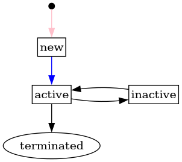

# Controllable Unit

A controllable unit (CU) is a unit in the power system that can be
actively controlled.

In FIS, each CU is linked to exactly one accounting point, ensuring a unique
connection to the balance responsible party (BRP) and determining its location
in the grid.

For more information about the CU concept and its role in the flexibility structure,
see [Conceptual Model and Terminology](../concepts/conceptual-model.md).

## Business Identifiers

Controllable units are identified by a UUID. UUID are simple and easy to
generate and requires no coordination with external bodies (like GS1 or
ENTSO-E). It is a un-complicated way to ensure uniqueness.

The UUIDs are generated by the system when a CU is created.

## Status transitions for controllable unit

The following diagram shows the status and its transitions for controllable
unit.
The Service Provider is responsible for creating a new controllable unit.
Initially, the status is set to "new." Once the CU registration is complete, the
Service Provider updates the status to "active." After termination, the status
can only be edited by a FIS operator.

[Full Size](../diagrams/controllable_unit_status.png)
|
[Plantuml description](../diagrams/controllable_unit_status.plantuml)
|
[How to read the diagram](./index.md#status)

## Relevant links

* [API Documentation](../api/v0/index.html#/operations/list_controllable_unit)
* [Download docx](../download/controllable_unit.docx)

## Fields

| Name                                                                                                   | Description                                                                                                                                                                                     | Format                                                                                                                                                                                                         | Reference                                           |
|--------------------------------------------------------------------------------------------------------|-------------------------------------------------------------------------------------------------------------------------------------------------------------------------------------------------|----------------------------------------------------------------------------------------------------------------------------------------------------------------------------------------------------------------|-----------------------------------------------------|
| <a name="field-id" href="#field-id">id</a>                                                             | Unique surrogate key.                                                                                                                                                                           | bigint Read only                                                                                                                                                                                           |                                                     |
| <a name="field-business_id" href="#field-business_id">business_id</a>                                  | Unique business identifier for the controllable unit.                                                                                                                                           | text Pattern: `^[0-9a-f]{8}-[0-9a-f]{4}-4[0-9a-f]{3}-[89ab][0-9a-f]{3}-[0-9a-f]{12}$` Read only                                                                                                        |                                                     |
| <a name="field-name" href="#field-name">name</a>                                                       | Free text name of the controllable unit.                                                                                                                                                        | text Required Max length: `512`                                                                                                                                                                        |                                                     |
| <a name="field-start_date" href="#field-start_date">start_date</a>                                     | The usage date when the controllable unit is first active.                                                                                                                                      | date                                                                                                                                                                                                           |                                                     |
| <a name="field-status" href="#field-status">status</a>                                                 | The status of the controllable unit.                                                                                                                                                            | text One of: `new`, `active`, `inactive`, `terminated` Default: `new`  Always `new` when created. Can then be updated to the other values. Once `terminated`, only editable by a FIS operator. |                                                     |
| <a name="field-regulation_direction" href="#field-regulation_direction">regulation_direction</a>       | The regulation direction of the controllable unit. `up` means it can be used to increase production or decrease consumption, while `down` means to decrease production or increase consumption. | text One of: `up`, `down`, `both` Required  `up`                                                                                                                                               |                                                     |
| <a name="field-maximum_active_power" href="#field-maximum_active_power">maximum_active_power</a>       | Maximum continuous active power that the controllable unit can produce or consume, i.e. deliver for balancing and congestion services, in kilowatts.                                            | decimal Required Min: `0` Max: `999999.999` Multiple of: `0.001`                                                                                                                               |                                                     |
| <a name="field-is_small" href="#field-is_small">is_small</a>                                           | Whether the controllable unit is small or not, following NCDR.                                                                                                                                  | boolean Read only                                                                                                                                                                                          |                                                     |
| <a name="field-accounting_point_id" href="#field-accounting_point_id">accounting_point_id</a>          | Reference to the accounting point that the controllable unit is connected to.                                                                                                                   | bigint Required Non-updatable                                                                                                                                                                          | [accounting_point.id](accounting_point.md#field-id) |
| <a name="field-additional_information" href="#field-additional_information">additional_information</a> | Free text field for extra information about the controllable unit if needed.                                                                                                                    | text                                                                                                                                                                                                           |                                                     |
| <a name="field-recorded_at" href="#field-recorded_at">recorded_at</a>                                  | When the resource was recorded (created or updated) in the system.                                                                                                                              | date-time Read only                                                                                                                                                                                        |                                                     |
| <a name="field-recorded_by" href="#field-recorded_by">recorded_by</a>                                  | The identity that recorded the resource.                                                                                                                                                        | bigint Read only                                                                                                                                                                                           |                                                     |

## Validation Rules

| Validation rule key | Validation rule                                                                                                                     | Status |
|---------------------|-------------------------------------------------------------------------------------------------------------------------------------|--------|
| CU-VAL004           | The controllable unit must have at least one technical resource for its status to be set to `active`.                               | DONE   |

## Notifications

| Action | Recipient                        | Comment                  |
|--------|----------------------------------|--------------------------|
| create | Connecting SO                    |                          |
| create | End user of the accounting point |                          |
| update | Active SP                        |                          |
| update | Connecting SO                    | When status is not `new` |

## Authorization

### Resource Level Authorization

Below is the [RLA](../technical/auth/authz-model.md#resource-level-authorization-rla)
for the
resource. The default policy is **deny**.

#### Anonymous

No policies.

#### Common

No policies.

#### Balance Responsible Party

| Policy key | Policy                                                                                     | Status |
|------------|--------------------------------------------------------------------------------------------|--------|
| CU-BRP001  | Read CU data that are connected to AP where they are BRP. Only for the contract period.    | DONE   |
| CU-BRP002  | Read CU history that are connected to AP where they are BRP. Only for the contract period. | DONE   |

#### End User

| Policy key | Policy                                                                                           | Status |
|------------|--------------------------------------------------------------------------------------------------|--------|
| CU-EU001   | Read CU data that are connected to AP where they are EU. Only for when they are EU on the AP.    | DONE   |
| CU-EU002   | Read CU history that are connected to AP where they are EU. Only for when they are EU on the AP. | DONE   |

#### Energy Supplier

| Policy key | Policy                                                                                    | Status |
|------------|-------------------------------------------------------------------------------------------|--------|
| CU-ES001   | Read CU data that are connected to AP where they are ES. Only for the contract period.    | DONE   |
| CU-ES002   | Read CU history that are connected to AP where they are ES. Only for the contract period. | DONE   |

#### Flexibility Information System Operator

| Policy key | Policy                          | Status |
|------------|---------------------------------|--------|
| CU-FISO001 | Read, create and update all CU. | DONE   |
| CU-FISO002 | Read all CU history.            | DONE   |

#### Organisation

No policies.

#### System Operator

| Policy key | Policy                                                       | Status |
|------------|--------------------------------------------------------------|--------|
| CU-SO001   | Read and update CU that are connected to AP belonging to SO. | DONE   |
| CU-SO002   | Read CU belonging to SPG that the SO can see.                | DONE   |
| CU-SO003   | Read history on CU that they can read.                       | DONE   |

#### Service Provider

| Policy key | Policy                                      | Status |
|------------|---------------------------------------------|--------|
| CU-SP001   | Read CU data for the period they are SP.    | DONE   |
| CU-SP002   | Create new CU.                              | DONE   |
| CU-SP003   | Update CU where they are current SP.        | DONE   |
| CU-SP004   | Read CU history for the period they are SP. | DONE   |
| CU-SP005   | Read CU they created.                       | DONE   |

#### Third Party

No policies.

### Field Level Authorization

For party type abbreviations, check
[the authentication docs](../technical/auth/authn-model.md#party-market-actors).

| FIELD                | ANON | BRP | ES | EU | FISO | SO | SP  | TP | ORG |
|----------------------|------|-----|----|----|------|----|-----|----|-----|
| id                   |      | R   | R  | R  | R    | R  | R   | R  |     |
| business_id          |      | R   | R  | R  | R    | R  | R   | R  |     |
| name                 |      | R   | R  | R  | RCU  | R  | RCU | R  |     |
| regulation_direction |      | R   | R  | R  | RCU  | R  | RCU | R  |     |
| maximum_active_power |      | R   | R  | R  | RCU  | R  | RCU | R  |     |
| is_small             |      | R   | R  | R  | R    | R  | R   | R  |     |
| start_date           |      | R   | R  | R  | RCU  | R  | RCU | R  |     |
| status               |      | R   | R  | R  | RCU  | R  | RCU | R  |     |
| accounting_point_id  |      | R   | R  | R  | RC   | R  | RC  | R  |     |
| recorded_at          |      | R   | R  | R  | R    | R  | R   | R  |     |
| recorded_by          |      | R   | R  | R  | R    | R  | R   | R  |     |
