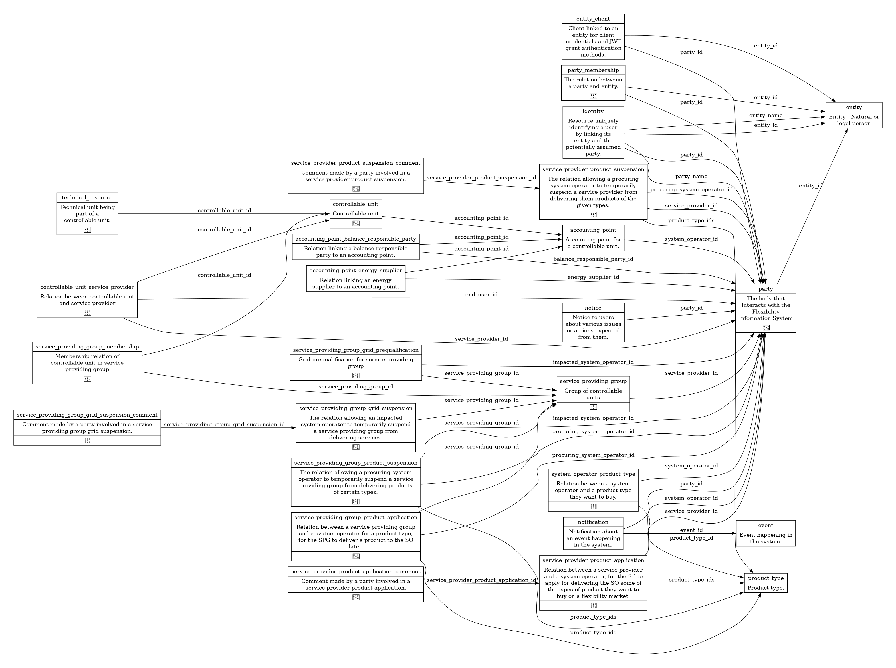

# Resources

!!! info

    Use the navigation menu to find the resource you are looking for.

This section of the documentation describes the resources in the API. This page
explains some concepts that are common to the resource pages. It also contains
an overview of the resources.

The following diagram shows all the resources in the system and how they are
connected. The boxes are resources and the arrows are relationships. The label
on the relationship is the name of the field on the resource where the arrow
originate. Think of the arrows as foreign keys/references.

Resources marked with 🕰️ have a corresponding `_history`
resource (see details below).

Future resources are dotted and marked with 🛠️.

Details about each resource can be found on the page for the specific resource.
Use the navigation menu to find the resource.

## Status

As we are exposing a resource-oriented data API, the various business processes
are not represented as resources in our database and the endpoints are not
explicitly tied to a particular process. Instead, we represent stateful content
in the resources as status fields in the database, that can be updated along the
life of a given resource to conceptually move it between the steps of a process.

The status fields generally have an initial state (_e.g._, `new`), used from the
creation of the resource to the start of a process involving it, and a terminal
state (_e.g._, `terminated`) to represent end of life.

### Status and transitions

We are using directed graph diagrams to show statuses and their transitions.

* `point` - the starting point
* `rectangles` - statuses
* `oval` - "End state". Only FIS operator can move out of this state.
* The following colors indicate the driving/responsible market party for a transition
    * `green` - system operator
    * `blue` - service provider
    * `pink` - flexibility information system
    * `black` - is used when multiple market parties can/are updating the status

We are generally just showing some example transitions that we think are
relevant. The system will not restrict the transitions to these, unless there
are very specific reasons. This means that, in general, that the procedures and
processes will dictate transitions, but it will _not_ be enforced by the system.

Example (from controllable unit):

## History

On most resources we are tracking historic versions in a separate resource
suffixed by `_history`. If the main resource is `controllable_unit`, then the
history resource is `controllable_unit_history`.

[Field Level Authorization](../technical/auth/authz-model.md#field-level-authorization-fla)
for the history resource follows the main resource, except it is _read only_.
The history record also contains three additional fields. The table below shows
what these fields are and where they inherit FLA from.

| Name                                                              | Description                                   | Format                                               | Reference | FLA           |
|-------------------------------------------------------------------|-----------------------------------------------|------------------------------------------------------|-----------|---------------|
| <a name="resource-id" href="#resource-id">&lt;resource&gt;_id</a> | Id of the resource that this history is for   | bigint Generated Read only                   |           | `id`          |
| <a name="replaced-at" href="#replaced-at">replaced_at</a>         | Time the resource was replaced                | timestamp with time zone Generated Read only |           | `recorded_at` |
| <a name="replaced-by" href="#replaced-by">replaced_by</a>         | Id of the identity that replaced the resource | bigint Generated Read only                   |           | `recorded_by` |

[Resource Level Authorization](../technical/auth/authz-model.md#resource-level-authorization-rla)
for the history resource are documented in the same place as the main resource
and typically start with `<action> history ..`.

## Notifications

When `create`, `update`, or `delete` actions are performed on a resource,
[events](event.md) are usually recorded. The events are notified to certain
parties. The rules for who is notified for each event are documented on the
resource page in the `Notifications` section.

If the action is performed by a party that is listed as the recipient of the
notification, the notification is not sent.

## Validation rules

Each resource is subject to several layers of validation to ensure consistency
in the database. The validations are documented on each individual page.

### Field format validation

The first layer is _field format_, stated for each field on the page of each
resource in the field table. It ensures every field belongs to a correct set of
values, independently of other fields and other resources. Expressed in the
field table.

### Inter-field validation

The second layer is _inter-field validation_. It checks that the fields in a
given resource entry are consistent with each other. Expressed as a list of
validation rules.

### Resource-level validation

The third layer is resource-level validation. This layer has a broader scope
than one resource because it checks several resources are consistent with each
other. For instance, it can perform checks in other resource tables thanks to
the foreign keys.

### Process-level validation

The fourth and last layer is _process-level validation_. It is the highest level
of validation because it is linked to the business processes manipulating the
database. It must verify that steps of a given process happen in the right
order, and that this reflects in the database.
