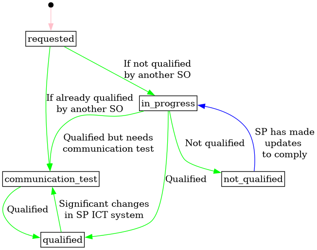

# Service Provider Product Application

The relation that links a service provider to a system operator, for the SP to
apply for delivering the SO some of the types of product they want to buy on a
flexibility market. The SP can apply for one or more product types, several
times, for a given SO.

## Status transitions

The following diagram shows the status transition we envision for an
application/qualification _resource_. We think of the "application" as a
resource in the system, that can be created and updated. The status of the
application is updated as the process and lifecycle of the application progresses.

[Full Size](../diagrams/service_provider_product_application_status.png)
|
[Graphviz description](../diagrams/service_provider_product_application_status.plantuml)
|
[How to read the diagram](./index.md#status-and-transitions)

## Relevant links

* [API Documentation](https://flex-test.elhub.no/api/v0/#/operations/list_service_provider_product_application)
* [Download docx](../download/service_provider_product_application.docx)

## Fields

| Name                                                                                          | Description                                                        | Format                                                                                                                   | Reference                                   |
|-----------------------------------------------------------------------------------------------|--------------------------------------------------------------------|--------------------------------------------------------------------------------------------------------------------------|---------------------------------------------|
| <a name="field-id" href="#field-id">id</a>                                                    | Unique surrogate identifier.                                       | bigint Read only                                                                                                     |                                             |
| <a name="field-service_provider_id" href="#field-service_provider_id">service_provider_id</a> | Reference to the service provider.                                 | bigint Required Non-updatable                                                                                    | [party.id](party.md#field-id)               |
| <a name="field-system_operator_id" href="#field-system_operator_id">system_operator_id</a>    | Reference to the system operator.                                  | bigint Required Non-updatable                                                                                    | [party.id](party.md#field-id)               |
| <a name="field-product_type_ids" href="#field-product_type_ids">product_type_ids</a>          | References to the product types.                                   |  Required Array                                                                                                  | [product_type.id](product_type.md#field-id) |
| <a name="field-status" href="#field-status">status</a>                                        | The status of the application.                                     | text One of: `requested`, `in_progress`, `communication_test`, `not_qualified`, `qualified` Default: `requested` |                                             |
| <a name="field-notes" href="#field-notes">notes</a>                                           | Free text notes on the current product application status.         | text Max length: `512`                                                                                               |                                             |
| <a name="field-last_qualified" href="#field-last_qualified">last_qualified</a>                | When the product application was last validated.                   | timestamp with time zone                                                                                                 |                                             |
| <a name="field-recorded_at" href="#field-recorded_at">recorded_at</a>                         | When the resource was recorded (created or updated) in the system. | timestamp with time zone Read only                                                                                   |                                             |
| <a name="field-recorded_by" href="#field-recorded_by">recorded_by</a>                         | The identity that recorded the resource.                           | bigint Read only                                                                                                     |                                             |

## Validation Rules

| Validation rule key | Validation rule                                                           | Status |
|---------------------|---------------------------------------------------------------------------|--------|
| SPPA-VAL001         | Inserted `product_type_ids` must be active product types asked by the SO. | DONE   |

## Notifications

| Action                 | Recipient | Comment |
|------------------------|-----------|---------|
| create, update, delete | SO        |         |
| create, update, delete | SP        |         |

## Authorization

### Resource Level Authorization

Below is the [RLA](../technical/auth.md#resource-level-authorization-rla) for the
resource. The default policy is **deny**.

#### Anonymous

No policies.

#### Common

| Policy key  | Policy                                   | Status |
|-------------|------------------------------------------|--------|
| SPPA-COM001 | Read history on SPPA that they can read. | DONE   |

#### Balance Responsible Party

No policies.

#### End User

No policies.

#### Energy Supplier

No policies.

#### Flexibility Information System Operator

| Policy key   | Policy                    | Status |
|--------------|---------------------------|--------|
| SPPA-FISO001 | Read and update all SPPA. | DONE   |

#### Market Operator

No policies.

#### System Operator

| Policy key | Policy                      | Status |
|------------|-----------------------------|--------|
| SPPA-SO001 | Read all SPPA.              | DONE   |
| SPPA-SO002 | Update SPPA targeting them. | DONE   |

#### Service Provider

| Policy key | Policy                                        | Status |
|------------|-----------------------------------------------|--------|
| SPPA-SP001 | Read and create SPPA concerning themselves.   | DONE   |
| SPPA-SP002 | Update their SPPA when status is `requested`. | DONE   |

#### Third Party

No policies.

### Field Level Authorization

For party type abbreviations, check [the auth docs](../technical/auth.md#party)

| FIELD               | ANON | BRP | ES | EU | FISO | MO | SO | SP  | TP |
|---------------------|------|-----|----|----|------|----|----|-----|----|
| id                  |      | R   | R  | R  | R    | R  | R  | R   | R  |
| service_provider_id |      | R   | R  | R  | R    | R  | R  | RC  | R  |
| system_operator_id  |      | R   | R  | R  | R    | R  | R  | RC  | R  |
| product_type_ids    |      | R   | R  | R  | RU   | R  | R  | RCU | R  |
| status              |      | R   | R  | R  | RU   | R  | RU | R   | R  |
| notes               |      | R   | R  | R  | RU   | R  | RU | R   | R  |
| last_qualified      |      | R   | R  | R  | RU   | R  | RU | R   | R  |
| recorded_at         |      | R   | R  | R  | R    | R  | R  | R   | R  |
| recorded_by         |      | R   | R  | R  | R    | R  | R  | R   | R  |
