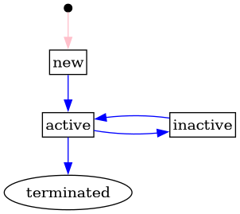

# Service Providing Group

A group of controllable units to be used in a flexibility product on the market.

## Status transitions for service providing group

The following diagram shows the status and its transitions for service providing
groups.

The service provider is responsible for creating a new service providing group.
Initially, the status is set to `new`. Once the SPG registration is complete,
the service provider updates the status to `active`. SPG grid prequalification
resources are created on activation for each impacted system operator.
The service provider can terminate the service providing group at any time.
After termination, the status can only be edited by a FIS operator.

[Full Size](../diagrams/service_providing_group_status.png)
|
[Plantuml description](../diagrams/service_providing_group_status.plantuml)
|
[How to read the diagram](./index.md#status)

## Relevant links

* [API Documentation](/api/v0/#/operations/list_service_providing_group)
* [Download docx](../download/service_providing_group.docx)

## Fields

| Name                                                                                          | Description                                                        | Format                                                                                                                                                                                             | Reference                     |
|-----------------------------------------------------------------------------------------------|--------------------------------------------------------------------|----------------------------------------------------------------------------------------------------------------------------------------------------------------------------------------------------|-------------------------------|
| <a name="field-id" href="#field-id">id</a>                                                    | Unique surrogate key.                                              | bigint Read only                                                                                                                                                                               |                               |
| <a name="field-name" href="#field-name">name</a>                                              | Free text name of the service providing group.                     | text Required Max length: `128`                                                                                                                                                            |                               |
| <a name="field-service_provider_id" href="#field-service_provider_id">service_provider_id</a> | Reference to the `party` (service provider) managing the group.    | bigint Required Non-updatable                                                                                                                                                              | [party.id](party.md#field-id) |
| <a name="field-status" href="#field-status">status</a>                                        | The status of the group.                                           | text One of: `new`, `active`, `terminated` Default: `new`  Always `new` when created. Can then be updated to the other values. Once `terminated`, only editable by a FIS operator. |                               |
| <a name="field-recorded_at" href="#field-recorded_at">recorded_at</a>                         | When the resource was recorded (created or updated) in the system. | timestamp with time zone Read only                                                                                                                                                             |                               |
| <a name="field-recorded_by" href="#field-recorded_by">recorded_by</a>                         | The identity that recorded the resource.                           | bigint Read only                                                                                                                                                                               |                               |

## Validation Rules

| Validation rule key | Validation rule                                       | Status |
|---------------------|-------------------------------------------------------|--------|
| SPG-VAL001          | An empty service providing group cannot be activated. | DONE   |

## Notifications

| Action         | Recipient       | Comment                  |
|----------------|-----------------|--------------------------|
| create, update | SP              |                          |
| update         | SO on member CU | When status is not `new` |

## Authorization

### Resource Level Authorization

Below is the [RLA](../technical/auth.md#resource-level-authorization-rla) for the
resource. The default policy is **deny**.

#### Anonymous

No policies.

#### Common

| Policy key | Policy                                  | Status |
|------------|-----------------------------------------|--------|
| SPG-COM001 | Read history on SPG that they can read. | DONE   |

#### Balance Responsible Party

No policies.

#### End User

No policies.

#### Energy Supplier

No policies.

#### Flexibility Information System Operator

| Policy key  | Policy                           | Status |
|-------------|----------------------------------|--------|
| SPG-FISO001 | Read, create and update all SPG. | DONE   |

#### Market Operator

No policies.

#### System Operator

| Policy key | Policy                                                             | Status |
|------------|--------------------------------------------------------------------|--------|
| SPG-SO001  | Read SPG containing grid prequalification resources they can read. | DONE   |
| SPG-SO002  | Read SPG containing product applications targeted at them.         | DONE   |

#### Service Provider

| Policy key | Policy                                            | Status |
|------------|---------------------------------------------------|--------|
| SPG-SP001  | Read, create and update SPG that belongs to them. | DONE   |

#### Third Party

No policies.

### Field Level Authorization

For party type abbreviations, check [the auth docs](../technical/auth.md#party-market-actors)

| FIELD               | ANON | BRP | ES | EU | FISO | MO | SO | SP  | TP |
|---------------------|------|-----|----|----|------|----|----|-----|----|
| id                  |      | R   | R  | R  | R    | R  | R  | R   | R  |
| name                |      | R   | R  | R  | RCU  | R  | R  | RCU | R  |
| service_provider_id |      | R   | R  | R  | RC   | R  | R  | RC  | R  |
| status              |      | R   | R  | R  | RU   | R  | R  | RU  | R  |
| recorded_at         |      | R   | R  | R  | R    | R  | R  | R   | R  |
| recorded_by         |      | R   | R  | R  | R    | R  | R  | R   | R  |
