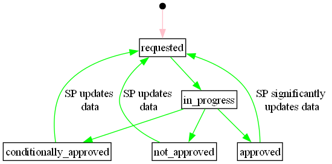

# Service Providing Group Grid Prequalification

A resource tracking the grid prequalification status of a service providing
group. One SPG grid prequalification per impacted system operator.

## Status transitions for grid prequalification

[Full Size](../diagrams/service_providing_group_prequalification_status.png)
|
[Plantuml description](../diagrams/service_providing_group_prequalification_status.plantuml)
|
[How to read the diagram](./index.md#status)

## Relevant links

* [API Documentation](../api/v0/index.html#/operations/list_service_providing_group_grid_prequalification)
* [Download docx](../download/service_providing_group_grid_prequalification.docx)

## Fields

| Name                                                                                                                  | Description                                                                                              | Format                                                                                                                                                                                                        | Reference                                                         |
|-----------------------------------------------------------------------------------------------------------------------|----------------------------------------------------------------------------------------------------------|---------------------------------------------------------------------------------------------------------------------------------------------------------------------------------------------------------------|-------------------------------------------------------------------|
| <a name="field-id" href="#field-id">id</a>                                                                            | Unique surrogate key.                                                                                    | bigint Read only                                                                                                                                                                                          |                                                                   |
| <a name="field-service_providing_group_id" href="#field-service_providing_group_id">service_providing_group_id</a>    | Reference to the service providing group whose grid prequalification is tracked by the current resource. | bigint Required Non-updatable                                                                                                                                                                         | [service_providing_group.id](service_providing_group.md#field-id) |
| <a name="field-impacted_system_operator_id" href="#field-impacted_system_operator_id">impacted_system_operator_id</a> | Reference to the `party` that is the impacted system operator.                                           | bigint Required Non-updatable                                                                                                                                                                         | [party.id](party.md#field-id)                                     |
| <a name="field-status" href="#field-status">status</a>                                                                | The status of the grid prequalification for this service providing group.                                | text One of: `requested`, `in_progress`, `conditionally_approved`, `approved`, `not_approved` Default: `requested`  Always `requested` when created. Can then be updated to the other values. |                                                                   |
| <a name="field-prequalified_at" href="#field-prequalified_at">prequalified_at</a>                                     | When the current grid prequalification was last approved.                                                | timestamp with time zone                                                                                                                                                                                      |                                                                   |
| <a name="field-recorded_at" href="#field-recorded_at">recorded_at</a>                                                 | When the resource was recorded (created or updated) in the system.                                       | timestamp with time zone Read only                                                                                                                                                                        |                                                                   |
| <a name="field-recorded_by" href="#field-recorded_by">recorded_by</a>                                                 | The identity that recorded the resource.                                                                 | bigint Read only                                                                                                                                                                                          |                                                                   |

## Validation Rules

| Validation rule key | Validation rule                                                                                                                                | Status |
|---------------------|------------------------------------------------------------------------------------------------------------------------------------------------|--------|
| SPGGP-VAL001        | If `status` is set to `approved` or `conditionally_approved`, then `prequalified_at` must already be specified in the resource or the request. | DONE   |
| SPGGP-VAL002        | If `status` is set to `not_approved`, then `prequalified_at` must be unset in the resource or by the request.                                  | DONE   |

## Notifications

| Action         | Recipient              | Comment |
|----------------|------------------------|---------|
| create, update | SP of SPG, Impacted SO |         |

## Authorization

### Resource Level Authorization

Below is the [RLA](../technical/auth.md#resource-level-authorization-rla) for the
resource. The default policy is **deny**.

#### Anonymous

No policies.

#### Common

| Policy key   | Policy                                    | Status |
|--------------|-------------------------------------------|--------|
| SPGGP-COM001 | Read history on SPGGP that they can read. | DONE   |

#### Balance Responsible Party

No policies.

#### End User

No policies.

#### Energy Supplier

No policies.

#### Flexibility Information System Operator

| Policy key    | Policy                             | Status |
|---------------|------------------------------------|--------|
| SPGGP-FISO001 | Read, create and update all SPGGP. | DONE   |

#### Market Operator

No policies.

#### Organisation

No policies.

#### System Operator

| Policy key  | Policy                                                                  | Status |
|-------------|-------------------------------------------------------------------------|--------|
| SPGGP-SO001 | Read and update SPGGP for which the SO is the impacted system operator. | DONE   |
| SPGGP-SO002 | Read SPGGP related to SPG they can see.                                 | DONE   |

#### Service Provider

| Policy key  | Policy                                                     | Status |
|-------------|------------------------------------------------------------|--------|
| SPGGP-SP001 | Read SPGGP attached to a SPG which the SP is in charge of. | DONE   |

#### Third Party

No policies.

### Field Level Authorization

For party type abbreviations, check [the auth docs](../technical/auth.md#party-market-actors)

| FIELD                       | ANON | BRP | ES | EU | FISO | MO | SO | SP | TP | ORG |
|-----------------------------|------|-----|----|----|------|----|----|----|----|-----|
| id                          |      | R   | R  | R  | R    | R  | R  | R  | R  |     |
| service_providing_group_id  |      | R   | R  | R  | RC   | R  | R  | R  | R  |     |
| impacted_system_operator_id |      | R   | R  | R  | RC   | R  | R  | R  | R  |     |
| status                      |      | R   | R  | R  | RU   | R  | RU | R  | R  |     |
| prequalified_at             |      | R   | R  | R  | RU   | R  | RU | R  | R  |     |
| recorded_at                 |      | R   | R  | R  | R    | R  | R  | R  | R  |     |
| recorded_by                 |      | R   | R  | R  | R    | R  | R  | R  | R  |     |
