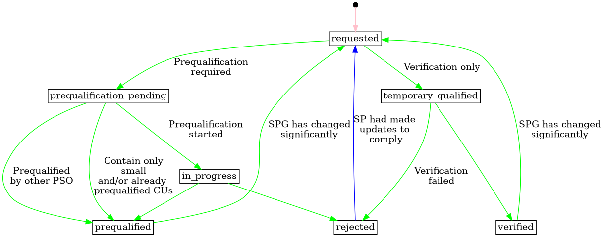

# Service Providing Group Product Application

Relation uniquely linking a service providing group and a system operator for a
product type, for the SPG to deliver a product to the SO later.

## Application status transitions

The following diagram shows the status transitions for service providing group
applications. This resource supports the application process and is updated as
it progresses.

The service provider is responsible for creating a new SPG product application.
Initially, the status is set to `requested`. The system operator then takes over
until the application is either `prequalified`, `verified` or `rejected`. If it
rejected, the service provider can make updates and propose the application
again.

[Full Size](../diagrams/service_providing_group_product_application_status.png)
|
[Graphviz description](../diagrams/service_providing_group_product_application_status.plantuml)
|
[How to read the diagram](./index.md#status)

## Relevant links

* [API Documentation](../api/v0/index.html#/operations/list_service_providing_group_product_application)
* [Download docx](../download/service_providing_group_product_application.docx)

## Fields

| Name                                                                                                                     | Description                                                        | Format                                                                                                                                                          | Reference                                                         |
|--------------------------------------------------------------------------------------------------------------------------|--------------------------------------------------------------------|-----------------------------------------------------------------------------------------------------------------------------------------------------------------|-------------------------------------------------------------------|
| <a name="field-id" href="#field-id">id</a>                                                                               | Unique surrogate identifier.                                       | bigint Read only                                                                                                                                            |                                                                   |
| <a name="field-service_providing_group_id" href="#field-service_providing_group_id">service_providing_group_id</a>       | Reference to the service providing group.                          | bigint Required Non-updatable                                                                                                                           | [service_providing_group.id](service_providing_group.md#field-id) |
| <a name="field-procuring_system_operator_id" href="#field-procuring_system_operator_id">procuring_system_operator_id</a> | Reference to the procuring system operator.                        | bigint Required Non-updatable                                                                                                                           | [party.id](party.md#field-id)                                     |
| <a name="field-product_type_ids" href="#field-product_type_ids">product_type_ids</a>                                     | References to the product types.                                   |  Required Array of bigint                                                                                                                               | [product_type.id](product_type.md#field-id)                       |
| <a name="field-status" href="#field-status">status</a>                                                                   | The status of the application.                                     | text One of: `requested`, `prequalification_pending`, `in_progress`, `temporary_qualified`, `prequalified`, `verified`, `rejected` Default: `requested` |                                                                   |
| <a name="field-notes" href="#field-notes">notes</a>                                                                      | Free text notes on the current product application status.         | text Max length: `512`                                                                                                                                      |                                                                   |
| <a name="field-prequalified_at" href="#field-prequalified_at">prequalified_at</a>                                        | When the product application was last prequalified.                | timestamp with time zone                                                                                                                                        |                                                                   |
| <a name="field-verified_at" href="#field-verified_at">verified_at</a>                                                    | When the product application was last verified.                    | timestamp with time zone                                                                                                                                        |                                                                   |
| <a name="field-recorded_at" href="#field-recorded_at">recorded_at</a>                                                    | When the resource was recorded (created or updated) in the system. | timestamp with time zone Read only                                                                                                                          |                                                                   |
| <a name="field-recorded_by" href="#field-recorded_by">recorded_by</a>                                                    | The identity that recorded the resource.                           | bigint Read only                                                                                                                                            |                                                                   |

## Validation Rules

| Validation rule key | Validation rule                                                                                                                  | Status |
|---------------------|----------------------------------------------------------------------------------------------------------------------------------|--------|
| SPGPA-VAL001        | Product applications can only be created on active SPGs.                                                                         | DONE   |
| SPGPA-VAL002        | Product applications can only be created on active system operator product types.                                                | DONE   |
| SPGPA-VAL003        | The SP opening the product application must be qualified for all the product types by the SO.                                    | DONE   |
| SPGPA-VAL004        | If `status` is set to `prequalified`, then `prequalified_at` must already be specified in the resource or the request.           | DONE   |
| SPGPA-VAL005        | If `status` is set to `verified`, then `verified_at` must already be specified in the resource or the request.                   | DONE   |
| SPGPA-VAL006        | If `status` is set to `rejected`, then both `prequalified_at` and `verified_at` must be unset in the resource or by the request. | DONE   |

## Notifications

| Action         | Recipient               | Comment |
|----------------|-------------------------|---------|
| create, update | Procuring SO, SP of SPG |         |

## Authorization

### Resource Level Authorization

Below is the [RLA](../technical/auth/authz-model.md#resource-level-authorization-rla)
for the
resource. The default policy is **deny**.

#### Anonymous

No policies.

#### Common

| Policy key   | Policy                                    | Status |
|--------------|-------------------------------------------|--------|
| SPGPA-COM001 | Read history on SPGPA that they can read. | DONE   |

#### Balance Responsible Party

No policies.

#### End User

No policies.

#### Energy Supplier

No policies.

#### Flexibility Information System Operator

| Policy key    | Policy                     | Status |
|---------------|----------------------------|--------|
| SPGPA-FISO001 | Read and update all SPGPA. | DONE   |

#### Organisation

No policies.

#### System Operator

| Policy key  | Policy                                                             | Status |
|-------------|--------------------------------------------------------------------|--------|
| SPGPA-SO001 | Read SPGPA for SPGs that have at least one SPGPA targeting the SO. | DONE   |
| SPGPA-SO002 | Update SPGPA targeting them.                                       | DONE   |

#### Service Provider

| Policy key  | Policy                                                                       | Status |
|-------------|------------------------------------------------------------------------------|--------|
| SPGPA-SP001 | Create and read SPGPA for SPG they are in charge for.                        | DONE   |
| SPGPA-SP002 | Update SPGPA for SPG they are in charge for, when the status is `requested`. | DONE   |

#### Third Party

No policies.

### Field Level Authorization

For party type abbreviations, check
[the authentication docs](../technical/auth/authn-model.md#party-market-actors).

| FIELD                        | ANON | BRP | ES | EU | FISO | SO | SP  | TP | ORG |
|------------------------------|------|-----|----|----|------|----|-----|----|-----|
| id                           |      | R   | R  | R  | R    | R  | R   | R  |     |
| service_providing_group_id   |      | R   | R  | R  | R    | R  | RC  | R  |     |
| procuring_system_operator_id |      | R   | R  | R  | R    | R  | RC  | R  |     |
| product_type_ids             |      | R   | R  | R  | RU   | RU | RCU | R  |     |
| status                       |      | R   | R  | R  | RU   | RU | RCU | R  |     |
| notes                        |      | R   | R  | R  | RU   | RU | R   | R  |     |
| prequalified_at              |      | R   | R  | R  | RU   | RU | R   | R  |     |
| verified_at                  |      | R   | R  | R  | RU   | RU | R   | R  |     |
| recorded_at                  |      | R   | R  | R  | R    | R  | R   | R  |     |
| recorded_by                  |      | R   | R  | R  | R    | R  | R   | R  |     |
